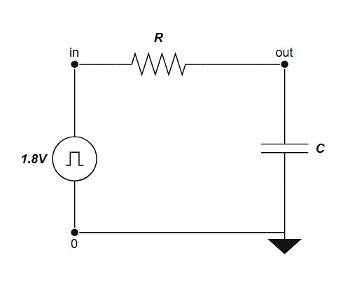

# IC-Characterization
This GitHub repository is created to provide hands-on experience in Analog IC Characterization using open-source tools such as **NGSpice**, **Xschem**, and the **SKY130 PDK**.
## What is Analog IC Characterization ?
Analog IC (Integrated Circuit) Characterization is the process of evaluating and measuring the electrical performance of an analog circuit under various conditions. This involves testing key parameters such as gain, offset, bandwidth, noise, power consumption, input/output impedance, temperature stability, and process variation sensitivity.

Characterization is carried out using tools like **Ngspice, Spectre, HSPICE, Eldo** (Simulation) and **Xschem** (Schematic) providing a complete framework for accurate simulation and analysis of analog circuits.

Characterization is usually performed post-design (pre- and post-fabrication) to ensure the circuit behaves as intended across different corners:

- Process Corners: Variations in manufacturing (e.g., TT, FF, SS).

- Voltage Corners: Operating at min/max supply voltages.

- Temperature Corners: Measuring across temperature range (e.g., -40°C to 125°C).

## Contents
- [1. Tool and PDK Setup](#1-tools-and-pdk-setup)
  - [1.1 Tools Setup](#11-tools-setup)
  - [1.2 PDK Setup](#12-pdk-setup)
  - [1.3 Install and Setup EDA Tools](#13-install-and-setup-eda-tools)
- [2. Writing a Netlist](#2-writing-a-netlist)
- [3. Linear Elements](#3-linear-elements)
  - [3.1 Resistors](#31-resistors)
  - [3.2 Capacitors](#32-capacitors)
  - [3.3 RC Circuits](#33-rc-circuits)
     - [3.3.1 Transient Analysis](#331-transient-analysis)
     - [3.3.2 AC Analysis](#332-ac-analysis)

## 1. Tools and PDK setup

### 1.1 Tools setup
For the simulation of circuits we will need the following tools.
- Spice netlist simulation - [[Ngspice](https://ngspice.sourceforge.io/)]
- Schematic Editor - [[Xschem](https://xschem.sourceforge.io/stefan/index.html)]

#### Ngspice


[Ngspice](http://ngspice.sourceforge.net/devel.html) is the open source spice simulator for electric and electronic circuits. Ngspice is an open project, there is no closed group of developers.

[Ngspice Reference Manual](https://ngspice.sourceforge.io/docs/ngspice-html-manual/manual.xhtml): Complete reference manual in HTML format.

### 1.2 PDK setup

A process design kit (PDK) is a set of files used within the semiconductor industry to model a fabrication process for the design tools used to design an integrated circuit. The PDK is created by the foundry defining a certain technology variation for their processes. It is then passed to their customers to use in the design process.

The PDK we are going to use is [Google Skywater 130nm PDK](https://skywater-pdk.readthedocs.io/en/main/).

Device Details: [docs](https://skywater-pdk.readthedocs.io/en/main/rules/device-details.html)


### 1.3 Install and Setup EDA Tools
- Launch Ubuntu 24.04. `Press Windows Key → select Ubuntu 24.04.`
- Update the system
```
  sudo apt update && sudo apt upgrade -y
```
- Clone the Github Repository
```
cd ~
git clone https://github.com/silicon-vlsi/SI-2025-AnalogIC.git

```
- Copy & make install scripts executable
```
cp ~/SI-2025-AnalogIC/install*.sh .
chmod +x install*.sh
```
- Install dependencies & EDA tools
```
./install-libs.sh
./install-eda.sh
```
- Add EDA environment variables
```
cat ~/SI-2025-AnalogIC/bashrc-eda >> ~/.bashrc
source ~/.bashrc
```
**Directory Structure** after installation should look like this:
```bash
share
└── pdk
cad
├── eda-ngspice
└── eda-xschem
work
└── xschem
.xschem/
└── simulations
```
## 2. Writing a Netlist
- To write a netlist in ``Ngspice`` we need to follow these steps.
- Open terminal and enter your working directory and type the following code:
```
mkdir IC_Char
cd IC_Char
```
- Make a new file ``vim file_name.sp`` to open a spice file (`.sp` is the file extension) with ``vim`` as a **Text Editor**. 

## 3. Linear Elements

### 3.1 Resistors

- A **resistor** is a passive electrical component that resists the flow of electric current, producing a voltage drop across its terminals according to **Ohm's Law**:   `` V = I * R ``
- The resistance R of a material depends on its physical properties and geometry, given by the formula: `` R = ρL / A ``
- In the **Skywater SKY130 PDK**, multiple resistor types are available for analog and digital IC design, offering different resistance values, temperature characteristics, and area trade-offs.

#### Types of Resistors available :
- ``sky130_fd_pr__res_high_po.model`` has base models with *0.35u, 0.69u, 1.41u, 2.85u, 5.73u* as **bin width** (fixed) with changable lengths. 
- ``sky130_fd_pr__res_xhigh_po.model`` also has base models with *0.35u, 0.69u, 1.41u, 2.85u, 5.73u* as **bin width** (fixed) with changable lengths.
- ``sky130_fd_pr__res_generic_nd.model`` is a Generic N-diff type resister.
- ``sky130_fd_pr__res_generic_pd.model`` is a Generic P-diff type resister.

```
Title: Resistor Simulation

.lib "/home/sdash/share/pdk/sky130A/libs.tech/ngspice/sky130.lib.spice" tt  ; Load SKY130 PDK model at typical corner
.temp 25                                                                     ; Set simulation temperature to 25°C

Vin     in      0       DC 1.8        ; Apply 1.8V to the resistor input
Vm      in      1       0V            ; Zero-volt source used to measure current
X1      1       0       vdd   sky130_fd_pr__res_high_po_0p35 L=3.5   ; Resistor instance (high-poly) with L=3.5µm
vsup    vdd     gnd     DC 1.8        ; Body terminal of resistor tied to 1.8V supply

.op                                   ; Perform DC operating point analysis

.control
run                                   ; Run the simulation
print v(in)                           ; Display input voltage
print abs(i(Vm))                      ; Display current through resistor (via Vm)
let RES = v(in)/abs(i(Vm))           ; Calculate resistance using Ohm's Law
print RES                             ; Print calculated resistance
.endc

.end
```


## Calculation of Resistance Values

| Temperature | <-- | - 40 &#8451; | --> | <-- | 25 &#8451; | --> | <-- | 125 &#8451; | --> | Process Variation | TempCo |
| - | - | - | - | - | - | - | - | - | - | - | - |
| Types | hh | tt | ll | hh | tt | ll | hh | tt | ll | - | - |
| sky130_fd_pr_res_high_po_0p35 | 5.03k | 4.33k | 3.64k | 5.14k | 4.45k | 3.74k | 5.41k | 4.68k | 3.96k |
| sky130_fd_pr_res_high_po_0p69 | 4.25k | 3.68k | 3.12k | 4.35k | 3.78k | 3.20k | 4.59k | 3.99k | 3.39k | 
| sky130_fd_pr_res_high_po_1p41 | 3.89k | 3.40k | 2.91k | 3.99k | 3.49k | 2.99k | 4.22k | 3.70k | 3.17k | 
| sky130_fd_pr_res_high_po_2p85 | 3.73k | 3.27k | 2.81k | 3.83k | 3.36k | 2.89k | 4.06k | 3.57k | 3.07k |
| sky130_fd_pr_res_high_po_5p73 | 3.65k | 3.20k | 2.76k | 3.75k | 3.30k | 2.84k | 3.99k | 3.50k | 3.01k |

### 3.2 Capacitors

- A **capacitor** is a passive electrical component that stores energy in the form of an electric field, defined by the relation: `` Q = C * V ``, where `C` is the capacitance in Farads.
- The capacitance C of a parallel-plate capacitor depends on its physical structure and the material between the plates, given by the formula: `` C = εA / d ``

- In the **Skywater SKY130 PDK**, various capacitor types are available for use in analog, RF, and digital designs, each offering trade-offs in capacitance density, linearity, voltage rating, and temperature stability.

#### Types of Capacitors available:
- ``sky130_fd_pr__cap_mim_m3_1.model`` is a **Metal-Insulator-Metal (MIM)** capacitor between **Metal3 and Metal2**, suitable for analog precision applications.
- ``sky130_fd_pr__cap_mim_m3_2.model`` is another **MIM** capacitor variant with different area usage and parasitic trade-offs.
- ``sky130_fd_pr__cap_mim_m2_1.model`` defines a MIM capacitor between **Metal2 and Metal1** layers.
- ``sky130_fd_pr__cap_var_lvt.model`` is a **MOS varactor** (voltage-dependent capacitor) built using LVT NMOS structure, useful for RF tuning.
- ``sky130_fd_pr__cap_var_hvt.model`` is a similar **varactor** using HVT device for different threshold and leakage behavior.

```
* RC Charging Circuit with Pulse Input
.lib "/home/sdash/share/pdk/sky130A/libs.tech/ngspice/sky130.lib.spice tt"
.temp 25

V1      in      0       pulse(0 1.8 0 1p 1p 100p 200p)
R1      in      out     4.45k
XC1     out     0       sky130_fd_pr__cap_mim_m3_1 w=1 l=1

.tran 0.1n 1n

.control
run
plot v(in) v(out)
.endc

.end
```
- We manually calculated the cap values using `C = τ / R`, where `τ` is 63% of V(output).



## Calculation of Capacitance Values

| Temperature | <-- | - 40 &#8451; | --> | <-- | 25 &#8451; | --> | <-- | 125 &#8451; | --> | Process Variation | TempCo |
| - | - | - | - | - | - | - | - | - | - | - | - |
| **Types** | hh | tt | ll | hh | tt | ll | hh | tt | ll | - | - |
| sky130_fd_pr_cap_mim_m3_1 | 3.35f | 2.76f | 2.11f | 3.31f | 2.76f | 2.14f | 3.30f | 2.76f | 2.11f |
| sky130_fd_pr_cap_mim_m3_2 | 3.52f | 2.96f | 2.29f | 3.43f | 2.96f | 2.29f | 3.52f | 2.96f | 2.29f |

### 3.3 RC Circuits

- An **RC circuit** is an electric circuit composed of **resistors (R)** and **capacitors (C)**, which exhibit a time-dependent response to voltage or current changes. The fundamental time constant is defined as:  
`τ = R * C`,
where `τ` (tau) represents the **time constant** in seconds, indicating how quickly the circuit charges or discharges.

- In the **Skywater SKY130 PDK**, **RC circuits** are implemented using integrated resistors (e.g., `sky130_fd_pr__res_high_po`) and capacitors (e.g., `sky130_fd_pr__cap_mim_m3_1`). These are critical in analog and mixed-signal design applications such as filters, timing circuits, and analog front ends.


## 3.3.1 Transient Analysis

```
Title: RC Ckt Simulation using SKY130 model

.lib "/home/sdash/share/pdk/sky130A/libs.tech/ngspice/sky130.lib.spice tt"
.temp 25

Vin     in      0       PULSE(0 1.8 0 0 0 100p 200p)
XR1     in      out     0       sky130_fd_pr__res_high_po_0p35 l =3.5
XC1     out     0       sky130_fd_pr__cap_mim_m3_1 w=1 l=1

.tran 1p 300p

.control
run
plot v(in) v(out)
.endc

*Measure Time delays
.meas tran rise        TRIG V(out) VAL=0.18 RISE=1 TARG V(out) VAL=1.62 RISE=1 ; rise‑time 10 % → 90 % at V(out)
.meas tran fall        TRIG V(out) VAL=1.62 FALL=1 TARG V(out) VAL=0.18 FALL=1 ; fall‑time 90 % → 10 % at V(out)
.meas tran rise_delay  TRIG V(in)  VAL=0.9  RISE=1 TARG V(out) VAL=0.9  RISE=1 ; tpd (low→high) 50 % V(in) → 50 % V(out)
.meas tran fall_delay  TRIG V(in)  VAL=0.9  FALL=1 TARG V(out) VAL=0.9  FALL=1 ; tpd (high→low) 50 % V(in) → 50 % V(out)

*Measure Max Voltage
.meas tran VMAX MAX V(out) ; peak V(out) during transient

.end
```


## Calculation of Rise, Fall and Propagation Delay


## 3.3.2 AC Analysis

```
* RC circuit AC analysis
.lib "/home/sdash/share/pdk/sky130A/libs.tech/ngspice/sky130.lib.spice" tt
.temp 25

V1      in      0       AC 1
XR1     in      out     0       sky130_fd_pr__res_high_po_0p35  l=3.5
XC1     out     0       sky130_fd_pr__cap_mim_m3_1 w=1 l=1

* AC Simulation
.ac dec 10 1 15g

* Output commands
.control
run
.meas ac f3db WHEN VDB(out) = -3 ; –3 dB cutoff frequency
plot vdb(out)
.endc

.end
```


## Calculation of Cutoff Frequency (Hz)

| Temperature | <-- | - 40 &#8451; | --> | <-- | 25 &#8451; | --> | <-- | 125 &#8451; | --> |
| - | - | - | - | - | - | - | - | - | - |
| **Types** | hh | tt | ll | hh | tt | ll | hh | tt | ll |
| sky130_fd_pr__res_high_po_0p35 & sky130_fd_pr_cap_mim_m3_1 | 7.32G | 10.05G | 16.91G | 7.39G | 10.57G | 16.66G | 7.37G | 10.37G | 15.99G |

### 3.4 CR Circuits

- A **Cr circuit** is essentially the same as an RC circuit, but with the capacitor (C) placed before the resistor (R) in the signal path. While electrically the time constant remains the same, the circuit response differs, especially in transient analysis. The fundamental time constant is defined as:  
`τ = R * C`,
where `τ` (tau) represents the **time constant** in seconds, indicating how quickly the circuit charges or discharges.

- In the **Skywater SKY130 PDK**, **CR circuits** are implemented using integrated capacitors (e.g., `sky130_fd_pr__cap_mim_m3_1`) and resistors (e.g., `sky130_fd_pr__res_high_po`). These configurations are often used in differentiator circuits, pulse shaping, and AC coupling applications in analog and RF systems.


## 3.4.1 Transient Analysis

```

```


## Calculation of Rise, Fall and Propagation Delay


## 3.4.2 AC Analysis

```

```


## Calculation of Cutoff Frequency (Hz)

| Temperature | <-- | - 40 &#8451; | --> | <-- | 25 &#8451; | --> | <-- | 125 &#8451; | --> |
| - | - | - | - | - | - | - | - | - | - |
| **Types** | hh | tt | ll | hh | tt | ll | hh | tt | ll |
| sky130_fd_pr__res_high_po_0p35 & sky130_fd_pr_cap_mim_m3_1 |  |  |  |  |  |  |  |  |  |
