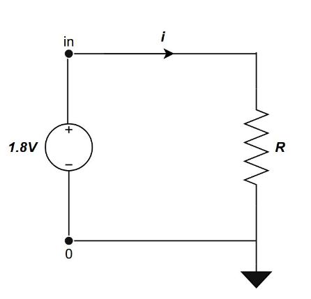
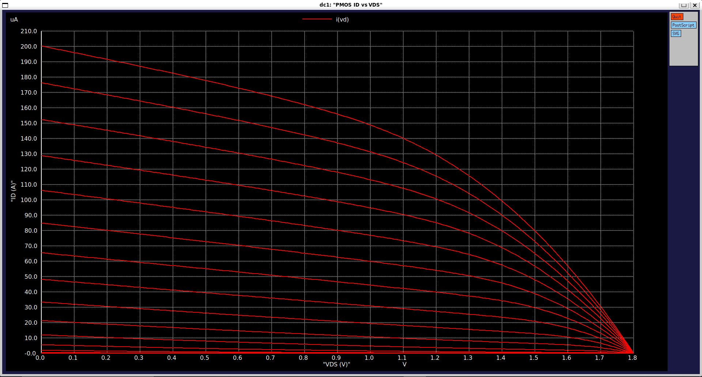
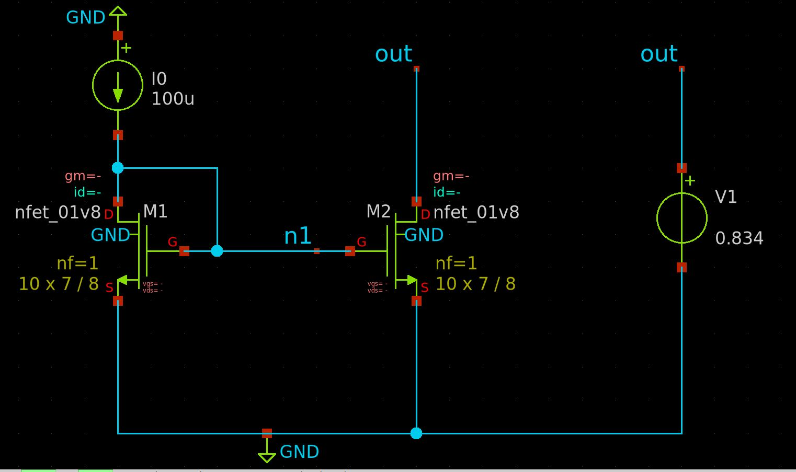
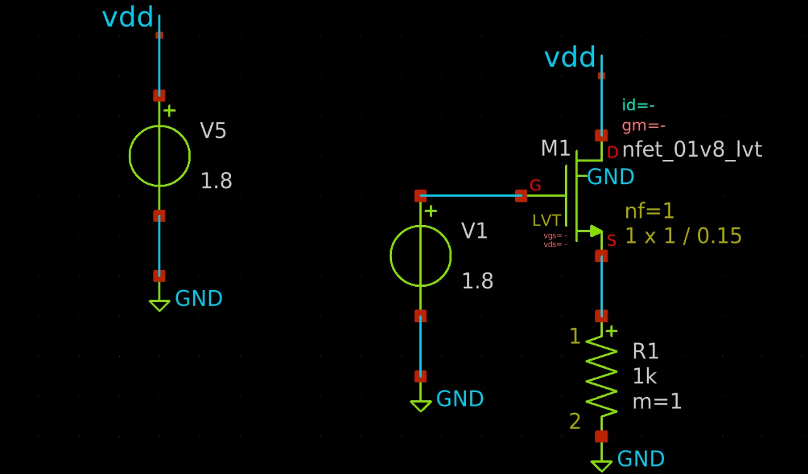
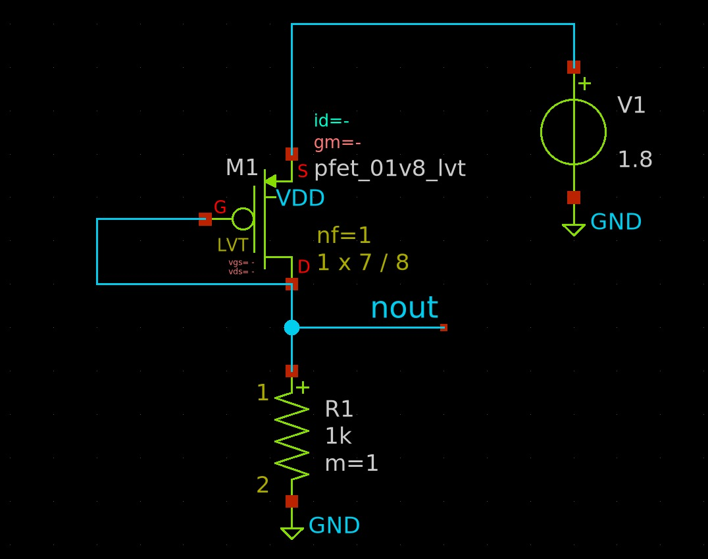
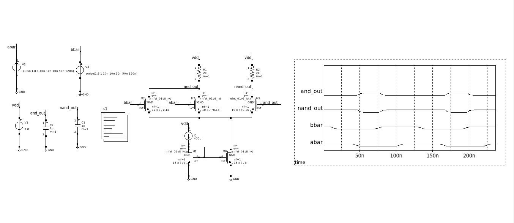
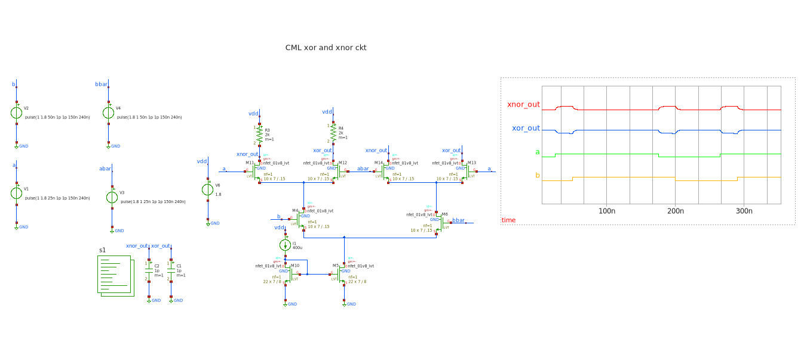

# IC-Characterization
This GitHub repository is created to provide hands-on experience in Analog IC Characterization using open-source tools such as **NGSpice**, **Xschem**, and the **SKY130 PDK**.
## What is Analog IC Characterization ?
Analog IC (Integrated Circuit) Characterization is the process of evaluating and measuring the electrical performance of an analog circuit under various conditions. This involves testing key parameters such as gain, offset, bandwidth, noise, power consumption, input/output impedance, temperature stability, and process variation sensitivity.

Characterization is carried out using tools like **Ngspice, Spectre, HSPICE, Eldo** (Simulation) and **Xschem** (Schematic) providing a complete framework for accurate simulation and analysis of analog circuits.

Characterization is usually performed post-design (pre- and post-fabrication) to ensure the circuit behaves as intended across different corners:

- Process Corners: Variations in manufacturing (e.g., TT, FF, SS).

- Voltage Corners: Operating at min/max supply voltages.

- Temperature Corners: Measuring across temperature range (e.g., -40°C to 125°C).

## Contents
- [1. Tool and PDK Setup](#1-tools-and-pdk-setup)
  - [1.1 Tools Required](#11-tools-required)
  - [1.2 PDK Required](#12-pdk-required)
  - [1.3 Install and Setup EDA Tools](#13-install-and-setup-eda-tools)
- [2. Writing a Netlist](#2-writing-a-netlist)
- [3. Linear Elements](#3-linear-elements)
  - [3.1 Resistors](#31-resistors)
  - [3.2 Capacitors](#32-capacitors)
  - [3.3 RC Circuits](#33-rc-circuits)
     - [3.3.1 Transient Analysis](#331-transient-analysis)
     - [3.3.2 AC Analysis](#332-ac-analysis)
  - [3.4 CR Circuits](#34-cr-circuits)
     - [3.4.1 Transient Analysis](#341-transient-analysis)
     - [3.4.2 AC Analysis](#342-ac-analysis)
- [4. MOSFET Circuits](#4-mosfet-circuits)
  - [4.1 NMOS Analysis](#41-nmos-analysis)
  - [4.2 PMOS Analysis](#42-pmos-analysis)
- [5. Inverter](#5-Inverter)
  - [5.1 Static Power](#51-static-power)
  - [5.2 Dynamic Power](#52-dynamic-power)
  - [5.3 Inverter Fanout](#53-inverter-fanout)
  - [5.4 Inverter chain characteristics](#54-Inverter-chain-characteristics)
- [6. Current Mirror](#6-current-mirror)
  - [6.1 Simple Current Mirror using NMOS](#61-simple-current-mirror-using-nmos)
  - [6.2 Simple Current Mirror using PMOS](#62-simple-current-mirror-using-pmos)
  - [6.3 Cascode Current Mirror using NMOS](#63-cascode-current-mirror-using-nmos)
  - [6.4 Cascode Current Mirror using PMOS](#64-cascode-current-mirror-using-pmos)
  - [6.5 Wide Swing Cascode Current Mirror using NMOS](#65-wide-swing-cascode-current-mirror-using-nmos)
  - [6.6 Wide Swing Cascode Current Mirror using PMOS](#66-wide-swing-cascode-current-mirror-using-pmos)
  - [6.7 Self Biased Wide Swing Cascode Current Mirror using NMOS](#67-self-biased-wide-swing-cascode-current-mirror-using-nmos)
  - [6.8 Self Biased Wide Swing Cascode Current Mirror using PMOS](#68-self-biased-wide-swing-cascode-current-mirror-using-pmos)
- [7. Single Stage Amplifiers](#7-single-stage-amplifiers)
  - [7.1 Common Source Amplifier using NMOS](#71-common-source-amplifier-using-NMOS)
  - [7.2 Common Source Amplifier using PMOS](#72-common-source-amplifier-using-PMOS)
  - [7.3 Common Drain Amplifier using NMOS](#73-common-drain-amplifier-using-NMOS)
  - [7.4 Common Drain Amplifier using PMOS](#74-common-drain-amplifier-using-PMOS)
  - [7.5 Common Gate Amplifier using NMOS](#75-common-gate-amplifier-using-NMOS)
  - [7.6 Common Gate Amplifier using PMOS](#76-common-gate-amplifier-using-PMOS)
- [8. Differential Amplifier](#8-Differential-Amplifier)
  - [8.1 Differential Amplifier using NMOS](#81-Differential-Amplifier-using-NMOS)
  - [8.2 Differential Amplifier using PMOS](#82-Differential-Amplifier-using-PMOS)
- [9. Common mode feedback Amplifier](#9-Common-mode-feedback-Amplifier)
- [10. Two stage Amplifier](#10-Two-stage-Amplifier)
  - [10.1 Two stage Amplifier using NMOS](#101-Two-stage-Amplifier-using-NMOS)
  - [10.2 Two stage Amplifier using PMOS](#102-Two-stage-Amplifier-using-PMOS)
- [11. Balanced Amplifier](#11-Balanced-Amplifier)
   - [11.1 Balanced Amplifier using NMOS](#111-Balanced-Amplifier-using-NMOS)
   - [11.2 Balanced Amplifier using PMOS](#112-Balanced-Amplifier-using-PMOS)
- [12. Telescopic amplifier](#12-Telescopic-amplifier)
- [13. Folded cascode amplifier](#13-Folded-cascode-amplifier)
- [14. StrongARM latch](#14-StrongARM-latch)
- [15. Current mode logic](#15-Current-mode-logic)
   - [15.1 Inverter and buffer using CML](#151-Inverter-and-buffer-using-CML)
   - [15.2 AND and NAND gate using CML](#152-AND-and-NAND-gate-using-CML)
   - [15.3 OR and NOR gate using CML](#153-OR-and-NOR-gate-using-CML)
   - [15.4 XOR and XNOR gate using CML](#154-XOR-and-XNOR-gate-using-CML)
- [16. BGR](#16-BGR)
   - [16.1 CTAT Simulation](#161-CTAT-Simulation)
   - [16.2 PTAT Simulation](#162-PTAT-Simulation)
   - [16.3 Resistance tempco.](#163-Resistance-tempco)
   - [16.4 BGR with SBCM](#164-BGR-with-SBCM)
  
# 1. Tools and PDK setup

## 1.1 Tools Required
For the simulation of circuits we will need the following tools.
- Spice netlist simulation - [[Ngspice](https://ngspice.sourceforge.io/)]
- Schematic Editor - [[Xschem](https://xschem.sourceforge.io/stefan/index.html)]

### Ngspice


[Ngspice](http://ngspice.sourceforge.net/devel.html) is the open source spice simulator for electric and electronic circuits. Ngspice is an open project, there is no closed group of developers.

[Ngspice Reference Manual](https://ngspice.sourceforge.io/docs/ngspice-html-manual/manual.xhtml): Complete reference manual in HTML format.

### Xschem


[Xschem](https://xschem.sourceforge.io/stefan/) is an open-source schematic capture tool for VLSI and electronics. It is designed to be lightweight, fast, and capable of handling large hierarchical circuits while remaining user-friendly.

[Xschem Reference Manual](https://xschem.sourceforge.io/stefan/xschem_man/xschem_man.html): Complete reference manual in HTML format.

## 1.2 PDK Required

A process design kit (PDK) is a set of files used within the semiconductor industry to model a fabrication process for the design tools used to design an integrated circuit. The PDK is created by the foundry defining a certain technology variation for their processes. It is then passed to their customers to use in the design process.

The PDK we are going to use is [Google Skywater 130nm PDK](https://skywater-pdk.readthedocs.io/en/main/).


Device Details: [docs](https://skywater-pdk.readthedocs.io/en/main/rules/device-details.html)

## 1.3 Install and Setup EDA Tools
## Windows Subsystem for Linux (WSL) for Open Source EDA tools

Windows Subsystem for Linux (WSL) is a feature of Windows that allows you to run a Linux environment on your Windows machine, without the need for a separate virtual machine or dual booting. With native X11 (graphics) support on WSL2, the latest WSL, in **Winodws 10 version 2004+ (Build 19041+)** or **Windows 11**, you can now run GUI apps including all the open-source EDA tools.

Now we will share instructions for installing WSL2 on Winodws 10/11 and install the EDA tools on a **Ubuntu 24.04** distribution.

## Install WSL
- **Prerequisites**: Winodws 10 version 2004+ (Build 19041+) or Windows 11
- If you have a previous WSL installed without your knowledge or, you've installed in from the _Microsoft Store_, it's best you **uninstall** it using the Windows "Add/remove Programs" app and/or `wsl --uninstall`
- Open PowerShell or Windows Command Prompt in **ADMINISTRATOR** mode by right-clicking and selecting "Run as administrator"
- In the PowerShell type `wsl --list --online`
  - This will list all the available distributions online. 
- To install a particular distribution (Distro) say `Ubuntu-24.04` (The name has to be exactly as printed in the above command):
  - `wsl --install -d Ubuntu-24.04`
- It's important to update the WSL now by typing the following in the Powershell:
  - `wsl --update`
- And shut it down: `wsl --shutdown`. Note: it will automatically start when the WSL distro selected from the Windows menu.

## Launching Ubuntu 24.04. 

- `Press Windows Key → select Ubuntu 24.04.`
- Update the system
```
  sudo apt update && sudo apt upgrade -y
```
- Clone the Github Repository
```
cd ~
git clone https://github.com/silicon-vlsi/SI-2025-AnalogIC.git

```
- Copy & make install scripts executable
```
cp ~/SI-2025-AnalogIC/install*.sh .
chmod +x install*.sh
```
- Install dependencies & EDA tools
```
./install-libs.sh
./install-eda.sh
```
- Add EDA environment variables
```
cat ~/SI-2025-AnalogIC/bashrc-eda >> ~/.bashrc
source ~/.bashrc
```
- Then type this command: 
``` 
tree -L 2
```
**Directory Structure** after installation should look like this:
```bash
share
└── pdk
cad
├── eda-magic
├── eda-netgen
├── eda-ngspice
└── eda-xschem
work
└── xschem
.xschem/
└── simulations
```

# 2. Writing a Netlist
- To write a netlist in ``Ngspice`` we need to follow these steps.
- Open terminal and enter your working directory and type the following code:
```
mkdir IC_Char
cd IC_Char
```
- Make a new file ``vim file_name.sp`` to open a spice file (`.sp` is the file extension) with ``vim`` as a **Text Editor**. 

# 3. Linear Elements

## 3.1 Resistors

- A **resistor** is a passive electrical component that resists the flow of electric current, producing a voltage drop across its terminals according to **Ohm's Law**:   `` V = I * R ``
- The resistance R of a material depends on its physical properties and geometry, given by the formula: `` R = ρL / A ``
- In the **Skywater SKY130 PDK**, multiple resistor types are available for analog and digital IC design, offering different resistance values, temperature characteristics, and area trade-offs.

### Types of Resistors available :
- ``sky130_fd_pr__res_high_po.model`` has base models with *0.35u, 0.69u, 1.41u, 2.85u, 5.73u* as **bin width** (fixed) with changable lengths. 
- ``sky130_fd_pr__res_xhigh_po.model`` also has base models with *0.35u, 0.69u, 1.41u, 2.85u, 5.73u* as **bin width** (fixed) with changable lengths.
- ``sky130_fd_pr__res_generic_nd.model`` is a Generic N-diff type resister.
- ``sky130_fd_pr__res_generic_pd.model`` is a Generic P-diff type resister.

```
Title: Resistor Simulation

.lib "/home/sdash/share/pdk/sky130A/libs.tech/ngspice/sky130.lib.spice" tt  ; Load SKY130 PDK model at typical corner
.temp 25                                                                     ; Set simulation temperature to 25°C

Vin     in      0       DC 1.8        ; Apply 1.8V to the resistor input
Vm      in      1       0V            ; Zero-volt source used to measure current
X1      1       0       vdd   sky130_fd_pr__res_high_po_0p35 L=3.5   ; Resistor instance (high-poly) with L=3.5µm
vsup    vdd     gnd     DC 1.8        ; Body terminal of resistor tied to 1.8V supply

.op                                   ; Perform DC operating point analysis

.control
run                                   ; Run the simulation
print v(in)                           ; Display input voltage
print abs(i(Vm))                      ; Display current through resistor (via Vm)
let RES = v(in)/abs(i(Vm))           ; Calculate resistance using Ohm's Law
print RES                             ; Print calculated resistance
.endc

.end
```



### Calculation of Resistance Values

| Temperature | <-- | - 40 &#8451; | --> | <-- | 25 &#8451; | --> | <-- | 125 &#8451; | --> | Process Variation | TempCo |
| - | - | - | - | - | - | - | - | - | - | - | - |
| Types | hh | tt | ll | hh | tt | ll | hh | tt | ll | - | - |
| sky130_fd_pr_res_high_po_0p35 | 5.03k | 4.33k | 3.64k | 5.14k | 4.45k | 3.74k | 5.41k | 4.68k | 3.96k |
| sky130_fd_pr_res_high_po_0p69 | 4.25k | 3.68k | 3.12k | 4.35k | 3.78k | 3.20k | 4.59k | 3.99k | 3.39k | 
| sky130_fd_pr_res_high_po_1p41 | 3.89k | 3.40k | 2.91k | 3.99k | 3.49k | 2.99k | 4.22k | 3.70k | 3.17k | 
| sky130_fd_pr_res_high_po_2p85 | 3.73k | 3.27k | 2.81k | 3.83k | 3.36k | 2.89k | 4.06k | 3.57k | 3.07k |
| sky130_fd_pr_res_high_po_5p73 | 3.65k | 3.20k | 2.76k | 3.75k | 3.30k | 2.84k | 3.99k | 3.50k | 3.01k |

## 3.2 Capacitors

- A **capacitor** is a passive electrical component that stores energy in the form of an electric field, defined by the relation: `` Q = C * V ``, where `C` is the capacitance in Farads.
- The capacitance C of a parallel-plate capacitor depends on its physical structure and the material between the plates, given by the formula: `` C = εA / d ``

- In the **Skywater SKY130 PDK**, various capacitor types are available for use in analog, RF, and digital designs, each offering trade-offs in capacitance density, linearity, voltage rating, and temperature stability.

### Types of Capacitors available:
- ``sky130_fd_pr__cap_mim_m3_1.model`` is a **Metal-Insulator-Metal (MIM)** capacitor between **Metal3 and Metal2**, suitable for analog precision applications.
- ``sky130_fd_pr__cap_mim_m3_2.model`` is another **MIM** capacitor variant with different area usage and parasitic trade-offs.
- ``sky130_fd_pr__cap_mim_m2_1.model`` defines a MIM capacitor between **Metal2 and Metal1** layers.
- ``sky130_fd_pr__cap_var_lvt.model`` is a **MOS varactor** (voltage-dependent capacitor) built using LVT NMOS structure, useful for RF tuning.
- ``sky130_fd_pr__cap_var_hvt.model`` is a similar **varactor** using HVT device for different threshold and leakage behavior.

```
* RC Charging Circuit with Pulse Input
.lib "/home/sdash/share/pdk/sky130A/libs.tech/ngspice/sky130.lib.spice tt"
.temp 25

V1      in      0       pulse(0 1.8 0 1p 1p 100p 200p)
R1      in      out     4.45k
XC1     out     0       sky130_fd_pr__cap_mim_m3_1 w=1 l=1

.tran 0.1n 1n

.control
run
plot v(in) v(out)
.endc

.end
```
- We manually calculated the cap values using `C = τ / R`, where `τ` is 63% of V(output).


### Calculation of Capacitance Values

| Temperature | <-- | - 40 &#8451; | --> | <-- | 25 &#8451; | --> | <-- | 125 &#8451; | --> | Process Variation | TempCo |
| - | - | - | - | - | - | - | - | - | - | - | - |
| **Types** | hh | tt | ll | hh | tt | ll | hh | tt | ll | - | - |
| sky130_fd_pr_cap_mim_m3_1 | 3.35f | 2.76f | 2.11f | 3.31f | 2.76f | 2.14f | 3.30f | 2.76f | 2.11f |
| sky130_fd_pr_cap_mim_m3_2 | 3.52f | 2.96f | 2.29f | 3.43f | 2.96f | 2.29f | 3.52f | 2.96f | 2.29f |

## 3.3 RC Circuits

- An **RC circuit** is an electric circuit composed of **resistors (R)** and **capacitors (C)**, which exhibit a time-dependent response to voltage or current changes. The fundamental time constant is defined as:  
`τ = R * C`,
where `τ` (tau) represents the **time constant** in seconds, indicating how quickly the circuit charges or discharges.

- In the **Skywater SKY130 PDK**, **RC circuits** are implemented using integrated resistors (e.g., `sky130_fd_pr__res_high_po`) and capacitors (e.g., `sky130_fd_pr__cap_mim_m3_1`). These are critical in analog and mixed-signal design applications such as filters, timing circuits, and analog front ends.


### 3.3.1 Transient Analysis

```
Title: RC Ckt Simulation using SKY130 model

.lib "/home/sdash/share/pdk/sky130A/libs.tech/ngspice/sky130.lib.spice tt"
.temp 25

Vin     in      0       PULSE(0 1.8 0 0 0 100p 200p)
XR1     in      out     0       sky130_fd_pr__res_high_po_0p35 l =3.5
XC1     out     0       sky130_fd_pr__cap_mim_m3_1 w=1 l=1

.tran 1p 300p

.control
run
plot v(in) v(out)
.endc

*Measure Time delays
.meas tran rise        TRIG V(out) VAL=0.18 RISE=1 TARG V(out) VAL=1.62 RISE=1 ; rise‑time 10 % → 90 % at V(out)
.meas tran fall        TRIG V(out) VAL=1.62 FALL=1 TARG V(out) VAL=0.18 FALL=1 ; fall‑time 90 % → 10 % at V(out)
.meas tran rise_delay  TRIG V(in)  VAL=0.9  RISE=1 TARG V(out) VAL=0.9  RISE=1 ; tpd (low→high) 50 % V(in) → 50 % V(out)
.meas tran fall_delay  TRIG V(in)  VAL=0.9  FALL=1 TARG V(out) VAL=0.9  FALL=1 ; tpd (high→low) 50 % V(in) → 50 % V(out)

*Measure Max Voltage
.meas tran VMAX MAX V(out) ; peak V(out) during transient

.end
```


### Calculation of Rise, Fall and Propagation Delay


## 3.3.2 AC Analysis

```
* RC circuit AC analysis
.lib "/home/sdash/share/pdk/sky130A/libs.tech/ngspice/sky130.lib.spice" tt
.temp 25

V1      in      0       AC 1
XR1     in      out     0       sky130_fd_pr__res_high_po_0p35  l=3.5
XC1     out     0       sky130_fd_pr__cap_mim_m3_1 w=1 l=1

* AC Simulation
.ac dec 10 1 15g

* Output commands
.control
run
.meas ac f3db WHEN VDB(out) = -3 ; –3 dB cutoff frequency
plot vdb(out)
.endc

.end
```


### Calculation of Cutoff Frequency (Hz)

| Temperature | <-- | - 40 &#8451; | --> | <-- | 25 &#8451; | --> | <-- | 125 &#8451; | --> |
| - | - | - | - | - | - | - | - | - | - |
| **Types** | hh | tt | ll | hh | tt | ll | hh | tt | ll |
| sky130_fd_pr__res_high_po_0p35 & sky130_fd_pr_cap_mim_m3_1 | 7.32G | 10.05G | 16.91G | 7.39G | 10.57G | 16.66G | 7.37G | 10.37G | 15.99G |

## 3.4 CR Circuits

- A **Cr circuit** is essentially the same as an RC circuit, but with the capacitor (C) placed before the resistor (R) in the signal path. While electrically the time constant remains the same, the circuit response differs, especially in transient analysis. The fundamental time constant is defined as:  
`τ = R * C`,
where `τ` (tau) represents the **time constant** in seconds, indicating how quickly the circuit charges or discharges.

- In the **Skywater SKY130 PDK**, **CR circuits** are implemented using integrated capacitors (e.g., `sky130_fd_pr__cap_mim_m3_1`) and resistors (e.g., `sky130_fd_pr__res_high_po`). These configurations are often used in differentiator circuits, pulse shaping, and AC coupling applications in analog and RF systems.


## 3.4.1 Transient Analysis

```
* Title: CR Ckt Simulation using SKY130 model

.lib "/home/sdash/share/pdk/sky130A/libs.tech/ngspice/sky130.lib.spice tt"
.temp 25

Vin     in      0       PULSE(0 1.8 0 0 0 100p 200p)
XC1     in      out     sky130_fd_pr__cap_mim_m3_1 w=1 l=1
XR1     out     0       0       sky130_fd_pr__res_high_po_0p35 l =3.5

.tran 1p 300p

.control
run
plot v(in) v(out)
.endc

*Measure Time delays
.meas tran rise TRIG V(out) VAL=0.14 RISE=1 TARG V(out) VAL=1.29 RISE=1
.meas tran fall TRIG V(out) VAL=1.29 FALL=1 TARG V(out) VAL=0.14 FALL=1
.meas tran rise_delay TRIG V(in) VAL=0.7 RISE=1 TARG V(out) VAL=0.7 RISE=1
.meas tran fall_delay TRIG V(in) VAL=0.7 FALL=1 TARG V(out) VAL=0.7 FALL=1

*Measure Max Voltage
.meas tran VMAX MAX V(out)

.end
```


## 3.4.2 AC Analysis

```
* CR Charging Circuit with Pulse Input
.lib "/home/manas6008/share/pdk/sky130A/libs.tech/ngspice/sky130.lib.spice tt"
.temp 25
V1       in     0           ac  1
XC1     in     out          sky130_fd_pr__cap_mim_m3_1  w=1 l=1
XR1     out     0       0   sky130_fd_pr__res_high_po_0p35  l=3.5
.ac dec 10 1meg 10e13
.control
run
plot vdb(out)
.endc
.end
```


# 4. MOSFET Circuits

- A MOSFET (Metal-Oxide-Semiconductor Field-Effect Transistor) is a three-terminal active device used for switching and amplification. Its current is controlled by the voltage applied to the gate terminal.
- The MOSFET operates in three regions: cutoff, linear, and saturation, depending on gate-source (V<sub>GS</sub>) and drain-source (V<sub>DS</sub>) voltages.
- In the Skywater SKY130 PDK, MOSFETs like `sky130_fd_pr__nfet_01v8` (NMOS) and `sky130_fd_pr__pfet_01v8` (PMOS) are commonly used. These are essential in digital logic, analog amplifiers, and switching applications.
- [MOSFET parameter extraction](https://www.dropbox.com/scl/fo/rvgcq8auvleyfdjhpd1iw/AEcyRvaafRv-gcav3MH0GGA?rlkey=mkijrvenaemf86jq2el99q39l&st=7h79l0d9&dl=0)

## 4.1 NMOS Analysis

- A **NMOS** (N-type MOSFET) is a majority-carrier device where current flows between the drain and source when a positive voltage is applied to the gate. It acts as a voltage-controlled current source.
- The drain current (I<sub>D</sub>) depends on the gate-to-source voltage (V<sub>GS</sub>), and its behavior changes across three regions:
  - Cutoff: V<sub>GS</sub> < V<sub>th</sub>, I<sub>D</sub> ≈ 0
  - Linear: V<sub>GS</sub> > V<sub>th</sub> and V<sub>DS</sub> < V<sub>GS</sub> − V<sub>th</sub>
  - Saturation: V<sub>DS</sub> ≥ V<sub>GS</sub> − V<sub>th</sub>
- The I<sub>D</sub>-V<sub>GS</sub> curve shows how the drain current increases with gate voltage (at constant V<sub>DS</sub>), helping identify the threshold voltage (V<sub>th</sub>), where the transistor starts conducting. This curve is essential for characterizing the device and is often used in DC sweep simulations.
- In the Skywater SKY130 PDK, NMOS devices like `sky130_fd_pr__nfet_01v8` are used in logic gates, analog blocks, and current sources.

```
* nmos analysis

.lib "/home/sdash/share/pdk/sky130A/libs.tech/ngspice/sky130.lib.spice" tt
.include "/home/sdash/share/pdk/sky130A/libs.ref/sky130_fd_pr/spice"
.temp 25

Vd      1       0       DC 1.8
Vid     1       d       DC 0
Vg      g       0       DC 0

* NMOS: D G S B
X1      d       g       0       0       sky130_fd_pr__nfet_01v8 w=0.42 l=1

.control
run
save all

*Uncomment these 2 lines for ID vs VGS Curve
*dc vg 0 1.8 0.001 vd 0 1.8 0.1
*plot  I(vid) xlabel "VGS (V)"  ylabel "ID (A)" title "ID vs VGS"

*Uncomment these 2 lines for ID vs VDS Curve
*dc vd 0 1.8 0.001 vg 0 1.8 0.1
*plot  I(vid) xlabel "VDS (V)"  ylabel "ID (A)" title "ID vs VDS"

.endc

.end
```
### I<sub>D</sub>-V<sub>GS</sub> curve


### I<sub>D</sub>-V<sub>DS</sub> curve


### Parameters across PVT

## 4.2 PMOS Analysis
- A **PMOS** (P-type MOSFET) is a majority-carrier device where current flows between the source and drain when a negative voltage is applied to the gate. Like NMOS, it behaves as a voltage-controlled current source but with opposite polarity.
- The drain current (I<sub>D</sub>) depends on the gate-to-source voltage (V<sub>GS</sub>), and its behavior changes across three regions:
  - Cutoff: V<sub>GS</sub> > V<sub>th</sub>, I<sub>D</sub> ≈ 0
  - Linear: V<sub>GS</sub> < V<sub>th</sub> and V<sub>SD</sub> < V<sub>SG</sub> − |V<sub>th</sub>|
  - Saturation: V<sub>SD</sub> ≥ V<sub>SG</sub> − |V<sub>th</sub>|
- The I<sub>D</sub>-V<sub>GS</sub> curve for a PMOS shows how drain current increases as gate voltage becomes more negative (at constant V<sub>DS</sub>), and helps extract the threshold voltage (V<sub>th</sub>), where the PMOS starts to conduct.
- In the Skywater SKY130 PDK, PMOS devices like `sky130_fd_pr__pfet_01v8` are widely used in CMOS logic, analog switches, and current mirrors.

```
* pmos analysis

.lib "/home/sdash/share/pdk/sky130A/libs.tech/ngspice/sky130.lib.spice" tt
.temp 25

* Bias sources
VS      s       0       1.8 ; Source at 1.8 V 
VG      g       0       0   ; Gate 
VD      d       0       0   ; Drain at 0 V

* PMOS: D  G  S  B
X1 d g s s sky130_fd_pr__pfet_01v8 w=1 l=0.15

.control
run
save all

*Uncomment these 2 lines for ID vs VGS Curve
*dc VG 0 1.8 0.01 VD 0 1.8 0.1
*plot I(VD) xlabel "VGS (V)" ylabel "ID (A)" title "PMOS ID vs VGS"

*Uncomment these 2 lines for ID vs VDS Curve
*dc VD 0 1.8 0.01 VG 0 1.8 0.1
*plot I(VD) xlabel "VDS (V)" ylabel "ID (A)" title "PMOS ID vs VDS"

.endc

.end
```
### I<sub>D</sub>-V<sub>GS</sub> curve


### I<sub>D</sub>-V<sub>DS</sub> curve


### Parameters across PVT

# 5. Inverter


A **CMOS inverter** using the open-source **SkyWater SKY130 PDK**, with `sky130_fd_pr__pfet_01v8_lvt` (pMOS) and `sky130_fd_pr__nfet_01v8_lvt` (nMOS) transistors. The inverter is designed and simulated in **Xschem + Ngspice**, showing correct switching behavior from 0 V to 1.8 V. Key performance aspects such as transfer characteristics, switching threshold, and rise/fall times are verified.  

## Key Points  
- **Technology:** SKY130 (1.8 V low-Vt devices)  
- **Transistors Used:** `pfet_01v8_lvt` (PMOS), `nfet_01v8_lvt` (NMOS)  
- **Simulation Tools:** Xschem (schematic) + Ngspice (simulation)  
- **Input:** Pulse source (0 → 1.8 V)  
- **Output:** Clean digital inversion with sharp transition near VDD/2
  
## DC analysis
```
* CMOS Inverter DC Simulation
.lib "/home/biswajit/share/pdk/sky130A/libs.tech/ngspice/sky130.lib.spice" tt
.temp 25
VDD ps 0 DC 1.8
VIN in 0 DC 0
XM1 out in 0 0 sky130_fd_pr__nfet_01v8 W=0.42 L=0.15
XM2 out in ps ps sky130_fd_pr__pfet_01v8 W=1.26 L=0.15
.dc VIN 0 1.8 0.01
.control
run
plot  v(in) v(out)
.endc
.end
```


## Transient Analysis
```
* CMOS Inverter Transient Simulation
.lib "/home/biswajit/share/pdk/sky130A/libs.tech/ngspice/sky130.lib.spice" tt
.temp 25
* Supply voltage
VDD vdd 0 DC 1.2
VIN in 0 PULSE(0 1.2 2n 0 0 100n 200n)
XM1 out in 0 0 sky130_fd_pr__nfet_01v8 W=1.26 L=0.15
XM2 out in vdd vdd sky130_fd_pr__pfet_01v8 W=1.26 L=0.15
Cload out 0 100f
.tran 0.1n 500n
.control
run
plot v(in) v(out)
plot v(out)
.endc
.end
```


## AC Analysis
```
*  AC analysis of CMOS inverter
.lib "/home/manas6008/share/pdk/sky130A/libs.tech/ngspice/sky130.lib.spice" ss
.temp 125
Vdd Vdd 0 1.8
Vin In  0 1.8 ac  1
XM1 Out In Vdd Vdd sky130_fd_pr__pfet_01v8_lvt w=7 l=.35
XM2 Out In 0   0   sky130_fd_pr__nfet_01v8_lvt w=7 l=.15
C1 out 0 100f
.ac dec 10 1meg 10e13
.control
run
plot vdb(out)
.endc
.end
```


## 5.1 Static Power
```
******INVERTER-STATIC******
.lib "/home/manas6008/share/pdk/sky130A/libs.tech/ngspice/sky130.lib.spice" ss
.temp 125
.global VDD  GND
**PMOS**
VDD      VDD     GND     DC      1.8
VIN      in      GND     DC      0
XP1      out     in      VDD     VDD    sky130_fd_pr__pfet_01v8_lvt L=0.35  W=7
XM1      out     in      GND     GND    sky130_fd_pr__nfet_01v8_lvt L=0.15  W=7
C1      out     0       1a

*NMOS*
Vns     n1      0       DC      1.8
V1      i1      0       DC      1.8
XP2     o1     i1       n1       n1    sky130_fd_pr__pfet_01v8_lvt L=0.35  W=7
XM2     o1     i1       0        0    sky130_fd_pr__nfet_01v8_lvt L=0.15  W=7
C2      o1      0       1a
.OP
.control
run
print abs(I(VDD))
print abs(I(Vns))
let static_power=((I(VDD)) + (I(Vns)))*1.8
print abs(static_power)
.endc
```
### Output
- abs(i(vdd)) = 2.153271e-09
- abs(i(vns)) = 1.285865e-07
- abs(static_power) = 2.353315e-07

## 5.2 Dynamic Power
```
*  Dynamic power calculation of CMOS Inverter
.lib "/home/manas6008/share/pdk/sky130A/libs.tech/ngspice/sky130.lib.spice" ss
.temp 125
Vdd Vdd 0 1.8
Vin In 0 PULSE(0 1.8 0 10n 10n 60n 120n)
XM1 Out In Vdd Vdd sky130_fd_pr__pfet_01v8_lvt w=7 l=.35
XM2 Out In 0   0   sky130_fd_pr__nfet_01v8_lvt w=7 l=.15
C1 out 0 1a
.tran 0.1n 240n               ; Transient analysis: step size and total simulation time
.op
.control
run
plot V(in)  V(Out)
plot abs(i(Vdd))
meas tran i(avg) AVG  i(Vdd)
meas tran rise_time TRIG v(out) VAL=0.18 RISE=1 TARG v(out) VAL=1.62 RISE=1
meas tran fall_time TRIG v(out) VAL=1.62 FALL=1 TARG v(out) VAL=0.18 FALL=1
meas tran delay_time TRIG v(in) VAL=0.9 RISE=1 TARG v(out) VAL=0.9 RISE=1
meas tran vmax MAX v(out)
meas tran vmin MIN v(out)
let  power = i(avg)*1.8
print power
.endc
.end
```
### Output
- i(avg)              =  -1.040382e-05   from=  0.000000e+00   to=  2.400000e-07
- rise_time           =  1.105302e-09    targ=  7.625172e-08   trig=  7.514641e-08
- fall_time           =  1.073558e-09    targ=  4.883824e-09   trig=  3.810266e-09
- delay_time          =  7.061907e-08    targ=  7.561907e-08   trig=  5.000000e-09
- vmax                =  1.801978e+00    at=  1.328000e-09
- vmin                =  -1.456401e-04   at=  1.900300e-07
- power = -1.87269e-05
  


## 5.3 Inverter fanout
```
* FANOUT
.lib "/home/manas6008/share/pdk/sky130A/libs.tech/ngspice/sky130.lib.spice" ss
.temp 125
Vdd Vdd 0 1.8
Vin In 0 PULSE(0 1.8 0 10n 10n 60n 120n)
XM1 Out In Vdd Vdd sky130_fd_pr__pfet_01v8_lvt w=7 l=.35
XM2 Out In 0   0   sky130_fd_pr__nfet_01v8_lvt w=7 l=.15

XM11 Out1 Out Vdd Vdd sky130_fd_pr__pfet_01v8_lvt w=7 l=.35
XM21 Out1 Out 0   0   sky130_fd_pr__nfet_01v8_lvt w=7 l=.15


XM12 Out2 Out Vdd Vdd sky130_fd_pr__pfet_01v8_lvt w=7 l=.35
XM22 Out2 Out 0   0   sky130_fd_pr__nfet_01v8_lvt w=7 l=.15


XM13 Out3 Out Vdd Vdd sky130_fd_pr__pfet_01v8_lvt w=7 l=.35
XM23 Out3 Out 0   0   sky130_fd_pr__nfet_01v8_lvt w=7 l=.15

XM14 Out4 Out Vdd Vdd sky130_fd_pr__pfet_01v8_lvt w=7 l=.35
XM24 Out4 Out 0   0   sky130_fd_pr__nfet_01v8_lvt w=7 l=.15
.tran 0.1n 240n
.op
.control
run
meas tran rise_time TRIG v(out) VAL=0.18 RISE=1 TARG v(out) VAL=1.62 RISE=1
meas tran fall_time TRIG v(out) VAL=1.62 FALL=1 TARG v(out) VAL=0.18 FALL=1
meas tran delay_time TRIG v(in) VAL=0.9 RISE=1 TARG v(out) VAL=0.9 RISE=1
meas tran vmax MAX v(out)
meas tran vmin MIN v(out)
.endc
.end
```
### Output
- rise_time           =  1.373773e-09 targ=  7.662521e-08 trig=  7.525144e-08
- fall_time           =  1.396628e-09 targ=  5.307938e-09 trig=  3.911310e-09
- delay_time          =  7.116898e-08 targ=  7.616898e-08 trig=  5.000000e-09
- vmax                =  1.801976e+00 at=  1.213500e-07
- vmin                =  -1.311942e-04 at=  7.015000e-08

## 5.4 Inverter chain characteristics
### Circuit Diagram

```
*inverter chain characteristics
.lib "/home/manas6008/share/pdk/sky130A/libs.tech/ngspice/sky130.lib.spice tt"
.temp 25
Vdd     n1      0     dc      1.8
V1      a       0     PULSE(0 1.8 0 1n 1n 4n 10n)
V2      b       0     dc      1
C1      out     0     100p
*enable
XM9     c       b     n1      n1      sky130_fd_pr__pfet_01v8_lvt  L=.35  W=7
XM10    c       b     0       0       sky130_fd_pr__nfet_01v8_lvt  L=.15  W=7
*NAND gate
XM1     n2      a     n1      n1      sky130_fd_pr__pfet_01v8_lvt  L=.35  W=7 m=2
XM2     n2      b     n1      n1      sky130_fd_pr__pfet_01v8_lvt  L=.35  W=7 m=2
XM3     n2      a     n3      0       sky130_fd_pr__nfet_01v8_lvt  L=.15  W=7
XM4     n3      b     0       0       sky130_fd_pr__nfet_01v8_lvt  L=.15  W=7
*NOR gate
XM5     n4      a     n1      n1      sky130_fd_pr__pfet_01v8_lvt  L=.35  W=7
XM6     n5      c     n4      n1      sky130_fd_pr__pfet_01v8_lvt  L=.35  W=7
XM7     n5      a     0       0       sky130_fd_pr__nfet_01v8_lvt  L=.15  W=7 m=2
XM8     n5      c     0       0       sky130_fd_pr__nfet_01v8_lvt  L=.15  W=7 m=2
*input to PMOS
XM11    o1      n2    n1      n1      sky130_fd_pr__pfet_01v8_lvt  L=.35  W=7 m=1
XM12    o1      n2    0       0       sky130_fd_pr__nfet_01v8_lvt  L=.15  W=7 m=1
XM13    o2      o1    n1      n1      sky130_fd_pr__pfet_01v8_lvt  L=.35  W=7 m=4
XM14    o2      o1    0       0       sky130_fd_pr__nfet_01v8_lvt  L=.15  W=7 m=4
XM15    o3      o2    n1      n1      sky130_fd_pr__pfet_01v8_lvt  L=.35  W=7 m=16
XM16    o3      o2    0       0       sky130_fd_pr__nfet_01v8_lvt  L=.15  W=7 m=16
XM17    o4      o3    n1      n1      sky130_fd_pr__pfet_01v8_lvt  L=.35  W=7 m=64
XM18    o4      o3    0       0       sky130_fd_pr__nfet_01v8_lvt  L=.15  W=7 m=64
XM19    out     o4    n1      n1      sky130_fd_pr__pfet_01v8_lvt  L=.35  W=7 m=256
*input to NMOS
XM20    o5      n5    n1      n1      sky130_fd_pr__pfet_01v8_lvt  L=.35  W=7 m=1
XM21    o5      n5    0       0       sky130_fd_pr__nfet_01v8_lvt  L=.15  W=7 m=1
XM22    o6      o5    n1      n1      sky130_fd_pr__pfet_01v8_lvt  L=.35  W=7 m=2
XM23    o6      o5    0       0       sky130_fd_pr__nfet_01v8_lvt  L=.15  W=7 m=2
XM24    o7      o6    n1      n1      sky130_fd_pr__pfet_01v8_lvt  L=.35  W=7 m=8
XM25    o7      o6    0       0       sky130_fd_pr__nfet_01v8_lvt  L=.15  W=7 m=8
XM26    o8      o7    n1      n1      sky130_fd_pr__pfet_01v8_lvt  L=.35  W=7 m=32
XM27    o8      o7    0       0       sky130_fd_pr__nfet_01v8_lvt  L=.15  W=7 m=32
XM28    out     o8     0       0       sky130_fd_pr__nfet_01v8_lvt  L=.15 W=7 m=128
.tran 1n 30n
.op
.control
run
meas tran rise_time TRIG v(out) VAL=0.18 RISE=1 TARG v(out) VAL=1.62 RISE=1
meas tran fall_time TRIG v(out) VAL=1.62 FALL=1 TARG v(out) VAL=0.18 FALL=1
meas tran delay_time TRIG v(a)  VAL=0.9 RISE=1 TARG v(out) VAL=0.9 RISE=1
meas tran vmax MAX v(out)
meas tran vmin MIN v(out)
meas tran i(avg) AVG  i(Vdd)
let  power = i(avg)*1.8
print power
plot V(n2)  V(n5)
plot v(out)
.endc
.end
```
### Output
- rise_time           =  6.928514e-10 targ=  1.767369e-09 trig=  1.074518e-09
- fall_time           =  3.375878e-10 targ=  7.349720e-09 trig=  7.012132e-09
- delay_time          =  8.196352e-10 targ=  1.319635e-09 trig=  5.000000e-10
- vmax                =  1.818931e+00 at=  2.692486e-08
- vmin                =  -9.521557e-03 at=  7.782723e-10
- i(avg)              =  -2.095249e-02 from=  0.000000e+00 to=  3.000000e-08
- power = -3.77145e-02
### Make and break ckt plot

### Inverter chain plot


# 6. Current Mirror
- A current mirror is an analog circuit that copies (or "mirrors") a reference current from one branch of a circuit into another branch, maintaining a constant output current regardless of the load resistance (within limits).
- It’s widely used in biasing circuits, active loads, and current-mode logic.
- Implemented using matched transistors (BJTs or MOSFETs).
- Key Idea : If two transistors are perfectly matched and have the same VGS then they will conduct the same drain/collector current.
### Advantages
- Accurate current replication (when devices are matched and well-designed).
- High output impedance - good for biasing and active loads.
- Compact design — no need for large resistors.
- Scalable — easy to generate multiple identical or scaled currents.
- Temperature tracking — matched devices track each other’s thermal changes.
### Disadvantages
- Device mismatch causes current errors.
- Finite output resistance leads to current variation.
- Voltage headroom requirement (especially in cascode types).
- Temperature dependence — though better than resistors, still affected.
- Limited accuracy at very low currents due to leakage and mismatch.
### feature of different type of current mirror

| **Feature**                             | **Simple Current Mirror**                | **Cascode Current Mirror**                    | **Wide-Swing Cascode Current Mirror**           | **Self-Biased Current Mirror**                  |
| --------------------------------------- | ---------------------------------------- | --------------------------------------------- | ----------------------------------------------- | ----------------------------------------------- |
| **Output Resistance (r<sub>out</sub>)** | Low   | Very High  | Very High    | High                   |
| **Accuracy (Current Matching)**         | Low–Medium | High                                          | High                                            | Medium–High                                     |
| **Voltage Headroom Requirement**        | Low (\~V<sub>DS(sat)</sub>)              | High (\~2 × V<sub>DS(sat)</sub>)              | Medium (\~V<sub>DS(sat)</sub> + V<sub>ov</sub>) | Medium–High (depends on topology)               |
| **Output Voltage Swing**                | Large (good swing)                       | Small (limited due to cascoding)              | Large (improved over normal cascode)            | Medium                                          |
| **Channel Length Modulation Effect**    | High (bad)                               | Very Low (good)                               | Very Low (good)                                 | Low–Medium                                      |
| **Power Consumption**                   | Low                                      | Medium                                        | Medium                                          | Medium                                          |
| **Design Complexity**                   | Very Low                                 | Medium                                        | Medium–High                                     | High                                            |
| **Best Use Case**                       | Simple biasing, low supply voltage       | High-accuracy bias, high supply voltage       | High-accuracy bias with better swing            | On-chip bias network without external reference |

### Advantages and disadvantages of different types of current mirror

| **Type**                              | **Advantages**                                                                                                                                                         | **Disadvantages**                                                                                                                                                                          |
| ------------------------------------- | ---------------------------------------------------------------------------------------------------------------------------------------------------------------------- | ------------------------------------------------------------------------------------------------------------------------------------------------------------------------------------------ |
| **Simple Current Mirror**             | - Very simple design<br>- Requires minimum components (2 matched transistors)<br>- Low area and power consumption                                                      | - Low output resistance (poor current matching for varying V<sub>OUT</sub>)<br>- Sensitive to channel length modulation<br>- Accuracy depends heavily on device matching                   |
| **Cascode Current Mirror**            | - Very high output resistance → better current matching<br>- Reduced channel length modulation effect<br>- Improved accuracy over simple mirror                        | - Requires higher voltage headroom (\~2 × V<sub>DS(sat)</sub>)<br>- Slightly more complex design (4 transistors)<br>- Larger area                                                          |
| **Wide-Swing Cascode Current Mirror** | - High output resistance like cascode<br>- Allows larger output voltage swing compared to standard cascode<br>- Better for low supply voltage than standard cascode    | - Still more complex than simple mirror<br>- Requires careful biasing for correct operation<br>- Voltage headroom still higher than simple mirror (but less than normal cascode)           |
| **Self-Biased Current Mirror**        | - No need for an external bias voltage (bias generated internally)<br>- Compact bias network for multiple mirrors<br>- Good matching due to internal reference sharing | - More complex circuit than basic mirror<br>- Output resistance depends on internal bias design<br>- Less flexible if different bias currents are needed in different parts of the circuit |


## 6.1 Simple Current Mirror using NMOS


### Input Impedence
```
* To find the input impedence ofcurrent mirror
.lib "/home/manas6008/share/pdk/sky130A/libs.tech/ngspice/sky130.lib.spice" tt
.temp 25
Iref drain n1 dc 100u
Vdd drain 0 dc 1.8
XM1 n1 n1  0  0 sky130_fd_pr__nfet_01v8_lvt  L=1 W=0.42 m=10
.control
dc Iref 0 100u 0.01u
run
plot  v(n1)
.endc
.end
```


### Output Impedence
```
* Output impedence of current mirror
.lib "/home/manas6008/share/pdk/sky130A/libs.tech/ngspice/sky130.lib.spice" tt
.temp 25
Vgs n1 0 dc 1.042 ;1.042 comes from Vinmin+Vt
Vd drain1 0 dc 1.8
XM12 drain1  n1  0  0 sky130_fd_pr__nfet_01v8_lvt  L=1 W=0.42 m=10
.control
dc Vd 0 1.8 0.01
run
plot  -i(Vd)
.endc
.end
```


### Gain
```
*gain of current mirror

.lib "/home/manas6008/share/pdk/sky130A/libs.tech/ngspice/sky130.lib.spice" tt
.temp 25

I1 0 n1 100u
V1 n2 0 1.8
X1 n1 n1 0 0  sky130_fd_pr__nfet_01v8_lvt l=1 w=0.42 m=10
X2 n2 n1 0 0  sky130_fd_pr__nfet_01v8_lvt l=1 w=0.42 m=10

.control
dc I1 0 100u 0.01u
run
plot abs(i(V1))
.endc
.end
```

### Calculation of input and output impedence

| Temperature | <-- | <-- | 25 &#8451; | --> | --> | 
| - | - | - | - | - | - |
| Types | ss | tt | ff | fs | sf | 
| Input Impedence |  3.22k  |  2.86k  |  2.63k  |  3.38k  |  2.55k  |
| Output Impedence | 140.16k | 124.35k | 97.48k | 121.08k | 94.89k |

## 6.2 Simple Current Mirror using PMOS


### Input Impedence
```
* Input impedence of pmos current mirror
.lib "/home/manas6008/share/pdk/sky130A/libs.tech/ngspice/sky130.lib.spice tt"
.temp 25
Vdd     n1      0       dc      1.8
XM1     n2      n2      n1      n1      sky130_fd_pr__pfet_01v8_lvt  L=8 W=7 m=10
I1      n2      0       dc      50u
.control
dc I1 0 50u 0.01u
run
plot v(n2)
.endc
.end
```


### Output Impedence
```
*Output impedence of pmos current mirror
.lib "/home/manas6008/share/pdk/sky130A/libs.tech/ngspice/sky130.lib.spice tt"
.temp 25
Vdd     n1      0       dc      1.8
XM1     0      n2      n1      n1      sky130_fd_pr__pfet_01v8_lvt  L=8 W=7 m=10
Vgs     n2      0       0.616 ; 0.616 comes from vinmin+vt , vinmin=1.267 and vt=-0.651
.control
dc Vdd 0 1.8 0.01
run
plot abs(i(Vdd))
.endc
.end
```


### Gain
```
*Gain of pmos current mirror
.lib "/home/manas6008/share/pdk/sky130A/libs.tech/ngspice/sky130.lib.spice tt"
.temp 25
Vdd     n1      0       dc      1.8
XM1     n2      n2      n1      n1      sky130_fd_pr__pfet_01v8_lvt  L=8 W=7 m=10
XM2     0      n2      n5      n5      sky130_fd_pr__pfet_01v8_lvt  L=8 W=7 m=10
I1      n2      0       dc      50u
V1      n5      0       dc      1.8
.control
dc I1 0 50u 0.01u
run
plot  abs(i(V1))
.endc
.end
```


### Calculation of input and output impedence

| Temperature | <-- | <-- | 25 &#8451; | --> | --> | 
| - | - | - | - | - | - |
| Types | ss | tt | ff | fs | sf | 
| Input Impedence |  4.6k  |  5.7k  |  4.7k  |  4.8k  |  4.2k  |
| Output Impedence | 77k | 215k | 205k | 348k | 180k |


## 6.3 Cascode Current Mirror using NMOS


### Input Impedence
```
*input impedence of cascode current mirror
.lib "/home/manas6008/share/pdk/sky130A/libs.tech/ngspice/sky130.lib.spice" tt
.temp 25
Iref drain n1 dc 100u
Vdd drain 0 dc 1.8
XM1 n1  n1  n2  0 sky130_fd_pr__nfet_01v8_lvt  L=1 W=0.42 m=10
XM12 n2 n2   0  0 sky130_fd_pr__nfet_01v8_lvt  L=1 W=0.42 m=10
.control
dc Iref 0 100u 0.01u
plot  v(n1) v(n2)
.endc
.end
```


### Output Impedence
```
* output impedence of cascode current mirror
.lib "/home/manas6008/share/pdk/sky130A/libs.tech/ngspice/sky130.lib.spice" tt
.temp 25
Vdd drain 0 dc 1.8
Vgs1 n1 0 2.029
Vgs2 n2 0 1.208
XM2 drain n1  n3  0 sky130_fd_pr__nfet_01v8_lvt  L=1 W=0.42 m=10
XM21 n3  n2  0  0 sky130_fd_pr__nfet_01v8_lvt  L=1 W=0.42 m=10
.control
dc Vdd 0 1.8 0.01
plot  abs(i(Vdd))
.endc
.end
```


### Gain
```
* gain of cascode current mirror
.lib "/home/manas6008/share/pdk/sky130A/libs.tech/ngspice/sky130.lib.spice" tt
.temp 25
Iref drain n1 dc 100u
Vdd drain 0 dc 1.8
XM1 n1  n1  n2  0 sky130_fd_pr__nfet_01v8_lvt  L=1 W=0.42 m=10
XM12 n2 n2   0  0 sky130_fd_pr__nfet_01v8_lvt  L=1 W=0.42 m=10
Vd drain1 0 dc 1.8
XM2 drain1 n1  n3  0 sky130_fd_pr__nfet_01v8_lvt  L=1 W=0.42 m=10
XM21 n3  n2  0  0 sky130_fd_pr__nfet_01v8_lvt  L=1 W=0.42 m=10
.control
dc Iref 0 100u 0.01u
plot  abs(i(Vd))
.endc
.end
```


### Calculation of input and output impedence

| Temperature | <-- | <-- | 25 &#8451; | --> | --> | 
| - | - | - | - | - | - |
| Types | ss | tt | ff | fs | sf | 
| Input Impedence |  10.5k  |  8.73k  |  7.75k  |  10.3k  |  7.84k  |
| Output Impedence | 230.65k | 130.67k | 81.66k | 159.34k | 157.08k |

## 6.4 Cascode Current Mirror using PMOS


### Input Impedence
```
*input impedence of pmos cascode current mirror
.lib "/home/manas6008/share/pdk/sky130A/libs.tech/ngspice/sky130.lib.spice tt"
.temp 25
Vdd     n1      0       dc      1.8
XM1     n2      n2      n1      n1      sky130_fd_pr__pfet_01v8_lvt  L=8 W=7 m=10
XM2     n3      n3      n2      n1      sky130_fd_pr__pfet_01v8_lvt  L=8 W=7 m=10
I1      n3      0       dc      50u
.control
dc I1 0 50u 0.01u
run
plot  v(n2) v(n3)
.endc
.end
```


### Output Impedence
```
*Output impedence of pmos cascode current mirror
.lib "/home/manas6008/share/pdk/sky130A/libs.tech/ngspice/sky130.lib.spice tt"
.temp 25
Vdd     n1      0       dc      1.8
XM1     n2     0.591      n1      n1      sky130_fd_pr__pfet_01v8_lvt  L=8 W=7 m=10
XM2     0      0.141      n2      n1      sky130_fd_pr__pfet_01v8_lvt  L=8 W=7 m=10
.control
dc Vdd 0 1.8 0.01
run
plot  abs(i(Vdd))
.endc
.end
```


### Gain
```
*Gain of pmos cascode current mirror
.lib "/home/manas6008/share/pdk/sky130A/libs.tech/ngspice/sky130.lib.spice tt"
.temp 25
Vdd     n1      0       dc      1.8
XM1     n2      n2     n1      n1      sky130_fd_pr__pfet_01v8_lvt  L=8 W=7 m=10
XM2     n3      n3     n2      n1      sky130_fd_pr__pfet_01v8_lvt  L=8 W=7 m=10
I1      n3      0       50u
XM3     n4      n2     n5      n5      sky130_fd_pr__pfet_01v8_lvt  L=8 W=7 m=10
XM4     0       n3     n4      n5      sky130_fd_pr__pfet_01v8_lvt  L=8 W=7 m=10
V1      n5      0       1.8
.control
dc I1 0 50u 0.01u
run
plot abs(i(V1))
.endc
.end
```


### Calculation of input and output impedence

| Temperature | <-- | <-- | 25 &#8451; | --> | --> | 
| - | - | - | - | - | - |
| Types | ss | tt | ff | fs | sf | 
| Input Impedence |  2.9k  |  2.5k  |  3k  |  3.3k  |  2.7k  |
| Output Impedence | 103k | 459k | 104k | 777k | 119k |


## 6.5 Wide Swing Cascode Current Mirror using NMOS


### Input Impedence
```
*input impedence of wide swing current mirror
.lib "/home/manas6008/share/pdk/sky130A/libs.tech/ngspice/sky130.lib.spice" tt
.temp 25
I1      0       n1      50u
X1      n1      n1      0       0       sky130_fd_pr__nfet_01v8_lvt l=4 w=0.42 m=10
I2      0       n2      50u
X2      n2      n1      n3      0       sky130_fd_pr__nfet_01v8_lvt l=1 w=0.42 m=10
X3      n3      n2      0       0       sky130_fd_pr__nfet_01v8_lvt l=1 w=0.42 m=10
.control
run
dc I1 0 50u 0.01u
plot v(n1)
dc I2 0 50u 0.01u
plot v(n2)
.endc
.end
```


### Output Impedence
```
* output impedence of wide swing current mirror
.lib "/home/manas6008/share/pdk/sky130A/libs.tech/ngspice/sky130.lib.spice" tt
.temp 25
Vgs1    n1      0       2.491
Vgs2    n2      0       1.254
X4      n4      n1      n5      0       sky130_fd_pr__nfet_01v8_lvt l=1 w=0.42 m=10
X5      n5      n2      0       0       sky130_fd_pr__nfet_01v8_lvt l=1 w=0.42 m=10
Vt      n4      0       1.8
.control
run
dc Vt 0 1.8 0.01
plot abs(i(Vt))
.endc
.end
```


### Gain
```
* gain of wide swing current mirror
.lib "/home/manas6008/share/pdk/sky130A/libs.tech/ngspice/sky130.lib.spice" tt
.temp 25
I1      0       n1      50u
X1      n1      n1      0       0       sky130_fd_pr__nfet_01v8_lvt l=4 w=0.42 m=10
I2      0       n2      50u
X2      n2      n1      n3      0       sky130_fd_pr__nfet_01v8_lvt l=1 w=0.42 m=10
X3      n3      n2      0       0       sky130_fd_pr__nfet_01v8_lvt l=1 w=0.42 m=10
X4      n4      n1      n5      0       sky130_fd_pr__nfet_01v8_lvt l=1 w=0.42 m=10
X5      n5      n2      0       0       sky130_fd_pr__nfet_01v8_lvt l=1 w=0.42 m=10
Vt      n4      0       1.8
.control
run
dc I1 0 50u 0.01u
dc I2 0 50u 0.01u
plot abs(i(Vt))
.endc
.end
```


### Calculation of input and output impedence

| Temperature | <-- | <-- | 25 &#8451; | --> | --> | 
| - | - | - | - | - | - |
| Types | ss | tt | ff | fs | sf | 
| Input Impedence |  9.93k  |  8.79k  |  7.61k  |  10.28k  |  7.94k  |
| Output Impedence | 130.27k | 83.31k | 101.45k | 69.18k | 124.86k |

## 6.6 Wide Swing Cascode Current Mirror using PMOS


### Input Impedence
```
*input impedence of pmos wide swing cascode current mirror
.lib "/home/manas6008/share/pdk/sky130A/libs.tech/ngspice/sky130.lib.spice tt"
.temp 25
V1      n1      0       dc      1.8
XM1     n2      n2     n1      n1      sky130_fd_pr__pfet_01v8_lvt  L=32 W=7 m=10
I1      n2      0       50u
XM2     n3      n2     n4      n1      sky130_fd_pr__pfet_01v8_lvt  L=8 W=7 m=10
I2      n3      0      50u
XM3     n4      n3     n1      n1      sky130_fd_pr__pfet_01v8_lvt  L=8 W=7 m=10
.control
run
dc I1 0 50u 0.01u
plot v(n2)
dc I2 0 50u 0.01u
plot v(n3)
.endc
.end
```


### Output Impedence
```
*output impedence of pmos wide swing cascode current mirror
.lib "/home/manas6008/share/pdk/sky130A/libs.tech/ngspice/sky130.lib.spice tt"
.temp 25
V1      n1      0       dc      1.8
XM1     n4      0.531     n1      n1      sky130_fd_pr__pfet_01v8_lvt  L=8 W=7 m=10
XM2     0       0.492     n4      n1      sky130_fd_pr__pfet_01v8_lvt  L=8 W=7 m=10
.control
run
dc V1 0 1.8 0.01
plot abs(i(V1))
.endc
.end
```


### Gain
```
*Gain of pmos current mirror
.lib "/home/manas6008/share/pdk/sky130A/libs.tech/ngspice/sky130.lib.spice tt"
.temp 25
V1      n1      0       dc      1.8
XM1     n2      n2     n1      n1      sky130_fd_pr__pfet_01v8_lvt  L=32 W=7 m=10
I1      n2      0       50u
V2      n5      0       dc      0
XM2     n3      n2     n4      n1      sky130_fd_pr__pfet_01v8_lvt  L=8 W=7 m=10
I2      n3      0       50u
XM3     n4      n3     n1      n1      sky130_fd_pr__pfet_01v8_lvt  L=8 W=7 m=10
XM4     n6      n3     n1      n1      sky130_fd_pr__pfet_01v8_lvt  L=8 W=7 m=10
XM5     n5      n2     n6      n1      sky130_fd_pr__pfet_01v8_lvt  L=8 W=7 m=10
.control
run
dc I2 0 50u 0.01u
plot abs(i(V2))
.endc
.end
```


## 6.7 Self Biased Wide Swing Cascode Current Mirror using NMOS


### Input Impedence
```
* input impedence of self bias current mirror
.lib "/home/manas6008/share/pdk/sky130A/libs.tech/ngspice/sky130.lib.spice" tt
.temp 25
I1      0       n1      100u
R1      n1      n2      2k
XM1     n2      n1      n3      0       sky130_fd_pr__nfet_01v8_lvt  L=1 W=0.42 m=10
XM2     n3      n2      0       0       sky130_fd_pr__nfet_01v8_lvt  L=1 W=0.42 m=10
.control
dc I1  0 100u  0.01u
run
plot  v(n2) v(n1)
.endc
.end
```


### Output Impedence
```
* output impedence of self bias current mirror
.lib "/home/manas6008/share/pdk/sky130A/libs.tech/ngspice/sky130.lib.spice" tt
.temp 25
Vm      n5      0       1.8
Vgs1    n1      0       2.059
Vgs2    n2      0       1.232
XM3     n5      n1      n6       0       sky130_fd_pr__nfet_01v8_lvt  L=1 W=0.42 m=10
XM4     n6      n2      0       0       sky130_fd_pr__nfet_01v8_lvt  L=1 W=0.42 m=10
.control
dc Vm 0 1.8 0.01
run
plot  abs(i(Vm))
.endc
.end
```


### Gain
```
* gain of self bias current mirror
.lib "/home/manas6008/share/pdk/sky130A/libs.tech/ngspice/sky130.lib.spice" sf
.temp 25
I1      0       n1      100u
R1      n1      n2      2k
Vm      n5      0       1.8
XM1     n2      n1      n3      0       sky130_fd_pr__nfet_01v8_lvt  L=1 W=0.42 m=10
XM2     n3      n2      0       0       sky130_fd_pr__nfet_01v8_lvt  L=1 W=0.42 m=10
XM3     n5      n1      n6       0       sky130_fd_pr__nfet_01v8_lvt  L=1 W=0.42 m=10
XM4     n6      n2      0       0       sky130_fd_pr__nfet_01v8_lvt  L=1 W=0.42 m=10
.control
dc I1  0 100u  0.01u
run
plot  -i(Vm)
.endc
.end
```


### Calculation of input and output impedence

| Temperature | <-- | <-- | 25 &#8451; | --> | --> | 
| - | - | - | - | - | - |
| Types | ss | tt | ff | fs | sf | 
| Input Impedence |  8.71k  |  7.46k  |  6.67k  |  8.86k  |  6.58k  |
| Output Impedence | 102.79k | 84.82k | 82.11k | 92.34k | 128.03k |

## 6.8 Self Biased Wide Swing Cascode Current Mirror using PMOS


### Input Impedence
```
*input impedence of pmos self bias current mirror
.lib "/home/manas6008/share/pdk/sky130A/libs.tech/ngspice/sky130.lib.spice tt"
.temp 25
V1      n1      0       dc      1.8
XM1     n4      n2     n1      n1      sky130_fd_pr__pfet_01v8_lvt  L=8 W=7 m=10
XM2     n2      n3     n4      n1      sky130_fd_pr__pfet_01v8_lvt  L=8 W=7 m=10
I1      n3      0       50u
R1      n2      n3      1k
.control
run
dc I1 0 50u  0.01u
plot v(n2) v(n3)
.endc
.end
```


### Output Impedence
```
*output impedence of pmos self bias current mirror
.lib "/home/manas6008/share/pdk/sky130A/libs.tech/ngspice/sky130.lib.spice tt"
.temp 25
V1      n1      0       dc      1.8
XM1     n4     0.494     n1      n1      sky130_fd_pr__pfet_01v8_lvt  L=8 W=7 m=10
XM2     0      0.492     n4      n1      sky130_fd_pr__pfet_01v8_lvt  L=8 W=7 m=10
.control
run
dc V1 0 1.8  0.01
plot abs(i(V1))
.endc
.end
```


### Gain
```
*Gain of pmos self bias current mirror
.lib "/home/manas6008/share/pdk/sky130A/libs.tech/ngspice/sky130.lib.spice tt"
.temp 25
V1      n1      0       dc      1.8
XM1     n4      n2    n1      n1      sky130_fd_pr__pfet_01v8_lvt  L=8 W=7 m=10
XM2     n2      n3    n4      n1      sky130_fd_pr__pfet_01v8_lvt  L=8 W=7 m=10
I1      n3      0       50u
R1      n2      n3      1k
V2      n5      0       1.8
XM3     n6      n2    n5      n5      sky130_fd_pr__pfet_01v8_lvt  L=8 W=7 m=10
XM4     0      n3    n6      n5      sky130_fd_pr__pfet_01v8_lvt  L=8 W=7 m=10
.control
run
dc I1 0 50u  0.01u
plot abs(i(V2))
.endc
.end
```


# 7. Single Stage Amplifiers
- A single-stage amplifier is the simplest form of amplifier — it uses just one active device (like a BJT, MOSFET, or JFET) along with biasing and load components to amplify a weak input signal into a stronger output signal.
- The term single stage means the signal passes through only one amplifying device before reaching the output.
### Advantages
- Simple design — easy to understand and build.
- Low cost — fewer components.
- Foundation for multi-stage amplifiers.
### Disadvantages
- Limited gain — can’t amplify very weak signals to large values in one stage.
- Lower input/output impedance control — may not match all sources/loads.
- Limited bandwidth — affected by transistor parasitics and load capacitance.
- Noisy — more susceptible to noise compared to differential stages.

## 7.1 Common Source Amplifier using NMOS

```
* common source using NMOS
.lib "/home/manas6008/share/pdk/sky130A/libs.tech/ngspice/sky130.lib.spice" sf
.temp 125
Vdd n1 0 dc 1.8
R1 n1 n2 1k
V1 n2 n3 dc 0
XM1 n3  gate 0  0 sky130_fd_pr__nfet_01v8_lvt  L=1 W=0.42
vg gate 0 dc 1.8
.control
run
* high input impedence infinity between gate and source
*dc Vg 0 1.8 0.01
*plot i(Vg)
*high output impedence between drain and source
*dc Vdd 0 1.8 0.01
*plot  i(V1)
.endc
.end
```

### Input impedence

### Output impedence


### Calculation of input and output impedence

| Temperature | <-- | - 40 &#8451; | --> | <-- | 25 &#8451; | --> | <-- | 125 &#8451; | --> | 
| - | - | - | - | - | - | - | - | - | - | 
| Types | ss | tt | ff | ss | tt | ff | ss | tt | ff | 
| Input Impedence |  ∞  |  ∞  |  ∞  |  ∞  |  ∞  |  ∞  |  ∞  |  ∞  |  ∞  |
| Output Impedence | 289.49k | 278.26k | 266.32k | 395.56k | 198.03k | 156.9k | 492.17k | 326.21k | 285.06k |

## 7.1.1 Design and simulation of common source amplifier
### Case 1 
- Design a common source amplifier with the given specification.
#### Specification :-
- Length = 2u
- Load cpacitor (CL) = 10PF
- current = 100u
- Gate voltage = 0.9V
- Output voltage = 1V
- Gain > 5 (Liner gain)
- unity gain bandwidth = 10MHZ
### Circuit design


### Case 2 
- Design a common source amplifier with the given specification.
#### Specification :-
- Length = 2u
- Load cpacitor (CL) = 10PF
- current = 500u
- Gate voltage = 0.9V
- Output voltage = 1V
- Gain > 5 (Liner gain)
- unity gain bandwidth = 10MHZ
### Circuit design


### Case 3 
- Design a common source amplifier with the given specification.
#### Specification :-
 - Length = 2u
 - Load cpacitor (CL) = 10PF
 - Output voltage = 1V
 - Gain > 5 (Liner gain)
 - unity gain bandwidth = 10MHZ
  
- To acheive the desired specification we have to adjust the gate voltage.
### Circuit design


### Comparisons of different type of Common-Source Amplifier

| Parameter | Id = 100 µA | Id = 500 µA | Vgs = 0.85v |
|-----------|-------------|-------------|-------------|
| VGS (V)   |     0.9     |     0.9     |     0.85    |
| Vth (V)   |     0.554   |     0.554   |     0.554   |
|    W/L    |     7.5     |     35      |     10      |
|  Req(k)   |     7.7     |     1.55    |     7.41    |
|  Rout(k)  |     250     |     50      |     202.2   |
| gain(db)  |     12.95   |     12.90   |     14.4    |
|    gm     |  573.13u    |     2.84m   |    704.06u  |
|    sp1    |  441.87k    |     10m     |    2.01m    |
|   ugb     |    8.81m    |     44m     |    10.08m   |

## 7.2 Common Source Amplifier using PMOS

```
* common source using PMOS
.lib "/home/manas6008/share/pdk/sky130A/libs.tech/ngspice/sky130.lib.spice" tt
.temp 125
Vdd n1 0 dc 1.8
R1 n2 n3  1k
V1 n3 0 dc 0
XM1 n2  gate n1  n1 sky130_fd_pr__pfet_01v8_lvt  L=8 W=7
vg gate 0 dc 1.2
.control
run
* high input impedence infinity between gate and source
*dc Vg 0 1.8 0.01
*plot i(Vg)
*high output impedence between drain and source
*dc Vdd 0 1.8 0.01
*plot  i(V1)
.endc
.end
```
### Input impedence

### Output impedence


### Calculation of input and output impedence

| Temperature | <-- | - 40 &#8451; | --> | <-- | 25 &#8451; | --> | <-- | 125 &#8451; | --> | 
| - | - | - | - | - | - | - | - | - | - | 
| Types | ss | tt | ff | ss | tt | ff | ss | tt | ff | 
| Input Impedence |  ∞  |  ∞  |  ∞  |  ∞  |  ∞  |  ∞  |  ∞  |  ∞  |  ∞  |
| Output Impedence | 862.8k | 175.2k | 354k | 117k | 473.6k | 188.3k | 240.1k | 195.2k | 151k |

## 7.3 Common Drain Amplifier using NMOS

```
* common drain
.lib "/home/manas6008/share/pdk/sky130A/libs.tech/ngspice/sky130.lib.spice" ss
.temp 25
Vdd drain 0 dc 1.8
Vg gate 0 dc 1.8
XM1 drain  gate n1 0 sky130_fd_pr__nfet_01v8_lvt  L=1 W=0.42
R1 n1 0 1k
V1 drain n1 dc 0
.control
run
* high input impedence infinity between gate and drain
*dc Vg 0 1.8 0.01
*plot  i(Vg)
*low output impedence between source and drain
*dc Vdd 0 1.8 0.01
*plot i(V1)
.endc
.end
```

### Input impedence

### Output impedence


### Calculation of input and output impedence

| Temperature | <-- | - 40 &#8451; | --> | <-- | 25 &#8451; | --> | <-- | 125 &#8451; | --> | 
| - | - | - | - | - | - | - | - | - | - | 
| Types | ss | tt | ff | ss | tt | ff | ss | tt | ff | 
| Input Impedence |  ∞  |  ∞  |  ∞  |  ∞  |  ∞  |  ∞  |  ∞  |  ∞  |  ∞  |
| Output Impedence | 1.006k | 1.027k | 0.99k | 1.018k | 0.995k | 0.999k | 1.003k | 1.028k | 1.014k |

## 7.4 Common Drain Amplifier using PMOS

```
* common drain
.lib "/home/manas6008/share/pdk/sky130A/libs.tech/ngspice/sky130.lib.spice" tt
.temp 25
Vdd d  0  dc 1.8
Vg  g  0  dc 0.9
XM1 d  g  n1  n1  sky130_fd_pr__pfet_01v8_lvt  L=8 W=7
R1  n1 0  1k
.control
run
* high input impedence infinity between gate and drain
*dc Vg 0 1.8 0.01
*plot  i(Vg)
*low output impedence between source and drain
dc Vdd 0 1.8 0.01
plot abs(i(Vdd))
.endc
.end
```
### Input impedence

### Output impedence


### Calculation of input and output impedence

| Temperature | <-- | - 40 &#8451; | --> | <-- | 25 &#8451; | --> | <-- | 125 &#8451; | --> | 
| - | - | - | - | - | - | - | - | - | - | 
| Types | ss | tt | ff | ss | tt | ff | ss | tt | ff | 
| Input Impedence |  ∞  |  ∞  |  ∞  |  ∞  |  ∞  |  ∞  |  ∞  |  ∞  |  ∞  |
| Output Impedence | 1.05k | 1.05k | 1.05k | 1.10k | 1.05k | 1.05k | 1.11k | 1.12k | 1.10k |


## 7.5 Common Gate Amplifier using NMOS

```
* common gate
.lib "/home/manas6008/share/pdk/sky130A/libs.tech/ngspice/sky130.lib.spice" ss
.temp 25
Vdd drain 0 dc 1.8
Vg gate 0 dc 1.8
XM1 drain  gate 0  0 sky130_fd_pr__nfet_01v8_lvt  L=1 W=0.42
*V1 n1 0  dc 1.8
.control
run
* low input impedence between source and gate
*dc V1 0 1.8 0.01
*plot  i(V1)
*high output impedence infinity between drain and gate
*dc Vdd 0 1.8 0.01
*plot i(Vg)
.endc
.end
```

### Input impedence

### Output impedence


### Calculation of input and output impedence
| Temperature | <-- | - 40 &#8451; | --> | <-- | 25 &#8451; | --> | <-- | 125 &#8451; | --> | 
| - | - | - | - | - | - | - | - | - | - | 
| Types | ss | tt | ff | ss | tt | ff | ss | tt | ff |
| Input Impedence | 13.28k | 10.94k | 9.08k | 16.43k | 12.73k | 9.938k | 25.94k | 20.12k | 15.36k |
| Output Impedence |  ∞  |  ∞  |  ∞  |  ∞  |  ∞  |  ∞  |  ∞  |  ∞  |  ∞  |

## 7.6 Common Gate Amplifier using PMOS

```
* common gate
.lib "/home/manas6008/share/pdk/sky130A/libs.tech/ngspice/sky130.lib.spice" tt
.temp 25
Vdd s   0  dc  1.8
Vg  g   0  dc  0
XM1 0   g  s   s   sky130_fd_pr__pfet_01v8_lvt  L=8 W=7
.control
run
* low input impedence between source and gate
*dc Vdd 0 1.8 0.01
*plot  abs(i(Vdd))
*high output impedence infinity between drain and gate
*dc Vdd 0 1.8 0.01
*plot i(Vg)
.endc
.end
```
### Input impedence

### Output impedence


### Calculation of input and output impedence
| Temperature | <-- | - 40 &#8451; | --> | <-- | 25 &#8451; | --> | <-- | 125 &#8451; | --> | 
| - | - | - | - | - | - | - | - | - | - | 
| Types | ss | tt | ff | ss | tt | ff | ss | tt | ff |
| Input Impedence | 15.4k | 12.9k | 12.1k | 17.2k | 15.5k | 13.7k | 22.2k | 17.6k | 16.3k |
| Output Impedence |  ∞  |  ∞  |  ∞  |  ∞  |  ∞  |  ∞  |  ∞  |  ∞  |  ∞  |


# 8. Differential Amplifier
- A differential amplifier is a type of electronic amplifier that amplifies the difference between two input signals while rejecting any voltage common to both inputs (called common-mode signals).
- It’s one of the most fundamental building blocks in analog and mixed-signal circuits.
### Advantages
- High CMRR
- Better stability
### Disadvantages
- Requires matched components for ideal operation.
- More complex biasing compared to single-ended amplifiers.

## 8.1 Differential Amplifier using NMOS
## Circuit Diagram

## DC Analysis
```
*dc analysis differntial amplifier using NMOS
.lib "/home/manas6008/share/pdk/sky130A/libs.tech/ngspice/sky130.lib.spice" tt
.temp 25
Vdd d 0 1.8
XM1 g1  g1 d  d sky130_fd_pr__pfet_01v8_lvt  L=8 W=7 m=10
XM2 n1  g1 d  d sky130_fd_pr__pfet_01v8_lvt  L=8 W=7 m=10
XM3 g1  n3  n2  0 sky130_fd_pr__nfet_01v8_lvt  L=0.5 W=7
XM4 n1  n3  n7  0 sky130_fd_pr__nfet_01v8_lvt  L=0.5 W=7
Vn  n3 0 1.25 
Iref 0 n4  50u
XM5 n4  n4  0  0 sky130_fd_pr__nfet_01v8_lvt  L=4 W=5 m=10
XM6 n8  n4  0  0 sky130_fd_pr__nfet_01v8_lvt  L=4 W=5 m=10
C1 n1 0 500f
V1 n2 n6 0
V2 n7 n6 0
V3 n6 n8 0
.op
.control
run
*dc Vn 0 1.8 0.01
*plot v(n1)
print v(n2)
print v(g1)
print v(n1)
print i(vdd)
print i(V1)
print i(V2)
print i(v3)
.endc
.end
```
### DC output of differntial amplifier

## AC Analysis
```
* ac analysis differntial amplifier using NMOS
.lib "/home/manas6008/share/pdk/sky130A/libs.tech/ngspice/sky130.lib.spice" tt
.temp 25
Vdd d 0 1.8
XM1 g1  g1 d  d sky130_fd_pr__pfet_01v8_lvt  L=8 W=7 m=10
XM2 n1  g1 d  d sky130_fd_pr__pfet_01v8_lvt  L=8 W=7 m=10
XM3 g1  n3  n2  0 sky130_fd_pr__nfet_01v8_lvt  L=.5 W=7
XM4 n1  n5  n7  0 sky130_fd_pr__nfet_01v8_lvt  L=.5 W=7
Vn  n3 0 1.25 ac 0.5
Vp  n5 0 1.25 ac -0.5
Iref 0 n4  50u
XM5 n4  n4  0  0 sky130_fd_pr__nfet_01v8_lvt  L=4 W=5 m=10
XM6 n8  n4  0  0 sky130_fd_pr__nfet_01v8_lvt  L=4 W=5 m=10
C1 n1 0 500f
V1 n2 n6 0
V2 n7 n6 0
V3 n6 n8 0
.ac dec 10 1 15meg
.control
run
plot (180/3.141)*ph(n1)
plot vdb(n1)
.endc
.end
```
### Gain of differntial amplifier

### Phase of differntial amplifier

## Transient Analysis
```
* Transient analysis differntial amplifier using NMOS
.lib "/home/manas6008/share/pdk/sky130A/libs.tech/ngspice/sky130.lib.spice" tt
.temp 25
Vdd d 0 1.8
XM1 g1  g1 d  d sky130_fd_pr__pfet_01v8_lvt  L=8 W=7 m=10
XM2 n1  g1 d  d sky130_fd_pr__pfet_01v8_lvt  L=8 W=7 m=10
XM3 g1  n3  n2  0 sky130_fd_pr__nfet_01v8_lvt  L=.5 W=7
XM4 n1  n5  n7  0 sky130_fd_pr__nfet_01v8_lvt  L=.5 W=7
Vn  n3 0 sin(1.25 5m 10k)
Vp  n5 0 sin(1.25 5m 10k 0 0 180)
Iref 0 n4  50u
XM5 n4  n4  0  0 sky130_fd_pr__nfet_01v8_lvt  L=4 W=5 m=10
XM6 n8  n4  0  0 sky130_fd_pr__nfet_01v8_lvt  L=4 W=5 m=10
C1 n1 0 500f
V1 n2 n6 0
V2 n7 n6 0
V3 n6 n8 0
.tran 0.1u 100u
.control
run
plot v(n3) v(n5)
plot v(n1)
.endc
.end
```
### Input of differntial amplifier

### Amplified output of differntial amplifier


## 8.2 Differential Amplifier using PMOS
## Circuit Diagram

## DC Analysis
```
*DC analysis of differntial amplifier using PMOS
.lib "/home/manas6008/share/pdk/sky130A/libs.tech/ngspice/sky130.lib.spice" ss
.temp 125
Vdd d 0 1.8
XM1 g1  g1 d  d sky130_fd_pr__pfet_01v8_lvt  L=8 W=7 m=10
XM2 n1  g1 d  d sky130_fd_pr__pfet_01v8_lvt  L=8 W=7 m=10
V1 n1 n2 0
Iref g1 0 50u
XM3 g2  i1  n2  n2  sky130_fd_pr__pfet_01v8_lvt  L=0.5 W=7 m=5
XM4 n3  i1  n2  n2  sky130_fd_pr__pfet_01v8_lvt  L=0.5 W=7 m=5
XM5 g2  g2  n4  0   sky130_fd_pr__nfet_01v8  L=4 W=2 m=5
XM6 n3  g2  n5  0   sky130_fd_pr__nfet_01v8  L=4 W=2 m=5
V2 n4 0 0
V3 n5 0 0
V4 i1 0 0.8
C1 n3 0 500f
.op
.control
run
*dc V4 0 1.8 0.01
*plot  v(n3)
print v(n2)
print v(g2)
print v(n3)
print i(vdd)
print i(V1)
print i(V2)
print i(v3)
.endc
.end
```
### DC output of differntial amplifier

## AC Analysis
```
* AC analysis of differntial amplifier using PMOS
.lib "/home/manas6008/share/pdk/sky130A/libs.tech/ngspice/sky130.lib.spice" ss
.temp 125
Vdd d 0 1.8
XM1 g1  g1 d  d sky130_fd_pr__pfet_01v8_lvt  L=8 W=7 m=10
XM2 n1  g1 d  d sky130_fd_pr__pfet_01v8_lvt  L=8 W=7 m=10
Iref g1 0 50u
XM3 g2  i1  n1  n1  sky130_fd_pr__pfet_01v8_lvt  L=0.35 W=7 m=5
XM4 n3  i2  n1  n1  sky130_fd_pr__pfet_01v8_lvt  L=0.35 W=7 m=5
XM5 g2  g2  0  0 sky130_fd_pr__nfet_01v8  L=4 W=2 m=5
XM6 n3  g2  0  0 sky130_fd_pr__nfet_01v8  L=4 W=2 m=5
Vn  i1 0 0.8 ac 0.5
Vp  i2 0 0.8 ac -0.5
C1 n3 0 500f
.ac dec 10 1 15meg
.control
run
let phase = (180/3.141)*ph(n3)
let gain = vdb(n3)
plot gain
plot phase
.endc
.end
```
### Gain of differntial amplifier

### Phase of differntial amplifier

## Transient Analysis
```
*Transient analysis of differntial amplifier using PMOS
.lib "/home/manas6008/share/pdk/sky130A/libs.tech/ngspice/sky130.lib.spice" ss
.temp 125
Vdd d 0 1.8
XM1 g1  g1 d  d sky130_fd_pr__pfet_01v8_lvt  L=8 W=7 m=10
XM2 n1  g1 d  d sky130_fd_pr__pfet_01v8_lvt  L=8 W=7 m=10
Iref g1 0 50u
XM3 g2  i1  n1  n1  sky130_fd_pr__pfet_01v8_lvt  L=0.35 W=7 m=5
XM4 n3  i2  n1  n1  sky130_fd_pr__pfet_01v8_lvt  L=0.35 W=7 m=5
XM5 g2  g2  0  0 sky130_fd_pr__nfet_01v8  L=4 W=2 m=5
XM6 n3  g2  0  0 sky130_fd_pr__nfet_01v8  L=4 W=2 m=5
Vn  i1 0 sin(0.8 1m 1k)
Vp  i2 0 sin(0.8 1m 1k 0 0 180)
C1 n3 0 500f
.tran 1u 1000u
.control
run
plot v(i1) v(i2)
plot v(n3)
.endc
.end
```
### Input of differntial amplifier

### Amplified output of differntial amplifier


# 9. Common mode feedback Amplifier
- A Common Mode Feedback (CMFB) amplifier is used in fully differential amplifiers to control the common mode output voltage ensuring it stays at a desired level (typically mid supply) while allowing differential signals to pass.
- Why it's needed: In fully differential amplifiers, there are two outputs (Vout1 and Vout2). The differential signal is the difference between them but without feedback their common mode level can drift due to mismatches or noise.
- CMFB keeps: (Vout1 + Vout2)/2 = Vref (a stable reference)
## Circuit Diagram

## DC Analysis
```
* DC analysis of common mode feedback amplifier
.lib "/home/manas6008/share/pdk/sky130A/libs.tech/ngspice/sky130.lib.spice" tt
.temp 25
*CMFB block netlist
Vdd  d 0  1.8
XM1 g1  g1 d  d sky130_fd_pr__pfet_01v8_lvt  L=8 W=7 m=10
XM2 g2  g1 d  d sky130_fd_pr__pfet_01v8_lvt  L=8 W=7 m=10
XM3 g1  n3  n2  0 sky130_fd_pr__nfet_01v8_lvt  L=.5 W=7
R1 n3 out1 4Meg
R2 n3 out2 4Meg
V1 n2 n6 0
XM4 g2  n4  n5  0 sky130_fd_pr__nfet_01v8_lvt  L=.5 W=7
Vref n4 0 1
V2 n5 n6 0
V3 n6 n9 0
XM6 n9  i6  0  0 sky130_fd_pr__nfet_01v8_lvt  L=4 W=5 m=10
*control block netlist
Vs s 0 1.8
XM7 out1  g2 s  s sky130_fd_pr__pfet_01v8_lvt  L=8 W=7 m=10
XM8 out2  g2 s  s sky130_fd_pr__pfet_01v8_lvt  L=8 W=7 m=10
XM9 out1  i1  i2  0 sky130_fd_pr__nfet_01v8_lvt  L=0.5 W=7
XM10 out2  i1  i3  0 sky130_fd_pr__nfet_01v8_lvt  L=0.5 W=7
Vn  i1 0 1.5
V4 i2 i4 0
V5 i3 i4 0
Ic 0 i6  50u
V6 i4 i5 0
XM11 i6  i6  0  0 sky130_fd_pr__nfet_01v8_lvt  L=4 W=5 m=10
XM12 i5  i6  0  0 sky130_fd_pr__nfet_01v8_lvt  L=4 W=5 m=10
.op
.control
run
dc Vn 0 1.8 0.01
plot v(out1)
plot v(out2)
print v(n6)
print v(g1)
print v(g2)
print i(Vdd)
print i(V1)
print i(V2)
print i(V3)
print v(i4)
print v(out2)
print v(out1)
print i(V4)
print i(V5)
print i(V6)
.endc
.end
```
### DC output of CMFB

## AC Analysis
```
*AC analysis of common mode feedback amplifier
.lib "/home/manas6008/share/pdk/sky130A/libs.tech/ngspice/sky130.lib.spice" tt
.temp 25
*CMFB block netlist
Vdd  d 0  1.8
XM1 g1  g1 d  d sky130_fd_pr__pfet_01v8_lvt  L=8 W=7 m=10
XM2 g2  g1 d  d sky130_fd_pr__pfet_01v8_lvt  L=8 W=7 m=10
XM3 g1  n3  n2  0 sky130_fd_pr__nfet_01v8_lvt  L=.5 W=7
R1 n3 out1 4MEG
R2 n3 out2 4MEG
V1 n2 n6 0
XM4 g2  n4  n5  0 sky130_fd_pr__nfet_01v8_lvt  L=.5 W=7
Vref n4 0 1
V2 n5 n6 0
V3 n6 n9 0
XM6 n9  i6  0  0 sky130_fd_pr__nfet_01v8_lvt  L=4 W=5 m=10
*control block netlist
Vs s 0 1.8
XM7 out1  g2 s  s sky130_fd_pr__pfet_01v8_lvt  L=8 W=7 m=10
XM8 out2  g2 s  s sky130_fd_pr__pfet_01v8_lvt  L=8 W=7 m=10
XM9 out1  i1  i2  0 sky130_fd_pr__nfet_01v8_lvt  L=.5 W=7
XM10 out2  i0  i3  0 sky130_fd_pr__nfet_01v8_lvt  L=.5 W=7
Vn  i1 0 1.25 ac 0.5
Vp  i0 0 1.25 ac -0.5
V4 i2 i4 0
V5 i3 i4 0
Ic 0 i6  50u
V6 i4 i5 0
XM11 i6  i6  0  0 sky130_fd_pr__nfet_01v8_lvt  L=4 W=5 m=10
XM12 i5  i6  0  0 sky130_fd_pr__nfet_01v8_lvt  L=4 W=5 m=10
.ac dec 10 1 200meg
.control
run
plot (180/3.141)*ph(out1) (180/3.141)*ph(out2)
plot vdb(out1) vdb(out2)
plot vdb(out1) - vdb(out2)
.endc
.end
```
### Phase of CMFB

### gain of CMFB

### Differential gain of CMFB

## Transient Analysis
```
*Trnasient analysis of common mode feedback amplifier
.lib "/home/manas6008/share/pdk/sky130A/libs.tech/ngspice/sky130.lib.spice" tt
.temp 25
*CMFB block netlist
Vdd  d 0  1.8
XM1 g1  g1 d  d sky130_fd_pr__pfet_01v8_lvt  L=8 W=7 m=10
XM2 g2  g1 d  d sky130_fd_pr__pfet_01v8_lvt  L=8 W=7 m=10
XM3 g1  n3  n9  0 sky130_fd_pr__nfet_01v8_lvt  L=.5 W=7
R1 n3 out1 4Meg
R2 n3 out2 4Meg
XM4 g2  n4  n9  0 sky130_fd_pr__nfet_01v8_lvt  L=.5 W=7
Vref n4 0 1
XM6 n9  i6  0  0 sky130_fd_pr__nfet_01v8_lvt  L=4 W=5 m=10
*control block netlist
Vs s 0 1.8
XM7 out1  g2 s  s sky130_fd_pr__pfet_01v8_lvt  L=8 W=7 m=10
XM8 out2  g2 s  s sky130_fd_pr__pfet_01v8_lvt  L=8 W=7 m=10
XM9 out1  i1  i2  0 sky130_fd_pr__nfet_01v8_lvt  L=.5 W=7
XM10 out2  i0  i2  0 sky130_fd_pr__nfet_01v8_lvt  L=.5 W=7
Vn  i1 0  sin(1.25 10m 10k)
Vp  i0 0  sin(1.25 10m 10k 0 0 180)
Ic 0 i6  50u
XM11 i6  i6  0  0 sky130_fd_pr__nfet_01v8_lvt  L=4 W=5 m=10
XM12 i2  i6  0  0 sky130_fd_pr__nfet_01v8_lvt  L=4 W=5 m=10
.tran 1u 300u
.control
run
plot v(i1) v(i0)
plot v(out1) v(out2)
.endc
.end
```
### Input of CMFB

### Amplified output of CMFB


# 10. Two stage Amplifier
- A two-stage op-amp is one of the most common CMOS amplifier topologies used in analog IC design, especially when you need high gain and reasonable output swing.
- It’s called “two-stage” because the signal passes through two cascaded gain stages before reaching the output.
### Structure
- A typical two-stage op-amp consists of:
### I.Stage 1 – Differential Amplifier with Active Load
- Purpose: Provides high input impedance, large differential gain, and converts differential input to a single-ended output.
- Often implemented with NMOS differential pair and PMOS current-mirror load.
- This stage sets much of the DC gain.
### II.Stage 2 – Common-Source Gain Stage
- Purpose: Further amplifies the single-ended signal from Stage 1 to the final output level.
- Usually an NMOS common-source transistor with a PMOS current-source load.
- This stage provides extra gain and helps drive moderate loads.
### III.Compensation Network
- Usually a Miller compensation capacitor between Stage-1 output and Stage-2 output.
- Sometimes includes a series resistor to move the zero to the left half-plane for stability.
- Ensures adequate phase margin for closed-loop stability.
### Advantages
- High DC Gain
- High Input Impedance
- Moderate Output Swing
### Disadvantages
- Larger Area
- Stability Issues
- Slew Rate Limitation
- More Power Consumption
- Lower Speed than Single-Stage
### Summary Table
| Feature          | Two-Stage Op-Amp                   |
| ---------------- | ---------------------------------- |
| **Gain**         | Very high (60–90 dB)               |
| **Bandwidth**    | Moderate (set by Miller C)         |
| **Load Drive**   | Moderate (pF range)                |
| **Complexity**   | Higher than single-stage           |
| **Stability**    | Requires compensation              |

## 10.1 Two stage Amplifier using NMOS
## Circuit Diagram

## DC Analysis
```
* opamp
.lib "/home/manas6008/share/pdk/sky130A/libs.tech/ngspice/sky130.lib.spice" tt
.temp 25
Vdd d 0  1.8
XM1 g1  g1 d  d sky130_fd_pr__pfet_01v8_lvt  L=8 W=7 m=5
XM2 n1  g1 d  d sky130_fd_pr__pfet_01v8_lvt  L=8 W=7 m=5
XM3 g1  o1  n2  0 sky130_fd_pr__nfet_01v8_lvt  L=0.5 W=7
XM4 n1  n3  n7  0 sky130_fd_pr__nfet_01v8_lvt  L=0.5 W=7
Vn  n3 0 1
V1 n2 n6 0
V2 n7 n6 0
Iref d n4  50u
XM5 n4  n4  0  0 sky130_fd_pr__nfet_01v8_lvt  L=4 W=5 m=10
XM6 n8  n4  0  0 sky130_fd_pr__nfet_01v8_lvt  L=4 W=5 m=10
V3 n6 n8 0
XM7 o1  n1 d  d sky130_fd_pr__pfet_01v8_lvt  L=8 W=7 m=80
XM8 n5  n4  0  0 sky130_fd_pr__nfet_01v8_lvt  L=4 W=5 m=78
V4  o1 n5  0
C1 o1 0 10p
C2 n1 o1 5p
.op
.control
run
print v(n6)
print v(g1)
print v(n1)
print v(o1)
print i(vdd)
print i(V1)
print i(V2)
print i(v3)
print i(V4)
.endc
.end
```
### Output
- v(n6) = 3.386534e-01
- v(g1) = 8.441351e-01
- v(n1) = 8.401575e-01
- v(o1) = 9.999348e-01
- i(vdd) = -4.98328e-04
- i(v1) = 2.453168e-05
- i(v2) = 2.453254e-05
- i(v3) = 4.906422e-05
- i(v4) = 3.992633e-04
## AC Analysis
```
* opamp
.lib "/home/manas6008/share/pdk/sky130A/libs.tech/ngspice/sky130.lib.spice" tt
.temp 25
Vdd d 0  1.8
XM1 g1  g1 d  d sky130_fd_pr__pfet_01v8_lvt  L=8 W=7 m=5
XM2 n1  g1 d  d sky130_fd_pr__pfet_01v8_lvt  L=8 W=7 m=5
XM3 g1  n3  n2  0 sky130_fd_pr__nfet_01v8_lvt  L=.5 W=7
XM4 n1  i1  n7  0 sky130_fd_pr__nfet_01v8_lvt  L=.5 W=7
Vn  n3 0 1 ac 0.5
Vp  i1 0 1 ac -0.5
V1 n2 n6 0
V2 n7 n6 0
Iref d n4  50u
XM5 n4  n4  0  0 sky130_fd_pr__nfet_01v8_lvt  L=4 W=5 m=10
XM6 n8  n4  0  0 sky130_fd_pr__nfet_01v8_lvt  L=4 W=5 m=10
V3 n6 n8 0
XM7 o1  n1 d  d sky130_fd_pr__pfet_01v8_lvt  L=8 W=7 m=80
XM8 n5  n4  0  0 sky130_fd_pr__nfet_01v8_lvt  L=4 W=5 m=78
V4  o1 n5  0
C1 o1 0 10p
C2 n1 o1 5p
.ac dec 10 1 10e13
.control
run
let gain = vdb(o1)
let phase = 180/3.141*ph(o1)
plot gain phase
* Find phase margin (phase at unity gain, i.e., vdb(o1) = 0dB)
meas ac phase_margin find phase when gain=0
* Find unity-gain bandwidth
meas ac unity_freq when gain=0
* Find gain margin (gain at phase = -180 deg)
meas ac gain_margin find gain  when phase=-180
* Find the frequency where phase=-180 deg
meas ac phase180_freq when phase=-180
* Find DC gain (at 1Hz)
meas ac dc_gain find gain at=1
.endc
.end
```
### Output
- phase_margin        =  3.740598e+00
- unity_freq          =  5.263136e+06
- gain_margin         =  -7.844505e+01
- phase180_freq       =  2.148937e+13
- dc_gain             =  7.239162e+01
### Gain and phase plot

## Stability Analysis
```
* opamp
.lib "/home/manas6008/share/pdk/sky130A/libs.tech/ngspice/sky130.lib.spice" tt
.temp 25

Vdd d 0  1.8
XM1 g1  g1 d  d sky130_fd_pr__pfet_01v8_lvt  L=8 W=7 m=5
XM2 n1  g1 d  d sky130_fd_pr__pfet_01v8_lvt  L=8 W=7 m=5
XM3 g1  o1  n2  0 sky130_fd_pr__nfet_01v8_lvt  L=.5 W=7
XM4 n1  i1  n7  0 sky130_fd_pr__nfet_01v8_lvt  L=.5 W=7
Vp  i1  0  dc 0 pulse(0.2 1.2 0 0 0 1 1 )
V1 n2 n6 0
V2 n7 n6 0
Iref d n4  50u
XM5 n4  n4  0  0 sky130_fd_pr__nfet_01v8_lvt  L=4 W=5 m=10
XM6 n8  n4  0  0 sky130_fd_pr__nfet_01v8_lvt  L=4 W=5 m=10
V3 n6 n8 0
XM7 o1  n1 d  d sky130_fd_pr__pfet_01v8_lvt  L=8 W=7 m=80
XM8 n5  n4  0  0 sky130_fd_pr__nfet_01v8_lvt  L=4 W=5 m=78
V4  o1 n5  0
C1 o1 0 10p
C2 n1 o1 5p

.tran 0.1u 10u
.control
run
plot v(i1)  v(o1)
.endc
.end
```
### Stability plot


## 10.2 Two stage Amplifier using PMOS 
## Circuit Diagram


## DC Analysis
```
* DC analysis of opamp using PMOS
.lib "/home/manas6008/share/pdk/sky130A/libs.tech/ngspice/sky130.lib.spice" tt
.temp 25

Vdd     d      0       dc      1.8
XM1     n2      n2      d      d      sky130_fd_pr__pfet_01v8_lvt  L=8 W=7 m=10
XM2     n5      n2      d      d      sky130_fd_pr__pfet_01v8_lvt  L=8 W=7 m=10
XM3     o1      n2      d      d      sky130_fd_pr__pfet_01v8_lvt  L=8 W=7 m=80
I1      n2      0       dc     50u
V1      n5      n6       dc      0
XM4     n1      o1      n6      n6      sky130_fd_pr__pfet_01v8_lvt  L=0.35 W=5
XM5     n3      i1      n6      n6      sky130_fd_pr__pfet_01v8_lvt  L=0.35 W=5
V2   i1 0 0.8
XM6  n1  n1  i2  0 sky130_fd_pr__nfet_01v8  L=8 W=5 m=5
XM7  n3  n1  i3  0 sky130_fd_pr__nfet_01v8  L=8 W=5 m=5
XM8  o1  n3  i4  0 sky130_fd_pr__nfet_01v8  L=8 W=5 m=80
V3      i2      0      dc      0
V4      i3      0      dc      0
V5      i4      0      dc      0
C1  o1 0 10p
C2  n3 o1 5p
.op
.control
run
print v(n6)
print v(n1)
print v(n3)
print v(o1)
print i(vdd)
print i(V1)
print i(v3)
print i(V4)
print i(V5)
.endc
.end
```
### Output
- v(n6) = 1.366238e+00
- v(n1) = 7.847250e-01
- v(n3) = 7.871332e-01
- v(o1) = 8.002205e-01
- i(vdd) = -4.99232e-04
- i(v1) = 4.909509e-05
- i(v3) = 2.454686e-05
- i(v4) = 2.454822e-05
- i(v5) = 4.001372e-04
  
## AC Analysis
```
* AC analysis of opamp using PMOS
.lib "/home/manas6008/share/pdk/sky130A/libs.tech/ngspice/sky130.lib.spice" ss
.temp 125
Vdd     d      0       dc      1.8
XM1     n2      n2      d      d      sky130_fd_pr__pfet_01v8_lvt  L=8 W=7 m=10
XM2     n5      n2      d      d      sky130_fd_pr__pfet_01v8_lvt  L=8 W=7 m=10
XM3     o1      n2      d      d      sky130_fd_pr__pfet_01v8_lvt  L=8 W=7 m=80
I1      n2      0       dc     50u
XM4     n1      o2      n5      n5      sky130_fd_pr__pfet_01v8_lvt  L=0.35 W=5
XM5     n3      i1      n5      n5      sky130_fd_pr__pfet_01v8_lvt  L=0.35 W=5
Vn   o2 0 0.8 ac 0.5
V2   i1 0 0.8 ac -0.5
XM6  n1  n1  0  0 sky130_fd_pr__nfet_01v8  L=8 W=5 m=5
XM7  n3  n1  0  0 sky130_fd_pr__nfet_01v8  L=8 W=5 m=5
XM8  o1  n3  0  0 sky130_fd_pr__nfet_01v8  L=8 W=5 m=80
C1  o1 0 10p
C2  n3 o1 5p
.ac dec 10 1 10e15
.control
run
let gain = vdb(o1)
let phase = 180/3.141*ph(o1)
plot gain phase
* Find phase margin (phase at unity gain, i.e., vdb(o1) = 0dB)
meas ac phase_margin find phase when gain=0
* Find unity-gain bandwidth
meas ac unity_freq when gain=0
* Find gain margin (gain at phase = -180 deg)
meas ac gain_margin find gain  when phase=-179.9
* Find the frequency where phase=-180 deg
meas ac phase180_freq when phase=-179.9
* Find DC gain (at 1Hz)
meas ac dc_gain find gain at=1
.endc
.end
```
### Output
- phase_margin        =  5.495842e+01
- unity_freq          =  3.212512e+06
- gain_margin         =  -8.436149e+01
- phase180_freq       =  9.715676e+12
- dc_gain             =  4.773053e+01
  
### Gain and phase plot


## Stability Analysis
```
* Stability analysis of opamp using PMOS
.lib "/home/manas6008/share/pdk/sky130A/libs.tech/ngspice/sky130.lib.spice" ss
.temp 125
Vdd     d      0       dc      1.8
XM1     n2      n2      d      d      sky130_fd_pr__pfet_01v8_lvt  L=8 W=7 m=10
XM2     n5      n2      d      d      sky130_fd_pr__pfet_01v8_lvt  L=8 W=7 m=10
XM3     o1      n2      d      d      sky130_fd_pr__pfet_01v8_lvt  L=8 W=7 m=80
I1      n2      0       dc     50u
XM4     n1      o1      n5      n5      sky130_fd_pr__pfet_01v8_lvt  L=0.35 W=5
XM5     n3      i1      n5      n5      sky130_fd_pr__pfet_01v8_lvt  L=0.35 W=5
V2   i1 0  dc 0 pulse(0.2 1.4 0 0 0 1 1 )
XM6  n1  n1  0  0 sky130_fd_pr__nfet_01v8  L=8 W=5 m=5
XM7  n3  n1  0  0 sky130_fd_pr__nfet_01v8  L=8 W=5 m=5
XM8  o1  n3  0  0 sky130_fd_pr__nfet_01v8  L=8 W=5 m=80
C1  o1 0 10p
C2  n3 o1 5p

.tran 0.1u 10u
.control
run
plot v(i1)  v(o1)
.endc
.end
```
### Stability plot


# 11. Balanced Amplifier
- A balanced amplifier is an amplifier configuration designed so that its output (or input) is symmetrical with respect to a reference point.
### Why Balanced?
- The signals are balanced in amplitude and anti-phase (180° apart).
- This symmetry provides better common-mode noise rejection — any interference picked up equally on both lines is canceled out when taking the difference.
### Advantages
- High CMRR
- Lower distortion
### Disadvantages
- More complex design
- Consumes more power than a single-ended stage.

## 11.1 Balanced Amplifier using NMOS
## Circuit Diagram

## DC Analysis
```
* DC analysis of balanced opamp using NMOS
.lib "/home/manas6008/share/pdk/sky130A/libs.tech/ngspice/sky130.lib.spice" tt
.temp 25
Vdd d 0  1.8
XM1 n1  g1 d  d sky130_fd_pr__pfet_01v8_lvt  L=8 W=7 m=10
XM2 g1  g1 d  d sky130_fd_pr__pfet_01v8_lvt  L=8 W=7 m=10
XM3 n2  g2 d  d sky130_fd_pr__pfet_01v8_lvt  L=8 W=7 m=10
XM4 g2  g2 d  d sky130_fd_pr__pfet_01v8_lvt  L=8 W=7 m=10
V1 n1 n3 0
V2 n2 n4 0
V3 g1 n5 0
V4 g2 n6 0
XM5 n5  n2  n7  0 sky130_fd_pr__nfet_01v8_lvt  L=0.5 W=7
XM6 n6  ip  n7  0 sky130_fd_pr__nfet_01v8_lvt  L=0.5 W=7
Vp  ip 0 1
Iref 0 n8  10u
V5 n7 n9 0
XM7 n8  n8  0  0 sky130_fd_pr__nfet_01v8  L=4 W=7
XM8 n9  n8  0  0 sky130_fd_pr__nfet_01v8  L=4 W=7
XM9 n3  n3  i1  0 sky130_fd_pr__nfet_01v8  L=4 W=7
XM10 n4  n3  i2  0 sky130_fd_pr__nfet_01v8  L=4 W=7
V6 i1 0 0
V7 i2 0 0
C1 n4 0 20p
.op
.control
run
print v(n1)
print v(g1)
print v(g2)
print v(n2)
print v(n7)
print i(vdd)
print i(V1)
print i(V2)
print i(v3)
print i(V4)
print i(V5)
print i(V6)
print i(V7)
.endc
.end
```
### Output
- v(n1) = 6.855037e-01
- v(g1) = 1.176956e+00
- v(g2) = 1.175200e+00
- v(n2) = 9.991082e-01
- v(n7) = 4.177139e-01
- i(vdd) = -1.97622e-05
- i(v1) = 4.923365e-06
- i(v2) = 4.988042e-06
- i(v3) = 4.879419e-06
- i(v4) = 4.971387e-06
- i(v5) = 9.850802e-06
- i(v6) = 4.923364e-06
- i(v7) = 4.988041e-06
  
## AC Analysis
```
* AC analysis of balance opamp using NMOS
.lib "/home/manas6008/share/pdk/sky130A/libs.tech/ngspice/sky130.lib.spice" tt
.temp 25
Vdd d 0  1.8
XM1 n1  g1 d  d sky130_fd_pr__pfet_01v8_lvt  L=8 W=7 m=10
XM2 g1  g1 d  d sky130_fd_pr__pfet_01v8_lvt  L=8 W=7 m=10
XM3 n2  g2 d  d sky130_fd_pr__pfet_01v8_lvt  L=8 W=7 m=10
XM4 g2  g2 d  d sky130_fd_pr__pfet_01v8_lvt  L=8 W=7 m=10
V1 n1 n3 0
V2 n2 n4 0
V3 g1 n5 0
V4 g2 n6 0
XM5 n5  in  n7  0 sky130_fd_pr__nfet_01v8_lvt  L=0.5 W=7
XM6 n6  ip  n7  0 sky130_fd_pr__nfet_01v8_lvt  L=0.5 W=7
Vn  in 0 1 ac 0.5
Vp  ip 0 1 ac -0.5
Iref 0 n8  10u
V5 n7 n9 0
XM7 n8  n8  0  0 sky130_fd_pr__nfet_01v8  L=4 W=7
XM8 n9  n8  0  0 sky130_fd_pr__nfet_01v8  L=4 W=7
XM9 n3  n3  i1  0 sky130_fd_pr__nfet_01v8  L=4 W=7
XM10 n4  n3  i2  0 sky130_fd_pr__nfet_01v8  L=4 W=7
V6 i1 0 0
V7 i2 0 0
C1 n4 0 20p
.ac dec 10 1 10e13
.control
run
let gain = vdb(n2)
let phase = 180/3.141*ph(n2)
plot gain phase
* Find phase margin (phase at unity gain, i.e., vdb(n2) = 0dB)
meas ac phase_margin find phase when gain=0
* Find unity-gain bandwidth
meas ac unity_freq when gain=0
* Find gain margin (gain at phase = -180 deg)
meas ac gain_margin find gain  when phase=-180
* Find the frequency where phase=-180 deg
meas ac phase180_freq when phase=-180
* Find DC gain (at 1Hz)
meas ac dc_gain find gain at=1
.endc
.end
```
### Output
- phase_margin        =  6.725095e+01
- unity_freq          =  7.751922e+05
- gain_margin         =  -8.939128e+01
- phase180_freq       =  9.879422e+12
- dc_gain             =  5.047292e+01
### Gain and phase plot


## Stability Analysis
```
* Stability analysis of balance opamp using NMOS
.lib "/home/manas6008/share/pdk/sky130A/libs.tech/ngspice/sky130.lib.spice" tt
.temp 25
Vdd d 0  1.8
XM1 n1  g1 d  d sky130_fd_pr__pfet_01v8_lvt  L=8 W=7 m=10
XM2 g1  g1 d  d sky130_fd_pr__pfet_01v8_lvt  L=8 W=7 m=10
XM3 n2  g2 d  d sky130_fd_pr__pfet_01v8_lvt  L=8 W=7 m=10
XM4 g2  g2 d  d sky130_fd_pr__pfet_01v8_lvt  L=8 W=7 m=10
V1 n1 n3 0
V2 n2 n4 0
V3 g1 n5 0
V4 g2 n6 0
XM5 n5  n2  n7  0 sky130_fd_pr__nfet_01v8_lvt  L=0.5 W=7
XM6 n6  ip  n7  0 sky130_fd_pr__nfet_01v8_lvt  L=0.5 W=7
Vp  ip 0 dc 0 pulse(0.2 1.2 0 0 0 1 1 )
Iref 0 n8  10u
XM7 n8  n8  0  0 sky130_fd_pr__nfet_01v8  L=4 W=7
XM8 n7  n8  0  0 sky130_fd_pr__nfet_01v8  L=4 W=7
XM9 n3  n3  0  0 sky130_fd_pr__nfet_01v8  L=4 W=7
XM10 n4  n3  0  0 sky130_fd_pr__nfet_01v8  L=4 W=7
C1 n4 0 20p

.tran 0.1u 10u
.control
run
plot v(ip) v(n2)
.endc
.end
```
### Stability plot


## PSRR analysis
```
* PSRR analysis of balance opamp using NMOS
.lib "/home/manas6008/share/pdk/sky130A/libs.tech/ngspice/sky130.lib.spice" ss
.temp 125
Vdd d 0  1.8 ac 1
XM1 n1  g1 d  d sky130_fd_pr__pfet_01v8_lvt  L=8 W=7 m=10
XM2 g1  g1 d  d sky130_fd_pr__pfet_01v8_lvt  L=8 W=7 m=10
XM3 n2  g2 d  d sky130_fd_pr__pfet_01v8_lvt  L=8 W=7 m=10
XM4 g2  g2 d  d sky130_fd_pr__pfet_01v8_lvt  L=8 W=7 m=10
XM5 g1  n2  n7  0 sky130_fd_pr__nfet_01v8_lvt  L=0.5 W=7
XM6 g2  ip  n7  0 sky130_fd_pr__nfet_01v8_lvt  L=0.5 W=7
Vp  ip 0 1
Iref 0 n8  10u
V5 n7 n9 0
XM7 n8  n8  0  0 sky130_fd_pr__nfet_01v8  L=4 W=7
XM8 n9  n8  0  0 sky130_fd_pr__nfet_01v8  L=4 W=7
XM9 n1  n1  0  0 sky130_fd_pr__nfet_01v8  L=4 W=7
XM10 n2  n1  0  0 sky130_fd_pr__nfet_01v8  L=4 W=7
C1 n2 0 20p
.ac dec 10 1 10e9
.control
run
let gain = vdb(n2)
plot gain
.endc
.end
```
### PSRR plot


## Noise analysis
```
* balance opamp noise analysis using NMOS
.lib "/home/manas6008/share/pdk/sky130A/libs.tech/ngspice/sky130.lib.spice" ss
.temp 125
Vdd d 0  1.8
XM1 n1  g1 d  d sky130_fd_pr__pfet_01v8_lvt  L=8 W=7 m=10
XM2 g1  g1 d  d sky130_fd_pr__pfet_01v8_lvt  L=8 W=7 m=10
XM3 n2  g2 d  d sky130_fd_pr__pfet_01v8_lvt  L=8 W=7 m=10
XM4 g2  g2 d  d sky130_fd_pr__pfet_01v8_lvt  L=8 W=7 m=10
XM5 g1  n2  n7  0 sky130_fd_pr__nfet_01v8_lvt  L=0.5 W=7
XM6 g2  ip  n7  0 sky130_fd_pr__nfet_01v8_lvt  L=0.5 W=7
Vp  ip 0 dc 1 ac 1
Iref 0 n8  10u
V5 n7 n9 0
XM7 n8  n8  0  0 sky130_fd_pr__nfet_01v8  L=4 W=7
XM8 n9  n8  0  0 sky130_fd_pr__nfet_01v8  L=4 W=7
XM9 n1  n1  0  0 sky130_fd_pr__nfet_01v8  L=4 W=7
XM10 n2  n1  0  0 sky130_fd_pr__nfet_01v8  L=4 W=7
C1 n2 0 20p
.op
.control
run
noise v(n2) vp dec 100 10 1MEG
setplot noise1
display
plot onoise_spectrum  inoise_spectrum
print onoise_spectrum inoise_spectrum
.endc
.end
```
### Noise plot


## Montecarlo simulation 
```
*montecarlo simulation of balance amplifier using NMOS
.lib "/home/manas6008/share/pdk/sky130A/libs.tech/ngspice/sky130.lib.spice" ss
.temp 125
* Define nominal parameters for device W and L
.param Wpfet = 7
.param Lpfet = 8
.param Wnfet = 7
.param Lnfet = 4
.param Wnlvfet = 7
.param Lnlvfet = 0.5
.param muln = 10
Vdd d 0 1.8
Vp ip 0 1         ; Input voltage fixed 1V
Iref 0 n8 10u
* PFET devices with param for W and L
xm1 n1  g1 d  d sky130_fd_pr__pfet_01v8_lvt  L={Lp} W={Wp} m={mn}
xm2 g1  g1 d  d sky130_fd_pr__pfet_01v8_lvt  L={Lp} W={Wp} m={mn}
xm3 n2  g2 d  d sky130_fd_pr__pfet_01v8_lvt  L={Lp} W={Wp} m={mn}
xm4 g2  g2 d  d sky130_fd_pr__pfet_01v8_lvt  L={Lp} W={Wp} m={mn}
* NFET devices with param for W and L
xm5 g1  n2  n7  0 sky130_fd_pr__nfet_01v8_lvt  L={Lnlv} W={Wnlv}
xm6 g2  ip  n7  0 sky130_fd_pr__nfet_01v8_lvt  L={Lnlv} W={Wnlv}
xm7 n8  n8  0  0 sky130_fd_pr__nfet_01v8  L={Ln} W={Wn}
xm8 n7  n8  0  0 sky130_fd_pr__nfet_01v8  L={Ln} W={Wn}
xm9 n1  n1  0  0 sky130_fd_pr__nfet_01v8  L={Ln} W={Wn}
xm10 n2  n1  0  0 sky130_fd_pr__nfet_01v8  L={Ln} W={Wn}
C1 n2 0 20p
* Randomize transistor widths only (±10%)
.param Wp = Wpfet*(1+ agauss(0, 0.10, 1))
.param Wn = Wnfet*(1+ agauss(0, 0.09, 2))
.param Ln = Lnfet*(1+ agauss(0, 0.08, 3))
.param Lp = Lpfet*(1+ agauss(0, 0.07, 4))
.param Wnlv = Wnfet*(1+ agauss(0, 0.06,5))
.param Lnlv = Lnfet*(1+ agauss(0, 0.05,6))
.param mn=int((muln*(1 + agauss(0,0.1,7))) + 0.5)
.control
let run = 0
echo Run,Output_Voltage > mc_output.csv
while run <1000
reset
op
let vout=v(n2)
print  $run vout >> mc_output.csv
print vout
let run = run + 1
end
.endc
```
### Montecarlo plot


## 11.2 Balanced Amplifier using PMOS
## Circuit Diagram

## DC Analysis
```
* balance opamp using PMOS
.lib "/home/manas6008/share/pdk/sky130A/libs.tech/ngspice/sky130.lib.spice" ss
.temp 125
Vdd     d      0       dc      1.8
XM1     n2      n2      d      d      sky130_fd_pr__pfet_01v8_lvt  L=8 W=7 m=5
XM2     n5      n2      d      d      sky130_fd_pr__pfet_01v8_lvt  L=8 W=7 m=5
I1      n2      0       dc     10u
V1      n5      n6       dc      0
XM3     g      g      d      d      sky130_fd_pr__pfet_01v8_lvt  L=8 W=7 m=5
XM4     n4      g     d      d      sky130_fd_pr__pfet_01v8_lvt  L=8 W=7 m=5
V2      g       n3      dc      0
V3      n4      n7      dc      0
XM5     o1      n7      n6      n6      sky130_fd_pr__pfet_01v8_lvt  L=1 W=7
XM6     o2      i2      n6      n6      sky130_fd_pr__pfet_01v8_lvt  L=1 W=7
V6   i2 0 0.8
XM7  o1  o1  o4  0 sky130_fd_pr__nfet_01v8  L=2 W=7
XM8  o2  o2  o5  0 sky130_fd_pr__nfet_01v8  L=2 W=7
XM9  n3  o1  0  0 sky130_fd_pr__nfet_01v8  L=2 W=7
XM10 n7  o2  0  0 sky130_fd_pr__nfet_01v8  L=2 W=7
V4  o4 0 0
V5  o5 0 0
C1  n4 0 10p
.op
.control
run
print v(n6)
print v(n3)
print v(o1)
print v(o2)
print v(n4)
print i(vdd)
print i(V1)
print i(V2)
print i(v3)
print i(V4)
print i(V5)
.endc
.end
```
### Output
- v(n6) = 1.354561e+00
- v(n3) = 1.149925e+00
- v(o1) = 6.226082e-01
- v(o2) = 6.246689e-01
- v(n4) = 8.029053e-01
- i(vdd) = -3.00672e-05
- i(v1) = 9.916820e-06
- i(v2) = 5.063573e-06
- i(v3) = 5.086798e-06
- i(v4) = 4.892859e-06
- i(v5) = 5.023960e-06
  
## AC analysis
```
*AC analysis balance opamp using PMOS
.lib "/home/manas6008/share/pdk/sky130A/libs.tech/ngspice/sky130.lib.spice" ss
.temp 125
Vdd     d      0       dc      1.8
XM1     n2      n2      d      d      sky130_fd_pr__pfet_01v8_lvt  L=8 W=7 m=5
XM2     n5      n2      d      d      sky130_fd_pr__pfet_01v8_lvt  L=8 W=7 m=5
I1      n2      0       dc     10u
XM3     g      g      d      d      sky130_fd_pr__pfet_01v8_lvt  L=8 W=7 m=5
XM4     n4      g     d      d      sky130_fd_pr__pfet_01v8_lvt  L=8 W=7 m=5
XM5     o1      in      n5      n5      sky130_fd_pr__pfet_01v8_lvt  L=1 W=7
XM6     o2      ip      n5      n5      sky130_fd_pr__pfet_01v8_lvt  L=1 W=7
Vn  in 0 0.8 ac 0.5
Vp  ip 0 0.8 ac -0.5
XM7  o1  o1  0  0 sky130_fd_pr__nfet_01v8  L=2 W=7
XM8  o2  o2  0  0 sky130_fd_pr__nfet_01v8  L=2 W=7
XM9  g  o1  0  0 sky130_fd_pr__nfet_01v8  L=2 W=7
XM10 n4  o2  0  0 sky130_fd_pr__nfet_01v8  L=2 W=7
C1  n4 0 10p
.ac dec 10 1 10e24
.control
run
let gain = vdb(n4)
let phase = 180/3.141*ph(n4)
plot gain phase
* Find phase margin (phase at unity gain, i.e., vdb(n4) = 0dB)
meas ac phase_margin find phase when gain=0
* Find unity-gain bandwidth
meas ac unity_freq when gain=0
* Find gain margin (gain at phase = -180 deg)
meas ac gain_margin find gain  when phase= -180
* Find the frequency where phase=-180 deg
meas ac phase180_freq when phase= -180
* Find DC gain (at 1Hz)
meas ac dc_gain find gain at=1
.endc
.end
```
### Output
- phase_margin        =  8.161813e+01
- unity_freq          =  7.135962e+05
- gain_margin         =  -8.121685e+01
- phase180_freq       =  1.826696e+13
- dc_gain             =  4.154253e+01
  
### Gain and phase plot


## Stability Analysis
```
* Stability analysis of balance opamp using PMOS
.lib "/home/manas6008/share/pdk/sky130A/libs.tech/ngspice/sky130.lib.spice" ss
.temp 125
Vdd     d      0       dc      1.8
XM1     n2      n2      d      d      sky130_fd_pr__pfet_01v8_lvt  L=8 W=7 m=5
XM2     n5      n2      d      d      sky130_fd_pr__pfet_01v8_lvt  L=8 W=7 m=5
I1      n2      0       dc     10u
XM3     g      g      d      d      sky130_fd_pr__pfet_01v8_lvt  L=8 W=7 m=5
XM4     n4      g     d      d      sky130_fd_pr__pfet_01v8_lvt  L=8 W=7 m=5
XM5     o1      n4      n5      n5      sky130_fd_pr__pfet_01v8_lvt  L=1 W=7
XM6     o2      ip      n5      n5      sky130_fd_pr__pfet_01v8_lvt  L=1 W=7
Vp  ip 0 dc 0 pulse(0.2 1.4 0 0 0 1 1 )
XM7  o1  o1  0  0 sky130_fd_pr__nfet_01v8  L=2 W=7
XM8  o2  o2  0  0 sky130_fd_pr__nfet_01v8  L=2 W=7
XM9  g  o1  0  0 sky130_fd_pr__nfet_01v8  L=2 W=7
XM10 n4  o2  0  0 sky130_fd_pr__nfet_01v8  L=2 W=7
C1  n4 0 10p
.tran 0.1u 10u
.control
run
plot v(ip) v(n4)
.endc
.end
```
### Stability plot


## PSRR analysis
```
*PSRR analysis balance opamp using PMOS
.lib "/home/manas6008/share/pdk/sky130A/libs.tech/ngspice/sky130.lib.spice" ss
.temp 125
Vdd     d      0       dc      1.8
XM1     n2      n2      d      d      sky130_fd_pr__pfet_01v8_lvt  L=8 W=7 m=5
XM2     n5      n2      d      d      sky130_fd_pr__pfet_01v8_lvt  L=8 W=7 m=5
I1      n2      0       dc     10u
XM3     g      g      d      d      sky130_fd_pr__pfet_01v8_lvt  L=8 W=7 m=5
XM4     n4      g     d      d      sky130_fd_pr__pfet_01v8_lvt  L=8 W=7 m=5
XM5     o1      n4      n5      n5      sky130_fd_pr__pfet_01v8_lvt  L=1 W=7
XM6     o2      ip      n5      n5      sky130_fd_pr__pfet_01v8_lvt  L=1 W=7
Vp  ip 0 0.8
XM7  o1  o1  g1  g1 sky130_fd_pr__nfet_01v8  L=2 W=7
XM8  o2  o2  g1  g1 sky130_fd_pr__nfet_01v8  L=2 W=7
XM9  g  o1   g1  g1 sky130_fd_pr__nfet_01v8  L=2 W=7
XM10 n4  o2  g1  g1 sky130_fd_pr__nfet_01v8  L=2 W=7
C1  n4 0 10p
Vg  0 g1  0 ac 1
.ac dec 10 1 10e5
.control
run
plot vdb(n4)
.endc
.end
```
### PSRR plot


## Noise analysis
```
*noise analysis balance opamp using PMOS
.lib "/home/manas6008/share/pdk/sky130A/libs.tech/ngspice/sky130.lib.spice" ss
.temp 125
Vdd     d      0       dc      1.8
XM1     n2      n2      d      d      sky130_fd_pr__pfet_01v8_lvt  L=8 W=7 m=5
XM2     n5      n2      d      d      sky130_fd_pr__pfet_01v8_lvt  L=8 W=7 m=5
I1      n2      0       dc     10u
XM3     g      g      d      d      sky130_fd_pr__pfet_01v8_lvt  L=8 W=7 m=5
XM4     n4      g     d      d      sky130_fd_pr__pfet_01v8_lvt  L=8 W=7 m=5
XM5     o1      n4      n5      n5      sky130_fd_pr__pfet_01v8_lvt  L=1 W=7
XM6     o2      ip      n5      n5      sky130_fd_pr__pfet_01v8_lvt  L=1 W=7
Vp  ip 0 0.8 ac 1
XM7  o1  o1  0  0 sky130_fd_pr__nfet_01v8  L=2 W=7
XM8  o2  o2  0  0 sky130_fd_pr__nfet_01v8  L=2 W=7
XM9  g  o1   0  0 sky130_fd_pr__nfet_01v8  L=2 W=7
XM10 n4  o2  0  0 sky130_fd_pr__nfet_01v8  L=2 W=7
C1  n4 0 10p
.op
.control
run
noise v(n4) vp dec 100 10 1MEG
setplot noise1
display
plot onoise_spectrum  inoise_spectrum
print onoise_spectrum inoise_spectrum
.endc
.end
```
### Noise plot


## Montecarlo simulation
```
* Montecarlo simukation of balance opamp using PMOS
.lib "/home/manas6008/share/pdk/sky130A/libs.tech/ngspice/sky130.lib.spice" ss
.temp 125
.param Wpfet = 7
.param Lpfet = 8
.param Wnfet = 7
.param Lnfet = 2
.param Wplvfet = 7
.param Lplvfet = 1
.param muln = 5
Vdd     d      0       dc      1.8
XM1     n2      n2      d      d      sky130_fd_pr__pfet_01v8_lvt  L={Lp} W={Wp} m={mn}
XM2     n5      n2      d      d      sky130_fd_pr__pfet_01v8_lvt  L={Lp} W={Wp} m={mn}
I1      n2      0       dc     10u
XM3     g      g      d      d      sky130_fd_pr__pfet_01v8_lvt  L={Lp} W={Wp} m={mn}
XM4     n4      g     d      d      sky130_fd_pr__pfet_01v8_lvt  L={Lp} W={Wp} m={mn}
XM5     o1      n4      n5      n5      sky130_fd_pr__pfet_01v8_lvt  L={Lplv} W={Wplv}
XM6     o2      i2      n5      n5      sky130_fd_pr__pfet_01v8_lvt  L={Lplv} W={Wplv}
V6   i2 0 0.8
XM7  o1  o1  0  0 sky130_fd_pr__nfet_01v8  L={Ln} W={Wn}
XM8  o2  o2  0  0 sky130_fd_pr__nfet_01v8  L={Ln} W={Wn}
XM9  g  o1  0  0 sky130_fd_pr__nfet_01v8  L={Ln} W={Wn}
XM10 n4  o2  0  0 sky130_fd_pr__nfet_01v8  L={Ln} W={Wn}
C1  n4 0 10p
.param Wp = Wpfet*(1+ agauss(0, 0.10, 1))
.param Wn = Wnfet*(1+ agauss(0, 0.09, 2))
.param Ln = Lnfet*(1+ agauss(0, 0.08, 3))
.param Lp = Lpfet*(1+ agauss(0, 0.07, 4))
.param Wplv = Wplvfet*(1+ agauss(0, 0.06,5))
.param Lplv = Lplvfet*(1+ agauss(0, 0.05,6))
.param mn=int((muln*(1 + agauss(0,0.1,7))) + 0.5)
.control
let run = 0
echo Run,Output_Voltage > mc_output_pmos.csv
while run <1000
reset
op
let vout=v(n4)
print  $run vout >> mc_output_pmos.csv
print vout
let run = run + 1
end
.endc
```
### Montecarlo plot


## 12. Telescopic amplifier
- A telescopic amplifier is a type of cascode amplifier where the input stage and cascode stage are stacked directly on top of each other.
- It’s called telescopic because the transistors are stacked vertically.
### Advantages
- Low noise
- Better bandwidth
- Very high DC gain
- Lower power consumption
### Disadvantages
- Limited output swing
- Limited input common-mode range
## Circuit Diagram

## DC Analysis
```
* DC analysis of telescopic amplifier
.lib "/home/manas6008/share/pdk/sky130A/libs.tech/ngspice/sky130.lib.spice ss"
.temp 125
Vdd      n1      0       dc      1.8
XM1     n4      n2    n1      n1      sky130_fd_pr__pfet_01v8_lvt  L=8 W=7 m=10
XM2     n5      n2    n1      n1      sky130_fd_pr__pfet_01v8_lvt  L=8 W=7 m=10
I1      n3      0       50u
R1      n2      n3      1k
XM3     n2      n3    n4      n1      sky130_fd_pr__pfet_01v8_lvt  L=8 W=7 m=10
XM4     n6      n3    n5      n1      sky130_fd_pr__pfet_01v8_lvt  L=8 W=7 m=10
R2      n6      n7      1k
XM5     n7      n6    n8    0       sky130_fd_pr__nfet_01v8  L=8 W=7 m=5
XM6     n8      n7    o1    0       sky130_fd_pr__nfet_01v8  L=8 W=7 m=5
V1      o1      0       0
XM7     i4      n7      0       0      sky130_fd_pr__nfet_01v8  L=8 W=3 m=9
V2      i1      i4      0
XM8     i2      in     s1      0      sky130_fd_pr__nfet_01v8  L=8 W=7 m=8
XM9     i3      in     s2      0      sky130_fd_pr__nfet_01v8  L=8 W=7 m=8
XM10     o3     n6     i2      0      sky130_fd_pr__nfet_01v8  L=8 W=7 m=8
XM11     o4     n6     i3      0      sky130_fd_pr__nfet_01v8  L=8 W=7 m=8
Vn      in      0       1.2
V3      s1      i1      0
V4      s2      i1      0
XM12      o3      n3    o5      n1      sky130_fd_pr__pfet_01v8_lvt  L=8 W=7 m=10
XM13      o4      n3    o6      n1      sky130_fd_pr__pfet_01v8_lvt  L=8 W=7 m=10
XM14      o5      o3    n1      n1      sky130_fd_pr__pfet_01v8_lvt  L=8 W=7 m=10
XM15      o6      o3    n1      n1      sky130_fd_pr__pfet_01v8_lvt  L=8 W=7 m=10
.op
.control
run
*dc Vn 0 1.8 0.01
*plot v(o4)
print v(i1)
print v(o4)
print i(vdd)
print i(V1)
print i(V2)
print i(v3)
print i(v4)
.endc
.end
```
### Output
- v(i1) = 2.467236e-01
- v(o4) = 9.962116e-01
- i(vdd) = -1.49052e-04
- i(v1) = 4.973116e-05
- i(v2) = 4.932079e-05
- i(v3) = 2.466040e-05
- i(v4) = 2.466040e-05
## DC plot


## AC analysis
```
* AC analysis of telescopic amplifier
.lib "/home/manas6008/share/pdk/sky130A/libs.tech/ngspice/sky130.lib.spice ss"
.temp 125
Vdd      n1      0       dc      1.8
XM1     n4      n2    n1      n1      sky130_fd_pr__pfet_01v8_lvt  L=8 W=7 m=10
XM2     n5      n2    n1      n1      sky130_fd_pr__pfet_01v8_lvt  L=8 W=7 m=10
I1      n3      0       50u
R1      n2      n3      1k
XM3     n2      n3    n4      n1      sky130_fd_pr__pfet_01v8_lvt  L=8 W=7 m=10
XM4     n6      n3    n5      n1      sky130_fd_pr__pfet_01v8_lvt  L=8 W=7 m=10
R2      n6      n7      1k
XM5     n7      n6    n8       0      sky130_fd_pr__nfet_01v8  L=8 W=5 m=7
XM6     n8      n7     0       0      sky130_fd_pr__nfet_01v8  L=8 W=5 m=7
XM7     i1      n7     0       0      sky130_fd_pr__nfet_01v8  L=8 W=3 m=9
XM8     i2      in     i1      0      sky130_fd_pr__nfet_01v8  L=8 W=7 m=8
XM9     i3      ip     i1      0      sky130_fd_pr__nfet_01v8  L=8 W=7 m=8
XM10     o3     n6     i2      0      sky130_fd_pr__nfet_01v8  L=8 W=7 m=8
XM11     o4     n6     i3      0      sky130_fd_pr__nfet_01v8  L=8 W=7 m=8
Vn      in      0       1.2  ac  -1
Vp      ip      0       1.2  ac  1
XM12      o3      n3    o5      n1      sky130_fd_pr__pfet_01v8_lvt  L=8 W=7 m=10
XM13      o4      n3    o6      n1      sky130_fd_pr__pfet_01v8_lvt  L=8 W=7 m=10
XM14      o5      o3    n1      n1      sky130_fd_pr__pfet_01v8_lvt  L=8 W=7 m=10
XM15      o6      o3    n1      n1      sky130_fd_pr__pfet_01v8_lvt  L=8 W=7 m=10
C1      o4      0       20p
.ac dec 10 1 10e14
.control
run
let gain = vdb(o4)
let phase = 180/3.141*ph(o4)
plot gain phase
* Find phase margin (phase at unity gain, i.e., vdb(o4) = 0dB)
meas ac phase_margin find phase when gain=0
* Find unity-gain bandwidth
meas ac unity_freq when gain=0
* Find gain margin (gain at phase = -180 deg)
meas ac gain_margin find gain  when phase=-180
* Find the frequency where phase=-180 deg
meas ac phase180_freq when phase=-180
* Find DC gain (at 1Hz)
meas ac dc_gain find gain at=1
.endc
.end
```
### Output
- phase_margin        =  8.118482e+01
- unity_freq          =  4.355617e+05
- gain_margin         =  -3.040954e+01
- phase180_freq       =  1.482782e+14
- dc_gain             =  4.044838e+01
### Gain and phase plot


## Stability analysis
```
* Stability analysis of telescopic amplifier
.lib "/home/manas6008/share/pdk/sky130A/libs.tech/ngspice/sky130.lib.spice ss"
.temp 125
Vdd      n1      0       dc      1.8
XM1     n4      n2    n1      n1      sky130_fd_pr__pfet_01v8_lvt  L=8 W=7 m=10
XM2     n5      n2    n1      n1      sky130_fd_pr__pfet_01v8_lvt  L=8 W=7 m=10
I1      n3      0       50u
R1      n2      n3      1k
XM3     n2      n3    n4      n1      sky130_fd_pr__pfet_01v8_lvt  L=8 W=7 m=10
XM4     n6      n3    n5      n1      sky130_fd_pr__pfet_01v8_lvt  L=8 W=7 m=10
R2      n6      n7      1k
XM5     n7      n6    n8    0       sky130_fd_pr__nfet_01v8  L=8  W=7 m=5
XM6     n8      n7     0    0       sky130_fd_pr__nfet_01v8  L=8  W=7 m=5
XM7     i1      n7     0       0      sky130_fd_pr__nfet_01v8  L=8 W=3 m=9
XM8     i2      ip     i1      0      sky130_fd_pr__nfet_01v8  L=8 W=7 m=8
XM9     i3      o4     i1      0      sky130_fd_pr__nfet_01v8  L=8 W=7 m=8
XM10     o3     n6     i2      0      sky130_fd_pr__nfet_01v8  L=8 W=7 m=8
XM11     o4     n6     i3      0      sky130_fd_pr__nfet_01v8  L=8 W=7 m=8
Vp      ip      0       dc 0 pulse(0.6 1.4 0 0 0 1 1 )
XM12      o3      n3    o5      n1      sky130_fd_pr__pfet_01v8_lvt  L=8 W=7 m=10
XM13      o4      n3    o6      n1      sky130_fd_pr__pfet_01v8_lvt  L=8 W=7 m=10
XM14      o5      o3    n1      n1      sky130_fd_pr__pfet_01v8_lvt  L=8 W=7 m=10
XM15      o6      o3    n1      n1      sky130_fd_pr__pfet_01v8_lvt  L=8 W=7 m=10
C1      o4      0       20p
.tran 0.1u 10u
.control
run
plot v(ip) v(o4)
.endc
.end
```
### Stability plot


## CMRR analysis
```
* CMRR analysis of telescopic amplifier
.lib "/home/manas6008/share/pdk/sky130A/libs.tech/ngspice/sky130.lib.spice ss"
.temp 125
Vdd      n1      0       dc      1.8
XM1     n4      n2    n1      n1      sky130_fd_pr__pfet_01v8_lvt  L=8 W=7 m=10
XM2     n5      n2    n1      n1      sky130_fd_pr__pfet_01v8_lvt  L=8 W=7 m=10
I1      n3      0       50u
R1      n2      n3      1k
XM3     n2      n3    n4      n1      sky130_fd_pr__pfet_01v8_lvt  L=8 W=7 m=10
XM4     n6      n3    n5      n1      sky130_fd_pr__pfet_01v8_lvt  L=8 W=7 m=10
R2      n6      n7      1k
XM5     n7      n6    n8       0      sky130_fd_pr__nfet_01v8  L=8 W=7 m=5
XM6     n8      n7     0       0      sky130_fd_pr__nfet_01v8  L=8 W=7 m=5
XM7     i1      n7     0       0      sky130_fd_pr__nfet_01v8  L=8 W=3 m=9
XM8     i2      in     i1      0      sky130_fd_pr__nfet_01v8  L=8 W=7 m=8
XM9     i3      in     i1      0      sky130_fd_pr__nfet_01v8  L=8 W=7 m=8
XM10     o3     n6     i2      0      sky130_fd_pr__nfet_01v8  L=8 W=7 m=8
XM11     o4     n6     i3      0      sky130_fd_pr__nfet_01v8  L=8 W=7 m=8
Vn      in      0       1.2  ac  1
XM12      o3      n3    o5      n1      sky130_fd_pr__pfet_01v8_lvt  L=8 W=7 m=10
XM13      o4      n3    o6      n1      sky130_fd_pr__pfet_01v8_lvt  L=8 W=7 m=10
XM14      o5      o3    n1      n1      sky130_fd_pr__pfet_01v8_lvt  L=8 W=7 m=10
XM15      o6      o3    n1      n1      sky130_fd_pr__pfet_01v8_lvt  L=8 W=7 m=10
C1      o4      0       20p
.ac dec 10 1 10e14
.control
run
let gain = vdb(o4)
plot gain
.endc
.end
```
### CMRR plot


## PSRR analysis
```
*PSRR analysis of telescopic amplifier
.lib "/home/manas6008/share/pdk/sky130A/libs.tech/ngspice/sky130.lib.spice ss"
.temp 125
Vdd      n1      0       dc      1.8 ac 1
XM1     n4      n2    n1      n1      sky130_fd_pr__pfet_01v8_lvt  L=8 W=7 m=10
XM2     n5      n2    n1      n1      sky130_fd_pr__pfet_01v8_lvt  L=8 W=7 m=10
I1      n3      0       50u
R1      n2      n3      1k
XM3     n2      n3    n4      n1      sky130_fd_pr__pfet_01v8_lvt  L=8 W=7 m=10
XM4     n6      n3    n5      n1      sky130_fd_pr__pfet_01v8_lvt  L=8 W=7 m=10
R2      n6      n7      1k
XM5     n7      n6    n8    0       sky130_fd_pr__nfet_01v8  L=8 W=7 m=5
XM6     n8      n7    0    0       sky130_fd_pr__nfet_01v8  L=8 W=7 m=5
XM7     i1      n7      0       0      sky130_fd_pr__nfet_01v8  L=8 W=3 m=9
XM8     i2      in     i1      0      sky130_fd_pr__nfet_01v8  L=8 W=7 m=8
XM9     i3      o4     i1      0      sky130_fd_pr__nfet_01v8  L=8 W=7 m=8
XM10     o3     n6     i2      0      sky130_fd_pr__nfet_01v8  L=8 W=7 m=8
XM11     o4     n6     i3      0      sky130_fd_pr__nfet_01v8  L=8 W=7 m=8
Vn      in      0       1.2
XM12      o3      n3    o5      n1      sky130_fd_pr__pfet_01v8_lvt  L=8 W=7 m=10
XM13      o4      n3    o6      n1      sky130_fd_pr__pfet_01v8_lvt  L=8 W=7 m=10
XM14      o5      o3    n1      n1      sky130_fd_pr__pfet_01v8_lvt  L=8 W=7 m=10
XM15      o6      o3    n1      n1      sky130_fd_pr__pfet_01v8_lvt  L=8 W=7 m=10
C1      o4      0       20p
.ac dec 10 1 10e9
.control
run
let gain = vdb(o4)
plot gain
.endc
.end
```
### PSRR plot


## Noise analysis
```
*Noise analysis of telescopic amplifier
.lib "/home/manas6008/share/pdk/sky130A/libs.tech/ngspice/sky130.lib.spice ss"
.temp 125
Vdd      n1      0       dc      1.8
XM1     n4      n2    n1      n1      sky130_fd_pr__pfet_01v8_lvt  L=8 W=7 m=10
XM2     n5      n2    n1      n1      sky130_fd_pr__pfet_01v8_lvt  L=8 W=7 m=10
I1      n3      0       50u
R1      n2      n3      1k
XM3     n2      n3    n4      n1      sky130_fd_pr__pfet_01v8_lvt  L=8 W=7 m=10
XM4     n6      n3    n5      n1      sky130_fd_pr__pfet_01v8_lvt  L=8 W=7 m=10
R2      n6      n7      1k
XM5     n7      n6    n8       0      sky130_fd_pr__nfet_01v8  L=8 W=5 m=7
XM6     n8      n7     0       0      sky130_fd_pr__nfet_01v8  L=8 W=5 m=7
XM7     i1      n7     0       0      sky130_fd_pr__nfet_01v8  L=8 W=3 m=9
XM8     i2      in     i1      0      sky130_fd_pr__nfet_01v8  L=8 W=7 m=8
XM9     i3      o4     i1      0      sky130_fd_pr__nfet_01v8  L=8 W=7 m=8
XM10     o3     n6     i2      0      sky130_fd_pr__nfet_01v8  L=8 W=7 m=8
XM11     o4     n6     i3      0      sky130_fd_pr__nfet_01v8  L=8 W=7 m=8
Vn      in      0       1.2  ac  -1
XM12      o3      n3    o5      n1      sky130_fd_pr__pfet_01v8_lvt  L=8 W=7 m=10
XM13      o4      n3    o6      n1      sky130_fd_pr__pfet_01v8_lvt  L=8 W=7 m=10
XM14      o5      o3    n1      n1      sky130_fd_pr__pfet_01v8_lvt  L=8 W=7 m=10
XM15      o6      o3    n1      n1      sky130_fd_pr__pfet_01v8_lvt  L=8 W=7 m=10
C1      o4      0       20p
.op
.control
run
noise v(o4) Vn dec 100 10 1MEG
setplot noise1
display
plot onoise_spectrum  inoise_spectrum
print onoise_spectrum inoise_spectrum
.endc
.end
```
### Noise plot


## 13. Folded cascode amplifier
- A folded cascode amplifier is a variation of the cascode amplifier topology that’s designed to combine high gain, wide output swing, and improved input common-mode range.
### Advantages
- High gain
- Better output swing
- Higher input common-mode range
### Disadvantages
- More area
- More complex biasing
- Higher power consumption
## Circuit Diagram

## DC Analysis
```
 *DC analysis of folded cascode  amplifier
.lib "/home/manas6008/share/pdk/sky130A/libs.tech/ngspice/sky130.lib.spice ss"
.temp 125
Vdd      n1      0       dc      1.8
I1       n1      n2      10u
R1       n2      n3      20k
R2       n6      n5      20k
V1       n9      0       0
V2       s1      d3      0
V3       s2      d3      0
V4       d3      d4      0
V5       n1      d7      0
V6       n1      d8      0
V7       s3       0      0
V8       s4       0      0
V9       in       0      1.6
XM1      n3      n2    n4      0      sky130_fd_pr__nfet_01v8_lvt  L=8 W=5 m=4
XM2      n5      n2    n7      0      sky130_fd_pr__nfet_01v8_lvt  L=8 W=5 m=4
XM3      n4      n3     0      0      sky130_fd_pr__nfet_01v8_lvt  L=8 W=5 m=4
XM4      n7      n3    n9      0      sky130_fd_pr__nfet_01v8_lvt  L=8 W=5 m=4
XM5      n6      n5    n8      n1     sky130_fd_pr__pfet_01v8_lvt  L=4 W=5 m=9
XM6      n8      n6    n1      n1     sky130_fd_pr__pfet_01v8_lvt  L=8 W=7 m=8
XM7      d1      in    s1      0      sky130_fd_pr__nfet_01v8_lvt  L=8 W=3 m=2
XM8      d2      in    s2      0      sky130_fd_pr__nfet_01v8_lvt  L=8 W=3 m=2
XM9      d4      n3    0       0      sky130_fd_pr__nfet_01v8_lvt  L=8 W=5 m=18
XM10     d1      o2    d7      n1     sky130_fd_pr__pfet_01v8_lvt  L=8 W=7 m=57
XM11     d2      o2    d8      n1     sky130_fd_pr__pfet_01v8_lvt  L=8 W=7 m=57
XM12     o2      n5    d1      n1     sky130_fd_pr__pfet_01v8_lvt  L=8 W=5 m=31
XM13     o1      n5    d2      n1     sky130_fd_pr__pfet_01v8_lvt  L=8 W=5 m=31
XM14     o2      n2    d5      0      sky130_fd_pr__nfet_01v8_lvt  L=8 W=5 m=14
XM15     o1      n2    d6      0      sky130_fd_pr__nfet_01v8_lvt  L=8 W=5 m=14
XM16     d5      n3    s3      0      sky130_fd_pr__nfet_01v8_lvt  L=8 W=5 m=14
XM17     d6      n3    s4      0      sky130_fd_pr__nfet_01v8_lvt  L=8 W=5 m=14
.op
.control
run
'dc V9 0 1.8 0.01
'plot v(o1)
print v(d3)
print v(o1)
print i(vdd)
print i(v1)
print i(v2)
print i(v3)
print i(v4)
print i(v5)
print i(v6)
print i(v7)
print i(v8)
.endc
.end
```
### Output 
- v(d3) = 4.450271e-01
- v(o1) = 1.100368e+00
- i(vdd) = -1.40448e-04
- i(v1) = 1.002578e-05
- i(v2) = 2.506823e-05
- i(v3) = 2.506823e-05
- i(v4) = 5.013646e-05
- i(v5) = 6.021098e-05
- i(v6) = 6.021098e-05
- i(v7) = 3.514276e-05
- i(v8) = 3.514276e-05

### DC plot


## AC analysis
```
*AC analysis of folded cascode  amplifier
.lib "/home/manas6008/share/pdk/sky130A/libs.tech/ngspice/sky130.lib.spice ss"
.temp 125
Vdd      n1      0       dc      1.8
I1       n1      n2      10u
R1       n2      n3      20k
R2       n6      n5      20k
Vn       in       0      1.6   ac    -1
Vp       ip       0      1.6   ac     1
XM1      n3      n2    n4      0      sky130_fd_pr__nfet_01v8_lvt  L=8 W=5 m=4
XM2      n5      n2    n7      0      sky130_fd_pr__nfet_01v8_lvt  L=8 W=5 m=4
XM3      n4      n3     0      0      sky130_fd_pr__nfet_01v8_lvt  L=8 W=5 m=4
XM4      n7      n3     0      0      sky130_fd_pr__nfet_01v8_lvt  L=8 W=5 m=4
XM5      n6      n5    n8      n1     sky130_fd_pr__pfet_01v8_lvt  L=4 W=5 m=9
XM6      n8      n6    n1      n1     sky130_fd_pr__pfet_01v8_lvt  L=8 W=7 m=8
XM7      d1      in    d3      0      sky130_fd_pr__nfet_01v8_lvt  L=8 W=3 m=2
XM8      d2      ip    d3      0      sky130_fd_pr__nfet_01v8_lvt  L=8 W=3 m=2
XM9      d3      n3    0       0      sky130_fd_pr__nfet_01v8_lvt  L=8 W=5 m=41
XM10     d1      o2    n1      n1     sky130_fd_pr__pfet_01v8_lvt  L=8 W=7 m=57
XM11     d2      o2    n1      n1     sky130_fd_pr__pfet_01v8_lvt  L=8 W=7 m=57
XM12     o2      n5    d1      n1     sky130_fd_pr__pfet_01v8_lvt  L=8 W=5 m=31
XM13     o1      n5    d2      n1     sky130_fd_pr__pfet_01v8_lvt  L=8 W=5 m=31
XM14     o2      n2    d5      0      sky130_fd_pr__nfet_01v8_lvt  L=8 W=5 m=14
XM15     o1      n2    d6      0      sky130_fd_pr__nfet_01v8_lvt  L=8 W=5 m=14
XM16     d5      n3    0       0      sky130_fd_pr__nfet_01v8_lvt  L=8 W=5 m=14
XM17     d6      n3    0       0      sky130_fd_pr__nfet_01v8_lvt  L=8 W=5 m=14
C1       o1      0      20p
.ac dec 10 1 10e14
.control
run
let gain = vdb(o1)
let phase = 180/3.141*ph(o1)
plot gain phase
* Find phase margin (phase at unity gain, i.e., vdb(o1) = 0dB)
meas ac phase_margin find phase when gain=0
* Find unity-gain bandwidth
meas ac unity_freq when gain=0
* Find gain margin (gain at phase = -180 deg)
meas ac gain_margin find gain  when phase=-180
* Find the frequency where phase=-180 deg
meas ac phase180_freq when phase=-180
* Find DC gain (at 1Hz)
meas ac dc_gain find gain at=1
.endc
.end
```
### Output
- phase_margin        =  5.664060e+01
- unity_freq          =  4.837716e+05
- gain_margin         =  -5.415927e+01
- phase180_freq       =  1.900169e+14
- dc_gain             =  4.027395e+01

### Gain and phase plot


## Stability analysis
```
*Stability analysis of folded cascode  amplifier
.lib "/home/manas6008/share/pdk/sky130A/libs.tech/ngspice/sky130.lib.spice ss"
.temp 125
Vdd      n1      0       dc      1.8
I1       n1      n2      10u
R1       n2      n3      20k
R2       n6      n5      20k
Vn       in       0      dc    0      pulse(0.4 1.4 0 0 0 1 1 )
XM1      n3      n2    n4      0      sky130_fd_pr__nfet_01v8_lvt  L=8 W=5 m=4
XM2      n5      n2    n7      0      sky130_fd_pr__nfet_01v8_lvt  L=8 W=5 m=4
XM3      n4      n3     0      0      sky130_fd_pr__nfet_01v8_lvt  L=8 W=5 m=4
XM4      n7      n3     0      0      sky130_fd_pr__nfet_01v8_lvt  L=8 W=5 m=4
XM5      n6      n5    n8      n1     sky130_fd_pr__pfet_01v8_lvt  L=4 W=5 m=9
XM6      n8      n6    n1      n1     sky130_fd_pr__pfet_01v8_lvt  L=8 W=7 m=8
XM7      d1      in    d3      0      sky130_fd_pr__nfet_01v8_lvt  L=8 W=3 m=2
XM8      d2      o1    d3      0      sky130_fd_pr__nfet_01v8_lvt  L=8 W=3 m=2
XM9      d3      n3    0       0      sky130_fd_pr__nfet_01v8_lvt  L=8 W=5 m=41
XM10     d1      o2    n1      n1     sky130_fd_pr__pfet_01v8_lvt  L=8 W=7 m=57
XM11     d2      o2    n1      n1     sky130_fd_pr__pfet_01v8_lvt  L=8 W=7 m=57
XM12     o2      n5    d1      n1     sky130_fd_pr__pfet_01v8_lvt  L=8 W=5 m=31
XM13     o1      n5    d2      n1     sky130_fd_pr__pfet_01v8_lvt  L=8 W=5 m=31
XM14     o2      n2    d5      0      sky130_fd_pr__nfet_01v8_lvt  L=8 W=5 m=14
XM15     o1      n2    d6      0      sky130_fd_pr__nfet_01v8_lvt  L=8 W=5 m=14
XM16     d5      n3    0       0      sky130_fd_pr__nfet_01v8_lvt  L=8 W=5 m=14
XM17     d6      n3    0       0      sky130_fd_pr__nfet_01v8_lvt  L=8 W=5 m=14
C1       o1      0      20p
.tran 0.1u 10u
.control
run
plot v(in) v(o1)
.endc
.end
```
### Stability plot


## PSRR analysis
```
*PSRR of folded cascode  amplifier
.lib "/home/manas6008/share/pdk/sky130A/libs.tech/ngspice/sky130.lib.spice ss"
.temp 125
Vdd      n1      0       dc      1.8 ac 1
I1       n1      n2      10u
R1       n2      n3      20k
R2       n6      n5      20k
Vn       in       0      1.6
XM1      n3      n2    n4      0      sky130_fd_pr__nfet_01v8_lvt  L=8 W=5 m=4
XM2      n5      n2    n7      0      sky130_fd_pr__nfet_01v8_lvt  L=8 W=5 m=4
XM3      n4      n3     0      0      sky130_fd_pr__nfet_01v8_lvt  L=8 W=5 m=4
XM4      n7      n3     0      0      sky130_fd_pr__nfet_01v8_lvt  L=8 W=5 m=4
XM5      n6      n5    n8      n1     sky130_fd_pr__pfet_01v8_lvt  L=4 W=5 m=9
XM6      n8      n6    n1      n1     sky130_fd_pr__pfet_01v8_lvt  L=8 W=7 m=8
XM7      d1      o1    d3      0      sky130_fd_pr__nfet_01v8_lvt  L=8 W=3 m=2
XM8      d2      in    d3      0      sky130_fd_pr__nfet_01v8_lvt  L=8 W=3 m=2
XM9      d3      n3    0       0      sky130_fd_pr__nfet_01v8_lvt  L=8 W=5 m=41
XM10     d1      o2    n1      n1     sky130_fd_pr__pfet_01v8_lvt  L=8 W=7 m=57
XM11     d2      o2    n1      n1     sky130_fd_pr__pfet_01v8_lvt  L=8 W=7 m=57
XM12     o2      n5    d1      n1     sky130_fd_pr__pfet_01v8_lvt  L=8 W=5 m=31
XM13     o1      n5    d2      n1     sky130_fd_pr__pfet_01v8_lvt  L=8 W=5 m=31
XM14     o2      n2    d5      0      sky130_fd_pr__nfet_01v8_lvt  L=8 W=5 m=14
XM15     o1      n2    d6      0      sky130_fd_pr__nfet_01v8_lvt  L=8 W=5 m=14
XM16     d5      n3    0       0      sky130_fd_pr__nfet_01v8_lvt  L=8 W=5 m=14
XM17     d6      n3    0       0      sky130_fd_pr__nfet_01v8_lvt  L=8 W=5 m=14
C1       o1      0      20p
.ac dec 10 1 10e9
.control
run
let gain = vdb(o1)
plot gain
.endc
.end
```
### PSRR plot


## CMRR analysis
```
*CMRR analysis of folded cascode  amplifier
.lib "/home/manas6008/share/pdk/sky130A/libs.tech/ngspice/sky130.lib.spice ss"
.temp 125
Vdd      n1      0       dc      1.8
I1       n1      n2      10u
R1       n2      n3      20k
R2       n6      n5      20k
Vn       in       0      1.6   ac    -1
XM1      n3      n2    n4      0      sky130_fd_pr__nfet_01v8_lvt  L=8 W=5 m=4
XM2      n5      n2    n7      0      sky130_fd_pr__nfet_01v8_lvt  L=8 W=5 m=4
XM3      n4      n3     0      0      sky130_fd_pr__nfet_01v8_lvt  L=8 W=5 m=4
XM4      n7      n3     0      0      sky130_fd_pr__nfet_01v8_lvt  L=8 W=5 m=4
XM5      n6      n5    n8      n1     sky130_fd_pr__pfet_01v8_lvt  L=4 W=5 m=9
XM6      n8      n6    n1      n1     sky130_fd_pr__pfet_01v8_lvt  L=8 W=7 m=8
XM7      d1      in    d3      0      sky130_fd_pr__nfet_01v8_lvt  L=8 W=3 m=2
XM8      d2      in    d3      0      sky130_fd_pr__nfet_01v8_lvt  L=8 W=3 m=2
XM9      d3      n3    0       0      sky130_fd_pr__nfet_01v8_lvt  L=8 W=5 m=41
XM10     d1      o2    n1      n1     sky130_fd_pr__pfet_01v8_lvt  L=8 W=7 m=57
XM11     d2      o2    n1      n1     sky130_fd_pr__pfet_01v8_lvt  L=8 W=7 m=57
XM12     o2      n5    d1      n1     sky130_fd_pr__pfet_01v8_lvt  L=8 W=5 m=31
XM13     o1      n5    d2      n1     sky130_fd_pr__pfet_01v8_lvt  L=8 W=5 m=31
XM14     o2      n2    d5      0      sky130_fd_pr__nfet_01v8_lvt  L=8 W=5 m=14
XM15     o1      n2    d6      0      sky130_fd_pr__nfet_01v8_lvt  L=8 W=5 m=14
XM16     d5      n3    0       0      sky130_fd_pr__nfet_01v8_lvt  L=8 W=5 m=14
XM17     d6      n3    0       0      sky130_fd_pr__nfet_01v8_lvt  L=8 W=5 m=14
C1       o1      0      20p
.ac dec 10 1 10e14
.control
run
let gain = vdb(o1)
plot gain
.endc
.end
```
### CMRR plot


## Noise analysis
```
*Noise analysis of folded cascode  amplifier
.lib "/home/manas6008/share/pdk/sky130A/libs.tech/ngspice/sky130.lib.spice ss"
.temp 125
Vdd      n1      0       dc      1.8
I1       n1      n2      10u
R1       n2      n3      20k
R2       n6      n5      20k
Vn       in       0      1.6   ac    -1
XM1      n3      n2    n4      0      sky130_fd_pr__nfet_01v8_lvt  L=8 W=5 m=4
XM2      n5      n2    n7      0      sky130_fd_pr__nfet_01v8_lvt  L=8 W=5 m=4
XM3      n4      n3     0      0      sky130_fd_pr__nfet_01v8_lvt  L=8 W=5 m=4
XM4      n7      n3     0      0      sky130_fd_pr__nfet_01v8_lvt  L=8 W=5 m=4
XM5      n6      n5    n8      n1     sky130_fd_pr__pfet_01v8_lvt  L=4 W=5 m=9
XM6      n8      n6    n1      n1     sky130_fd_pr__pfet_01v8_lvt  L=8 W=7 m=8
XM7      d1      in    d3      0      sky130_fd_pr__nfet_01v8_lvt  L=8 W=3 m=2
XM8      d2      o1    d3      0      sky130_fd_pr__nfet_01v8_lvt  L=8 W=3 m=2
XM9      d3      n3    0       0      sky130_fd_pr__nfet_01v8_lvt  L=8 W=5 m=41
XM10     d1      o2    n1      n1     sky130_fd_pr__pfet_01v8_lvt  L=8 W=7 m=57
XM11     d2      o2    n1      n1     sky130_fd_pr__pfet_01v8_lvt  L=8 W=7 m=57
XM12     o2      n5    d1      n1     sky130_fd_pr__pfet_01v8_lvt  L=8 W=5 m=31
XM13     o1      n5    d2      n1     sky130_fd_pr__pfet_01v8_lvt  L=8 W=5 m=31
XM14     o2      n2    d5      0      sky130_fd_pr__nfet_01v8_lvt  L=8 W=5 m=14
XM15     o1      n2    d6      0      sky130_fd_pr__nfet_01v8_lvt  L=8 W=5 m=14
XM16     d5      n3    0       0      sky130_fd_pr__nfet_01v8_lvt  L=8 W=5 m=14
XM17     d6      n3    0       0      sky130_fd_pr__nfet_01v8_lvt  L=8 W=5 m=14
C1       o1      0      20p
.op
.control
run
noise v(o1) vn dec 100 10 1MEG
setplot noise1
display
plot onoise_spectrum  inoise_spectrum
*print onoise_spectrum inoise_spectrum
.endc
.end
```
### Noise plot


## 14. StrongARM latch
## Circuit Diagram

```
*modified strongARM Latch
.lib "/home/manas6008/share/pdk/sky130A/libs.tech/ngspice/sky130.lib.spice ss"
.temp 125
Vdd      n1      0       dc      1.8
VC       ck      0       PULSE(0 1.8 0 10n 10n 60n 120n)
V1       in      0       1.2
*V2       ip      0       1.6
C1       o1      0       5p
C2       o2      0       5p
XM1      p       in      n4      0      sky130_fd_pr__nfet_01v8_lvt  L=.15 W=7
XM2      q       o1      n4      0      sky130_fd_pr__nfet_01v8_lvt  L=.15 W=7
XM3      o2      o1      p       0      sky130_fd_pr__nfet_01v8_lvt  L=.15 W=7
XM4      o1      o2      q       0      sky130_fd_pr__nfet_01v8_lvt  L=.15 W=7
XM5      o2      o1      n1      n1     sky130_fd_pr__pfet_01v8_lvt  L=.35 W=7
XM6      o1      o2      n1      n1     sky130_fd_pr__pfet_01v8_lvt  L=.35 W=7
XM7      o2      ck      n1      n1     sky130_fd_pr__pfet_01v8_lvt  L=.35 W=7
XM8      o1      ck      n1      n1     sky130_fd_pr__pfet_01v8_lvt  L=.35 W=7
XM9      n4      ck      0       0      sky130_fd_pr__nfet_01v8_lvt  L=.15 W=7
XM10     p       ck      n1      n1     sky130_fd_pr__pfet_01v8_lvt  L=.35 W=7
XM11     q       ck      n1      n1     sky130_fd_pr__pfet_01v8_lvt  L=.35 W=7
.tran 0.1n 240n
.op
.control
run
plot v(ck) v(o1) v(o2)
.endc
.end
```
### Output


## 15. Current mode logic
- Current Mode Logic (CML) is a high-speed & low-noise digital logic family known for its excellent performance in high-frequency applications.
 ### Comparison
 
## 15.1 Inverter and buffer using CML
## DC analysis

```
* CML inverter and buffer DC analysis
.lib /home/manas6008/share/pdk/sky130A/libs.tech/ngspice/sky130.lib.spice ss
.temp 125
Vdd   d     0    1.8
Iref  0     n4   400u
R1    d     out  2k
R2    d     out1 2k
v1    in    0    1.8
v2    ip    0    1
XM1   n4    n4   0   0 sky130_fd_pr__nfet_01v8_lvt  L=8    W=5   m=20
XM2   n8    n4   0   0 sky130_fd_pr__nfet_01v8_lvt  L=8    W=5   m=20
XM3   out   in   n8  0 sky130_fd_pr__nfet_01v8_lvt  L=0.15 W=7   m=10
XM4   out1  ip   n8  0 sky130_fd_pr__nfet_01v8_lvt  L=0.15 W=7   m=10
.dc   v1    0    1.8   0.1
.dc   v2    0    1.8   0.1
.control
run
plot v(out) v(out1)
.endc
.end
```
### DC plot

## Transient analysis

```
* CML inverter and buffer transient analysis
.lib /home/manas6008/share/pdk/sky130A/libs.tech/ngspice/sky130.lib.spice ss
.temp 125
Vdd   d     0    1.8
Iref  0     n4   400u
R1    d     out  2k
R2    d     out1 2k
v1    in    0    pulse(1 1.8 0 10n 10n 50n 120n)
v2    ip    0    pulse(1.8 1 0 10n 10n 50n 120n)
C1    out   0    1p
c2    out1  0    1p
XM1   n4    n4   0   0 sky130_fd_pr__nfet_01v8_lvt  L=8    W=5   m=20
XM2   n8    n4   0   0 sky130_fd_pr__nfet_01v8_lvt  L=8    W=5   m=20
XM3   out   in   n8  0 sky130_fd_pr__nfet_01v8_lvt  L=0.15 W=7   m=10
XM4   out1  ip   n8  0 sky130_fd_pr__nfet_01v8_lvt  L=0.15 W=7   m=10
.tran 0.1n 240n
.control
run
let buf_op =  v(out)
let inv_op =  v(out1)
plot buf_op inv_op
.endc
.end
```
### transient plot


## 15.2 AND and NAND gate using CML
## DC analysis

```
* CML and and nand gate DC analysis
.lib /home/manas6008/share/pdk/sky130A/libs.tech/ngspice/sky130.lib.spice ss
.temp 125
Vdd   d        0       1.8
Iref  0        n4      400u
R1    d        and_out     2k
R2    d        nand_out    2k
v1    abar     0       1.8
v2    bbar     0       1
XM1   n4       n4      0   0 sky130_fd_pr__nfet_01v8_lvt  L=8    W=7   m=15
XM2   n8       n4      0   0 sky130_fd_pr__nfet_01v8_lvt  L=8    W=7   m=15
XM3   nand_out and_out n8  0 sky130_fd_pr__nfet_01v8_lvt  L=0.15 W=7   m=10
XM4   and_out  abar    n8  0 sky130_fd_pr__nfet_01v8_lvt  L=0.15 W=7   m=10
XM5   and_out  bbar    n8  0 sky130_fd_pr__nfet_01v8_lvt  L=0.15 W=7   m=10
.dc   v1       0       1.8   0.1
.dc   v2       0       1.8   0.1
.control
run
plot v(and_out) v(nand_out)
.endc
.end
```
### DC plot

## Transient analysis

```
* CML and and nand gate transient analysis
.lib /home/manas6008/share/pdk/sky130A/libs.tech/ngspice/sky130.lib.spice ss
.temp 125
Vdd   d        0       1.8
Iref  0        n4      400u
R1    d        and_out     2k
R2    d        nand_out    2k
v1    abar     0       pulse(1.8 1 0 10n 10n 50n 120n)
v2    bbar     0       pulse(1.8 1 0 10n 10n 50n 120n)
c1    and_out  0       1p
c2    nand_out 0       1p
XM1   n4       n4      0   0 sky130_fd_pr__nfet_01v8_lvt  L=8    W=7   m=15
XM2   n8       n4      0   0 sky130_fd_pr__nfet_01v8_lvt  L=8    W=7   m=15
XM3   nand_out and_out n8  0 sky130_fd_pr__nfet_01v8_lvt  L=0.15 W=7   m=10
XM4   and_out  abar    n8  0 sky130_fd_pr__nfet_01v8_lvt  L=0.15 W=7   m=10
XM5   and_out  bbar    n8  0 sky130_fd_pr__nfet_01v8_lvt  L=0.15 W=7   m=10
.tran 1n  240n
.control
run
plot v(and_out) v(nand_out)
.endc
.end
```
### transient plot


## 15.3 OR and NOR gate using CML
## DC analysis

```
*CML OR NOR DC analysiS
.lib /home/abhi/share/pdk/sky130A/libs.tech/ngspice/sky130.lib.spice ss
.temp 125
Vdd   vd       0       1.8
Iref  vd       d1     400u
R1    vd       or_out     2k
R2    vd       nor_out    2k
v1    abar     0       1
v2    bbar     0       1.8
v3    a        0       1.8
v4    b        0       1
XM1   d1       d1     0    0 sky130_fd_pr__nfet_01v8  L=8      W=7   m=22
XM2   d2       d1     0    0 sky130_fd_pr__nfet_01v8  L=8      W=7   m=22
XM3   d3       abar   d2   0 sky130_fd_pr__nfet_01v8  L=.15    W=7   m=10
XM4   d4        a     d2   0 sky130_fd_pr__nfet_01v8  L=.15    W=7   m=10
XM5   or_out    0     d4   0 sky130_fd_pr__nfet_01v8  L=.15    W=7   m=10
XM6   nor_out   vd    d4   0 sky130_fd_pr__nfet_01v8  L=.15    W=7   m=10
XM7   or_out    bbar  d3   0 sky130_fd_pr__nfet_01v8  L=.15    W=7   m=10
XM8   nor_out   b     d3   0 sky130_fd_pr__nfet_01v8  L=.15    W=7   m=10
.dc   v3       0      2   0.1
.dc   v4       0      2   0.1
.control
run
plot v(or_out) v(nor_out)
.endc
.end
```
### DC plot

## Transient analysis

```

*CML OR NOR tran analysiS
.lib /home/abhi/share/pdk/sky130A/libs.tech/ngspice/sky130.lib.spice ss
.temp 125
Vdd   vd       0       1.8
Iref  vd       d1     400u
R1    vd       or_out     2k
R2    vd       nor_out    2k
v1    abar     0       pulse(1.8 1 25n 10n 10n 50n 120n)
v2    bbar     0       pulse(1.8 1 50n 10n 10n 50n 120n)
v3    b        0       pulse(1 1.8 50n 10n 10n 50n 120n)
v4    a        0       pulse(1 1.8 25n 10n 10n 50n 120n)
c1    or_out  0       1p
c2    nor_out 0       1p
XM1   d1       d1     0    0 sky130_fd_pr__nfet_01v8  L=8      W=7   m=22
XM2   d2       d1     0    0 sky130_fd_pr__nfet_01v8  L=8      W=7   m=22
XM3   d3       abar   d2   0 sky130_fd_pr__nfet_01v8  L=.15    W=7   m=10
XM4   d4        a     d2   0 sky130_fd_pr__nfet_01v8  L=.15    W=7   m=10
XM5   or_out    0     d4   0 sky130_fd_pr__nfet_01v8  L=.15    W=7   m=10
XM6   nor_out   vd    d4   0 sky130_fd_pr__nfet_01v8  L=.15    W=7   m=10
XM7   or_out    bbar  d3   0 sky130_fd_pr__nfet_01v8  L=.15    W=7   m=10
XM8   nor_out   b     d3   0 sky130_fd_pr__nfet_01v8  L=.15    W=7   m=10
.tran 1n 240n
.control
run
plot v(or_out) v(nor_out)
.endc
.end

```
### transient plot


## 15.4 XOR and XNOR gate using CML
## DC analysis

```
*CML XOR XNOR DC analysis
.lib /home/abhi/share/pdk/sky130A/libs.tech/ngspice/sky130.lib.spice ss
.temp 125
Vdd   vd       0       1.8
Iref  vd       d1     400u
R1    vd       xor_out     2k
R2    vd       xnor_out    2k
v1    abar     0       1.8
v2    bbar     0       1
v3    a        0       1
v4    b        0       1.8
XM1   d1       d1      0   0 sky130_fd_pr__nfet_01v8  L=8      W=7   m=22
XM2   d2       d1      0   0 sky130_fd_pr__nfet_01v8  L=8      W=7   m=22
XM3   d3       b      d2   0 sky130_fd_pr__nfet_01v8  L=.15    W=7   m=10
XM4   d4       bbar   d2   0 sky130_fd_pr__nfet_01v8  L=.15    W=7   m=10
XM5   xor_out  abar   d4   0 sky130_fd_pr__nfet_01v8  L=.15    W=7   m=10
XM6   xnor_out a      d4   0 sky130_fd_pr__nfet_01v8  L=.15    W=7   m=10
XM7   xor_out  a      d3   0 sky130_fd_pr__nfet_01v8  L=.15    W=7   m=10
XM8   xnor_out abar   d3   0 sky130_fd_pr__nfet_01v8  L=.15    W=7   m=10
.dc   v3       0       2   0.1
.dc   v4       0       2   0.1
.control
run
plot v(xor_out) v(xnor_out)
.endc
.end
```
### DC plot

## Transient analysis

```
*CML XOR XNOR TRANSIENT AnalysiS
.lib /home/abhi/share/pdk/sky130A/libs.tech/ngspice/sky130.lib.spice ss
.temp 125
Vdd   vd       0       1.8
Iref  vd       d1     400u
R1    vd       xor_out     2k
R2    vd       xnor_out    2k
v1    abar     0       pulse(1.8 1 25n 10n 10n 50n 120n)
v2    bbar     0       pulse(1.8 1 50n 10n 10n 50n 120n)
v3    b        0       pulse(1 1.8 50n 10n 10n 50n 120n)
v4    a        0       pulse(1 1.8 25n 10n 10n 50n 120n)
c1    xor_out  0       1p
c2    xnor_out 0       1p
XM1   d1       d1      0   0 sky130_fd_pr__nfet_01v8  L=8      W=7   m=22
XM2   d2       d1      0   0 sky130_fd_pr__nfet_01v8  L=8      W=7   m=22
XM3   d3       b      d2   0 sky130_fd_pr__nfet_01v8  L=.15    W=7   m=10
XM4   d4       bbar   d2   0 sky130_fd_pr__nfet_01v8  L=.15    W=7   m=10
XM5   xor_out  abar   d4   0 sky130_fd_pr__nfet_01v8  L=.15    W=7   m=10
XM6   xnor_out a      d4   0 sky130_fd_pr__nfet_01v8  L=.15    W=7   m=10
XM7   xor_out  a      d3   0 sky130_fd_pr__nfet_01v8  L=.15    W=7   m=10
XM8   xnor_out abar   d3   0 sky130_fd_pr__nfet_01v8  L=.15    W=7   m=10
.tran  1n  240n
.control
run
plot v(xor_out) v(xnor_out)
.endc
.end
```
### transient plot


# 16. BGR
## intoduction to BGR (Bandgap reference)
 The Bandgap Reference (BGR) is a circuit which provides a stable voltage output which is independent of factors like temperature, supply voltage.
## Why BGR
- A battery is unsuitable for use as a reference voltage source.
   - voltage drops over time
- A typical power supply is also not suitable
   - noisy output and/or residual ripple.
- A voltage reference IC used buried Zener diode,
   - Discrete design required additional components and high frequency filtering circuits due to higher thermal noise.
   - Low voltage Zener diode is not available
### Solution
- A Bangap reference which can be integrated in bulk CMOS, Bi-CMOS or Bipolar technologies without the use of external components.
## Features of BGR
- Temp. independent voltage reference circuit widely used in Integrated Circuits
- Produces constant voltage regardless of power supply variation, temp. Changes and circuit loading
- Output voltage of 1.2v (close to the band gap energy of silicon at 0 deg kelvin)
- All applications starting from analog, digital, mixed mode, RF and system-on-chip (SoC).
## Applications of BGR
- Low dropout regulators (LDO)
- DC-to-DC buck converters
- Analog-to-Digital Converter (ADC)
- Digital-to-Analog Converter (DAC)

## 16.1 CTAT Simulation
Usually semiconductor diodes shows CTAT behaviour. If we consider constant current is flowing through a forwrard biased diode, then with increase in temp. we can observe that the voltage across the diode is decreaseing. Generally, it is found that the slope of the V~Temp is -2mV/deg Centigarde.


### CTAT Voltage generation with single BJT
```
*CTAT Voltage generation with single BJT
.lib /home/manas6008/share/pdk/sky130A/libs.tech/ngspice/sky130.lib.spice ss
vdd     d        0          1.8
I0      d        ctat_op    10u
xpq1    0        0          ctat_op   sky130_fd_pr__pnp_05v5_W3p40L3p40   m=1
.dc     temp    -40         125       5
.control
run
plot v(ctat_op)
plot deriv(v(ctat_op))
.endc
.end
```


### CTAT Voltage generation with Multiple BJT
```
*CTAT_ckt Voltage generation with Multiple BJT
.lib /home/manas6008/share/pdk/sky130A/libs.tech/ngspice/sky130.lib.spice ss
vdd     d        0          1.8
I0      d        ctat_op    10u
xpq1    0        0          ctat_op   sky130_fd_pr__pnp_05v5_W3p40L3p40   m=8
.dc     temp    -40         125       5
.control
run
plot v(ctat_op)
plot deriv(v(ctat_op))
.endc
.end
```


### CTAT Voltage generation with different current source values
```
*CTAT_ckt Voltage generation with different current source values
.lib /home/manas6008/share/pdk/sky130A/libs.tech/ngspice/sky130.lib.spice ss
vdd     d        0          1.8
I0      d        ctat_op    10u
xpq1    0        0          ctat_op   sky130_fd_pr__pnp_05v5_W3p40L3p40   m=8
.dc     temp    -40         125       5      I0    1u    10u      1u
.control
run
plot v(ctat_op)
.endc
.end
```


## 16.2 PTAT Simulation
- Vt (Thermal Voltage) which is directly proportional to the temp. (order ~ 1)
- Is (Reverse saturation current) which is directly proportional to the temp. (order ~ 2.5), as this Is term is in denominator so with increase in temp. the ln(Io/Is) decreases which is responsible for CTAT nature of the diode.
So to get a PTAT Voltage generation circuit we have to find some way such that we can get the Vt separated from Is.
```
ra1= Combined Voltage across R1,R2,R3,R4 and Q1 (CTAT in nature but less sloppy)
ptat_op= Voltage across Q1 (CTAT in nature but more sloppy)
ra1-ptat_op= Voltage across R1,R2,R3,R4 (PTAT in nature)
```
From above we can see that the voltage ra1-ptat_op is PTAT in nature, but it's slope is very less as compared to the CTAT, so we have to increase the slope. In order to increase the slope we can use multiple BJTs as diode, so that current per individual diode will be less and it the slope of ra1-ptat_op will increase.
### PTAT Voltage generation with ideal current source


```
*Difference of ctat ckt is PTAT ckt
.lib /home/manas6008/share/pdk/sky130A/libs.tech/ngspice/sky130.lib.spice ss
vdd     d        0           1.8
I0      d        ctat_op     10u
I1      d        ctat_op1    10u
xpq1    0        0           ctat_op    sky130_fd_pr__pnp_05v5_W3p40L3p40   m=1
xpq2    0        0           ctat_op1   sky130_fd_pr__pnp_05v5_W3p40L3p40   m=8
.dc     temp    -40          125              5
.control
run
plot v(ctat_op) v(ctat_op1)
let ptat_op = v(ctat_op)-v(ctat_op1)
plot ptat_op
.endc
.end
```


### PTAT voltage generation across resistor

```
*Difference in resistor voltage is PTAT
.lib /home/manas6008/share/pdk/sky130A/libs.tech/ngspice/sky130.lib.spice ss
vdd     d        0           1.8
I0      d        ra1         10u
xra1    ra1      na1         d       sky130_fd_pr__res_high_po_1p41      w=1.41  l=7.8
xra2    na1      na2         d       sky130_fd_pr__res_high_po_1p41      w=1.41  l=7.8
xra3    na2      na3         d       sky130_fd_pr__res_high_po_1p41      w=1.41  l=7.8
xra4    na2      na3         d       sky130_fd_pr__res_high_po_1p41      w=1.41  l=7.8
xpq1    0        0           na3     sky130_fd_pr__pnp_05v5_W3p40L3p40   m=8
.dc     temp    -40          125              5
.control
run
let  ptat_op = v(ra1)-v(na3)
plot v(na3) v(ra1)
plot ptat_op
.endc
.end
```


### PTAT circuit verification

```
* PTAT ckt verification and check voltage is equal or not
.lib /home/manas6008/share/pdk/sky130A/libs.tech/ngspice/sky130.lib.spice ss
vdd     d        0           2
XM1     g2       g1          d      d      sky130_fd_pr__pfet_01v8_lvt       L=8 W=5 m=8
XM2     g1       g1          d      d      sky130_fd_pr__pfet_01v8_lvt       L=8 W=5 m=8
XM3     g2       g2          op     0      sky130_fd_pr__nfet_01v8_lvt       L=8 W=7 m=1
XM4     g1       g2          ra1    0      sky130_fd_pr__nfet_01v8_lvt       L=8 W=7 m=1
xra5    ra1      na1         d             sky130_fd_pr__res_high_po_1p41    w=1.41  l=7.8
xra6    na1      na2         d             sky130_fd_pr__res_high_po_1p41    w=1.41  l=7.8
xra7    na2      na3         d             sky130_fd_pr__res_high_po_1p41    w=1.41  l=7.8
xra8    na2      na3         d             sky130_fd_pr__res_high_po_1p41    w=1.41  l=7.8
xpq9    0        0           op            sky130_fd_pr__pnp_05v5_W3p40L3p40 m=1
xpq10   0        0           na3           sky130_fd_pr__pnp_05v5_W3p40L3p40 m=8
.dc     temp    -40          125              5
.control
run
plot v(ra1) v(op)
plot v(ra1)-v(na3)
.endc
.end
```


## 16.3 Resistance tempco.
We know that resistor also behaves as PTAT, i.e the voltage across the resistor also increases with increase in the temp. In our BGR the PTAT voltage we are getting is not only by the virtue of Vt(Thermal voltgae) but with the additional PTAT voltage of the resistance.
```
*Tempco variation
.lib /home/manas6008/share/pdk/sky130A/libs.tech/ngspice/sky130.lib.spice ss
vdd     d        0           1.8
I0      d        ra1         10u
xra1    ra1      na1         d       sky130_fd_pr__res_high_po_1p41      w=1.41  l=7.8
xra2    na1      na2         d       sky130_fd_pr__res_high_po_1p41      w=1.41  l=7.8
xra3    na2      0           d       sky130_fd_pr__res_high_po_1p41      w=1.41  l=7.8
xra4    na2      0           d       sky130_fd_pr__res_high_po_1p41      w=1.41  l=7.8
.dc     temp    -40          125              5   I0    1u    10u   1u
.control
run
plot v(ra1)
.endc
.end
```


## 16.4 BGR with SBCM
BGR principle : The operation principle of BGR circuits is to sum a voltage with negative temprature coefficient with another one exhibiting opposite temperature dependancies. Generally semiconductor diode behave as CTAT i.e. Complement to absolute temp. which means with increase in temp. the voltage across the diode will decrease. So we need to find a PTAT circuit which can cancel out the CTAT nature i.e. with rise in temp. the voltage across that device will increase and thus we can get a constant voltage reference with respect to temp.
### Advantages of SBCM BGR:
- Simplest topology
- Easy to design
- Always stable
### Limitations of SBCM BGR:
- Low power supply rejection ratio (PSRR)
- Cacode design needed to reduce PSRR
- Voltage head-room issue
- Need start-up circuit
### BGR using current mirror

```
* BGR ckt using current mirror
.lib /home/manas6008/share/pdk/sky130A/libs.tech/ngspice/sky130.lib.spice ss
vdd     d        0           2
XM1     g2       g1          d      d      sky130_fd_pr__pfet_01v8_lvt       L=8 W=5 m=8
XM2     g1       g1          d      d      sky130_fd_pr__pfet_01v8_lvt       L=8 W=5 m=8
XM3     g2       g2          op     0      sky130_fd_pr__nfet_01v8_lvt       L=8 W=7 m=1
XM4     g1       g2          ra1    0      sky130_fd_pr__nfet_01v8_lvt       L=8 W=7 m=1
XM5     vref     g1          d      d      sky130_fd_pr__pfet_01v8_lvt       L=8 W=5 m=8
xra1    ra1      na1         d             sky130_fd_pr__res_high_po_1p41    w=1.41  l=7.8
xra2    na1      na2         d             sky130_fd_pr__res_high_po_1p41    w=1.41  l=7.8
xra3    na2      na3         d             sky130_fd_pr__res_high_po_1p41    w=1.41  l=7.8
xra4    na2      na3         d             sky130_fd_pr__res_high_po_1p41    w=1.41  l=7.8

xra5    vref     na4         d             sky130_fd_pr__res_high_po_1p41    w=1.41  l=14.1
xra6    na4      na5         d             sky130_fd_pr__res_high_po_1p41    w=1.41  l=14.1
xra7    na5      na6         d             sky130_fd_pr__res_high_po_1p41    w=1.41  l=14.1
xra8    na6      na7         d             sky130_fd_pr__res_high_po_1p41    w=1.41  l=14.1
xra9    na7      na8         d             sky130_fd_pr__res_high_po_1p41    w=1.41  l=14.1
xra10   na8      na9         d             sky130_fd_pr__res_high_po_1p41    w=1.41  l=14.1
xra11   na9      na10        d             sky130_fd_pr__res_high_po_1p41    w=1.41  l=14.1
xra12   na10     na11        d             sky130_fd_pr__res_high_po_1p41    w=1.41  l=14.1
xra13   na11     na12        d             sky130_fd_pr__res_high_po_1p41    w=1.41  l=14.1
xra14   na12     na13        d             sky130_fd_pr__res_high_po_1p41    w=1.41  l=14.1
xra15   na13     na14        d             sky130_fd_pr__res_high_po_1p41    w=1.41  l=14.1
xra16   na14     na15        d             sky130_fd_pr__res_high_po_1p41    w=1.41  l=14.1
xp1     0        0           na15          sky130_fd_pr__pnp_05v5_W3p40L3p40 m=1
xpq2    0        0           op            sky130_fd_pr__pnp_05v5_W3p40L3p40 m=1
xpq3    0        0           na3           sky130_fd_pr__pnp_05v5_W3p40L3p40 m=8
.dc     temp    -40          175              5
.control
run
plot v(vref) v(na15) v(vref)-v(na15)
.endc
.end
```


### BGR using current mirror and startup circuit
The start-up circuit is required to move out the self biased current mirror from degenerative bias point (zero current). The start-up circuit forecefully flows a slow amount of current through the self-biased current mirror when the current is 0 in the current mirror branches, as the current mirror is self biased this small current creats a disturbance and the current mirror auto biased to the desired current value


```
* BGR ckt using current mirror and startup ckt
.lib /home/manas6008/share/pdk/sky130A/libs.tech/ngspice/sky130.lib.spice ss
vdd     d        0           2
*startup ckt
XM6     net1     g1          d      d      sky130_fd_pr__pfet_01v8_lvt       L=8 W=5 m=2
XM7     net2     g1          net1   d      sky130_fd_pr__pfet_01v8_lvt       L=8 W=5 m=2
XM8     g2       net2        g1     d      sky130_fd_pr__pfet_01v8_lvt       L=8 W=1 m=1
XM9     net2     net2        net3   0      sky130_fd_pr__nfet_01v8_lvt       L=8 W=1 m=1
XM10    net3     net3        0      0      sky130_fd_pr__nfet_01v8_lvt       L=8 W=1 m=1
*SBCM ckt
XM1     g2       g1          d      d      sky130_fd_pr__pfet_01v8_lvt       L=8 W=5 m=8
XM2     g1       g1          d      d      sky130_fd_pr__pfet_01v8_lvt       L=8 W=5 m=8
XM3     g2       g2          op     0      sky130_fd_pr__nfet_01v8_lvt       L=8 W=7 m=1
XM4     g1       g2          ra1    0      sky130_fd_pr__nfet_01v8_lvt       L=8 W=7 m=1
xra1    ra1      na1         d             sky130_fd_pr__res_high_po_1p41    w=1.41  l=7.8
xra2    na1      na2         d             sky130_fd_pr__res_high_po_1p41    w=1.41  l=7.8
xra3    na2      na3         d             sky130_fd_pr__res_high_po_1p41    w=1.41  l=7.8
xra4    na2      na3         d             sky130_fd_pr__res_high_po_1p41    w=1.41  l=7.8
xpq2    0        0           op            sky130_fd_pr__pnp_05v5_W3p40L3p40 m=1
xpq3    0        0           na3           sky130_fd_pr__pnp_05v5_W3p40L3p40 m=8
*reference branch
XM5     vref     g1          d      d      sky130_fd_pr__pfet_01v8_lvt       L=8 W=5 m=8
xra5    vref     na4         d             sky130_fd_pr__res_high_po_1p41    w=1.41  l=14.1
xra6    na4      na5         d             sky130_fd_pr__res_high_po_1p41    w=1.41  l=14.1
xra7    na5      na6         d             sky130_fd_pr__res_high_po_1p41    w=1.41  l=14.1
xra8    na6      na7         d             sky130_fd_pr__res_high_po_1p41    w=1.41  l=14.1
xra9    na7      na8         d             sky130_fd_pr__res_high_po_1p41    w=1.41  l=14.1
xra10   na8      na9         d             sky130_fd_pr__res_high_po_1p41    w=1.41  l=14.1
xra11   na9      na10        d             sky130_fd_pr__res_high_po_1p41    w=1.41  l=14.1
xra12   na10     na11        d             sky130_fd_pr__res_high_po_1p41    w=1.41  l=14.1
xra13   na11     na12        d             sky130_fd_pr__res_high_po_1p41    w=1.41  l=14.1
xra14   na12     na13        d             sky130_fd_pr__res_high_po_1p41    w=1.41  l=14.1
xra15   na13     na14        d             sky130_fd_pr__res_high_po_1p41    w=1.41  l=14.1
xra16   na14     na15        d             sky130_fd_pr__res_high_po_1p41    w=1.41  l=14.1
xpq1     0        0           na15          sky130_fd_pr__pnp_05v5_W3p40L3p40 m=1
.dc     temp    -40          125              5
.control
run
plot v(vref) v(na15) v(vref)-v(na15)
.endc
.end
```


