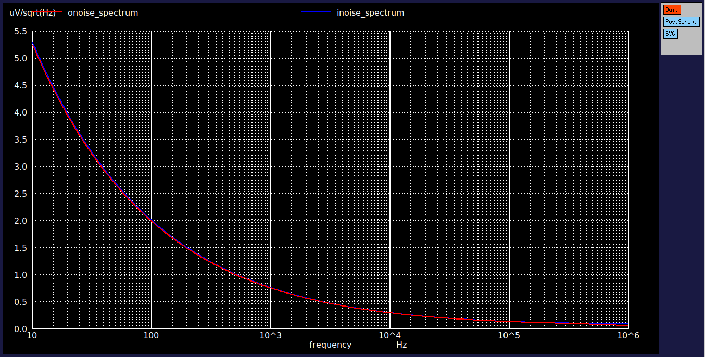

# IC-Characterization
This GitHub repository is created to provide hands-on experience in Analog IC Characterization using open-source tools such as **NGSpice**, **Xschem**, and the **SKY130 PDK**.
## What is Analog IC Characterization ?
Analog IC (Integrated Circuit) Characterization is the process of evaluating and measuring the electrical performance of an analog circuit under various conditions. This involves testing key parameters such as gain, offset, bandwidth, noise, power consumption, input/output impedance, temperature stability, and process variation sensitivity.

Characterization is carried out using tools like **Ngspice, Spectre, HSPICE, Eldo** (Simulation) and **Xschem** (Schematic) providing a complete framework for accurate simulation and analysis of analog circuits.

Characterization is usually performed post-design (pre- and post-fabrication) to ensure the circuit behaves as intended across different corners:

- Process Corners: Variations in manufacturing (e.g., TT, FF, SS).

- Voltage Corners: Operating at min/max supply voltages.

- Temperature Corners: Measuring across temperature range (e.g., -40°C to 125°C).

## Contents
- [1. Tool and PDK Setup](#1-tools-and-pdk-setup)
  - [1.1 Tools Setup](#11-tools-setup)
  - [1.2 PDK Setup](#12-pdk-setup)
  - [1.3 Install and Setup EDA Tools](#13-install-and-setup-eda-tools)
- [2. Writing a Netlist](#2-writing-a-netlist)
- [3. Linear Elements](#3-linear-elements)
  - [3.1 Resistors](#31-resistors)
  - [3.2 Capacitors](#32-capacitors)
  - [3.3 RC Circuits](#33-rc-circuits)
     - [3.3.1 Transient Analysis](#331-transient-analysis)
     - [3.3.2 AC Analysis](#332-ac-analysis)
  - [3.4 CR Circuits](#34-cr-circuits)
     - [3.4.1 Transient Analysis](#341-transient-analysis)
     - [3.4.2 AC Analysis](#342-ac-analysis)
- [4. MOSFET Circuits](#4-mosfet-circuits)
  - [4.1 NMOS Analysis](#41-nmos-analysis)
  - [4.2 PMOS Analysis](#42-pmos-analysis)
- [6. Current Mirror](#5-current-mirror)
  - [6.1 Simple Current Mirror using NMOS](#61-simple-current-mirror-using-nmos)
  - [6.2 Simple Current Mirror using PMOS](#62-simple-current-mirror-using-pmos)
  - [6.3 Cascode Current Mirror using NMOS](#63-cascode-current-mirror-using-nmos)
  - [6.4 Cascode Current Mirror using PMOS](#64-cascode-current-mirror-using-pmos)
  - [6.5 Wide Swing Cascode Current Mirror using NMOS](#65-wide-swing-cascode-current-mirror-using-nmos)
  - [6.6 Wide Swing Cascode Current Mirror using PMOS](#66-wide-swing-cascode-current-mirror-using-pmos)
  - [6.7 Self Biased Wide Swing Cascode Current Mirror using NMOS](#67-self-biased-wide-swing-cascode-current-mirror-using-nmos)
  - [6.8 Self Biased Wide Swing Cascode Current Mirror using PMOS](#68-self-biased-wide-swing-cascode-current-mirror-using-pmos)
- [7. Single Stage Amplifiers](#7-single-stage-amplifiers)
  - [7.1 Common Source Amplifier](#71-common-source-amplifier)
  - [7.2 Common Drain Amplifier](#72-common-drain-amplifier)
  - [7.3 Common Gate Amplifier](#73-common-gate-amplifier)
  
# 1. Tools and PDK setup

## 1.1 Tools setup
For the simulation of circuits we will need the following tools.
- Spice netlist simulation - [[Ngspice](https://ngspice.sourceforge.io/)]
- Schematic Editor - [[Xschem](https://xschem.sourceforge.io/stefan/index.html)]

### Ngspice


[Ngspice](http://ngspice.sourceforge.net/devel.html) is the open source spice simulator for electric and electronic circuits. Ngspice is an open project, there is no closed group of developers.

[Ngspice Reference Manual](https://ngspice.sourceforge.io/docs/ngspice-html-manual/manual.xhtml): Complete reference manual in HTML format.

## 1.2 PDK setup

A process design kit (PDK) is a set of files used within the semiconductor industry to model a fabrication process for the design tools used to design an integrated circuit. The PDK is created by the foundry defining a certain technology variation for their processes. It is then passed to their customers to use in the design process.

The PDK we are going to use is [Google Skywater 130nm PDK](https://skywater-pdk.readthedocs.io/en/main/).

Device Details: [docs](https://skywater-pdk.readthedocs.io/en/main/rules/device-details.html)


## 1.3 Install and Setup EDA Tools
- Launch Ubuntu 24.04. `Press Windows Key → select Ubuntu 24.04.`
- Update the system
```
  sudo apt update && sudo apt upgrade -y
```
- Clone the Github Repository
```
cd ~
git clone https://github.com/silicon-vlsi/SI-2025-AnalogIC.git

```
- Copy & make install scripts executable
```
cp ~/SI-2025-AnalogIC/install*.sh .
chmod +x install*.sh
```
- Install dependencies & EDA tools
```
./install-libs.sh
./install-eda.sh
```
- Add EDA environment variables
```
cat ~/SI-2025-AnalogIC/bashrc-eda >> ~/.bashrc
source ~/.bashrc
```
**Directory Structure** after installation should look like this:
```bash
share
└── pdk
cad
├── eda-ngspice
└── eda-xschem
work
└── xschem
.xschem/
└── simulations
```
# 2. Writing a Netlist
- To write a netlist in ``Ngspice`` we need to follow these steps.
- Open terminal and enter your working directory and type the following code:
```
mkdir IC_Char
cd IC_Char
```
- Make a new file ``vim file_name.sp`` to open a spice file (`.sp` is the file extension) with ``vim`` as a **Text Editor**. 

# 3. Linear Elements

## 3.1 Resistors

- A **resistor** is a passive electrical component that resists the flow of electric current, producing a voltage drop across its terminals according to **Ohm's Law**:   `` V = I * R ``
- The resistance R of a material depends on its physical properties and geometry, given by the formula: `` R = ρL / A ``
- In the **Skywater SKY130 PDK**, multiple resistor types are available for analog and digital IC design, offering different resistance values, temperature characteristics, and area trade-offs.

### Types of Resistors available :
- ``sky130_fd_pr__res_high_po.model`` has base models with *0.35u, 0.69u, 1.41u, 2.85u, 5.73u* as **bin width** (fixed) with changable lengths. 
- ``sky130_fd_pr__res_xhigh_po.model`` also has base models with *0.35u, 0.69u, 1.41u, 2.85u, 5.73u* as **bin width** (fixed) with changable lengths.
- ``sky130_fd_pr__res_generic_nd.model`` is a Generic N-diff type resister.
- ``sky130_fd_pr__res_generic_pd.model`` is a Generic P-diff type resister.

```
Title: Resistor Simulation

.lib "/home/sdash/share/pdk/sky130A/libs.tech/ngspice/sky130.lib.spice" tt  ; Load SKY130 PDK model at typical corner
.temp 25                                                                     ; Set simulation temperature to 25°C

Vin     in      0       DC 1.8        ; Apply 1.8V to the resistor input
Vm      in      1       0V            ; Zero-volt source used to measure current
X1      1       0       vdd   sky130_fd_pr__res_high_po_0p35 L=3.5   ; Resistor instance (high-poly) with L=3.5µm
vsup    vdd     gnd     DC 1.8        ; Body terminal of resistor tied to 1.8V supply

.op                                   ; Perform DC operating point analysis

.control
run                                   ; Run the simulation
print v(in)                           ; Display input voltage
print abs(i(Vm))                      ; Display current through resistor (via Vm)
let RES = v(in)/abs(i(Vm))           ; Calculate resistance using Ohm's Law
print RES                             ; Print calculated resistance
.endc

.end
```


### Calculation of Resistance Values

| Temperature | <-- | - 40 &#8451; | --> | <-- | 25 &#8451; | --> | <-- | 125 &#8451; | --> | Process Variation | TempCo |
| - | - | - | - | - | - | - | - | - | - | - | - |
| Types | hh | tt | ll | hh | tt | ll | hh | tt | ll | - | - |
| sky130_fd_pr_res_high_po_0p35 | 5.03k | 4.33k | 3.64k | 5.14k | 4.45k | 3.74k | 5.41k | 4.68k | 3.96k |
| sky130_fd_pr_res_high_po_0p69 | 4.25k | 3.68k | 3.12k | 4.35k | 3.78k | 3.20k | 4.59k | 3.99k | 3.39k | 
| sky130_fd_pr_res_high_po_1p41 | 3.89k | 3.40k | 2.91k | 3.99k | 3.49k | 2.99k | 4.22k | 3.70k | 3.17k | 
| sky130_fd_pr_res_high_po_2p85 | 3.73k | 3.27k | 2.81k | 3.83k | 3.36k | 2.89k | 4.06k | 3.57k | 3.07k |
| sky130_fd_pr_res_high_po_5p73 | 3.65k | 3.20k | 2.76k | 3.75k | 3.30k | 2.84k | 3.99k | 3.50k | 3.01k |

## 3.2 Capacitors

- A **capacitor** is a passive electrical component that stores energy in the form of an electric field, defined by the relation: `` Q = C * V ``, where `C` is the capacitance in Farads.
- The capacitance C of a parallel-plate capacitor depends on its physical structure and the material between the plates, given by the formula: `` C = εA / d ``

- In the **Skywater SKY130 PDK**, various capacitor types are available for use in analog, RF, and digital designs, each offering trade-offs in capacitance density, linearity, voltage rating, and temperature stability.

### Types of Capacitors available:
- ``sky130_fd_pr__cap_mim_m3_1.model`` is a **Metal-Insulator-Metal (MIM)** capacitor between **Metal3 and Metal2**, suitable for analog precision applications.
- ``sky130_fd_pr__cap_mim_m3_2.model`` is another **MIM** capacitor variant with different area usage and parasitic trade-offs.
- ``sky130_fd_pr__cap_mim_m2_1.model`` defines a MIM capacitor between **Metal2 and Metal1** layers.
- ``sky130_fd_pr__cap_var_lvt.model`` is a **MOS varactor** (voltage-dependent capacitor) built using LVT NMOS structure, useful for RF tuning.
- ``sky130_fd_pr__cap_var_hvt.model`` is a similar **varactor** using HVT device for different threshold and leakage behavior.

```
* RC Charging Circuit with Pulse Input
.lib "/home/sdash/share/pdk/sky130A/libs.tech/ngspice/sky130.lib.spice tt"
.temp 25

V1      in      0       pulse(0 1.8 0 1p 1p 100p 200p)
R1      in      out     4.45k
XC1     out     0       sky130_fd_pr__cap_mim_m3_1 w=1 l=1

.tran 0.1n 1n

.control
run
plot v(in) v(out)
.endc

.end
```
- We manually calculated the cap values using `C = τ / R`, where `τ` is 63% of V(output).


### Calculation of Capacitance Values

| Temperature | <-- | - 40 &#8451; | --> | <-- | 25 &#8451; | --> | <-- | 125 &#8451; | --> | Process Variation | TempCo |
| - | - | - | - | - | - | - | - | - | - | - | - |
| **Types** | hh | tt | ll | hh | tt | ll | hh | tt | ll | - | - |
| sky130_fd_pr_cap_mim_m3_1 | 3.35f | 2.76f | 2.11f | 3.31f | 2.76f | 2.14f | 3.30f | 2.76f | 2.11f |
| sky130_fd_pr_cap_mim_m3_2 | 3.52f | 2.96f | 2.29f | 3.43f | 2.96f | 2.29f | 3.52f | 2.96f | 2.29f |

## 3.3 RC Circuits

- An **RC circuit** is an electric circuit composed of **resistors (R)** and **capacitors (C)**, which exhibit a time-dependent response to voltage or current changes. The fundamental time constant is defined as:  
`τ = R * C`,
where `τ` (tau) represents the **time constant** in seconds, indicating how quickly the circuit charges or discharges.

- In the **Skywater SKY130 PDK**, **RC circuits** are implemented using integrated resistors (e.g., `sky130_fd_pr__res_high_po`) and capacitors (e.g., `sky130_fd_pr__cap_mim_m3_1`). These are critical in analog and mixed-signal design applications such as filters, timing circuits, and analog front ends.


### 3.3.1 Transient Analysis

```
Title: RC Ckt Simulation using SKY130 model

.lib "/home/sdash/share/pdk/sky130A/libs.tech/ngspice/sky130.lib.spice tt"
.temp 25

Vin     in      0       PULSE(0 1.8 0 0 0 100p 200p)
XR1     in      out     0       sky130_fd_pr__res_high_po_0p35 l =3.5
XC1     out     0       sky130_fd_pr__cap_mim_m3_1 w=1 l=1

.tran 1p 300p

.control
run
plot v(in) v(out)
.endc

*Measure Time delays
.meas tran rise        TRIG V(out) VAL=0.18 RISE=1 TARG V(out) VAL=1.62 RISE=1 ; rise‑time 10 % → 90 % at V(out)
.meas tran fall        TRIG V(out) VAL=1.62 FALL=1 TARG V(out) VAL=0.18 FALL=1 ; fall‑time 90 % → 10 % at V(out)
.meas tran rise_delay  TRIG V(in)  VAL=0.9  RISE=1 TARG V(out) VAL=0.9  RISE=1 ; tpd (low→high) 50 % V(in) → 50 % V(out)
.meas tran fall_delay  TRIG V(in)  VAL=0.9  FALL=1 TARG V(out) VAL=0.9  FALL=1 ; tpd (high→low) 50 % V(in) → 50 % V(out)

*Measure Max Voltage
.meas tran VMAX MAX V(out) ; peak V(out) during transient

.end
```


### Calculation of Rise, Fall and Propagation Delay


## 3.3.2 AC Analysis

```
* RC circuit AC analysis
.lib "/home/sdash/share/pdk/sky130A/libs.tech/ngspice/sky130.lib.spice" tt
.temp 25

V1      in      0       AC 1
XR1     in      out     0       sky130_fd_pr__res_high_po_0p35  l=3.5
XC1     out     0       sky130_fd_pr__cap_mim_m3_1 w=1 l=1

* AC Simulation
.ac dec 10 1 15g

* Output commands
.control
run
.meas ac f3db WHEN VDB(out) = -3 ; –3 dB cutoff frequency
plot vdb(out)
.endc

.end
```


### Calculation of Cutoff Frequency (Hz)

| Temperature | <-- | - 40 &#8451; | --> | <-- | 25 &#8451; | --> | <-- | 125 &#8451; | --> |
| - | - | - | - | - | - | - | - | - | - |
| **Types** | hh | tt | ll | hh | tt | ll | hh | tt | ll |
| sky130_fd_pr__res_high_po_0p35 & sky130_fd_pr_cap_mim_m3_1 | 7.32G | 10.05G | 16.91G | 7.39G | 10.57G | 16.66G | 7.37G | 10.37G | 15.99G |

## 3.4 CR Circuits

- A **Cr circuit** is essentially the same as an RC circuit, but with the capacitor (C) placed before the resistor (R) in the signal path. While electrically the time constant remains the same, the circuit response differs, especially in transient analysis. The fundamental time constant is defined as:  
`τ = R * C`,
where `τ` (tau) represents the **time constant** in seconds, indicating how quickly the circuit charges or discharges.

- In the **Skywater SKY130 PDK**, **CR circuits** are implemented using integrated capacitors (e.g., `sky130_fd_pr__cap_mim_m3_1`) and resistors (e.g., `sky130_fd_pr__res_high_po`). These configurations are often used in differentiator circuits, pulse shaping, and AC coupling applications in analog and RF systems.


## 3.4.1 Transient Analysis

```

```


### Calculation of Rise, Fall and Propagation Delay


## 3.4.2 AC Analysis

```

```


### Calculation of Cutoff Frequency (Hz)

| Temperature | <-- | - 40 &#8451; | --> | <-- | 25 &#8451; | --> | <-- | 125 &#8451; | --> |
| - | - | - | - | - | - | - | - | - | - |
| **Types** | hh | tt | ll | hh | tt | ll | hh | tt | ll |
| sky130_fd_pr_cap_mim_m3_1 & sky130_fd_pr__res_high_po_0p35 |  |  |  |  |  |  |  |  |  |

# 4. MOSFET Circuits

- A MOSFET (Metal-Oxide-Semiconductor Field-Effect Transistor) is a three-terminal active device used for switching and amplification. Its current is controlled by the voltage applied to the gate terminal.
- The MOSFET operates in three regions: cutoff, linear, and saturation, depending on gate-source (V<sub>GS</sub>) and drain-source (V<sub>DS</sub>) voltages.
- In the Skywater SKY130 PDK, MOSFETs like `sky130_fd_pr__nfet_01v8` (NMOS) and `sky130_fd_pr__pfet_01v8` (PMOS) are commonly used. These are essential in digital logic, analog amplifiers, and switching applications.

## 4.1 NMOS Analysis

- A **NMOS** (N-type MOSFET) is a majority-carrier device where current flows between the drain and source when a positive voltage is applied to the gate. It acts as a voltage-controlled current source.
- The drain current (I<sub>D</sub>) depends on the gate-to-source voltage (V<sub>GS</sub>), and its behavior changes across three regions:
  - Cutoff: V<sub>GS</sub> < V<sub>th</sub>, I<sub>D</sub> ≈ 0
  - Linear: V<sub>GS</sub> > V<sub>th</sub> and V<sub>DS</sub> < V<sub>GS</sub> − V<sub>th</sub>
  - Saturation: V<sub>DS</sub> ≥ V<sub>GS</sub> − V<sub>th</sub>
- The I<sub>D</sub>-V<sub>GS</sub> curve shows how the drain current increases with gate voltage (at constant V<sub>DS</sub>), helping identify the threshold voltage (V<sub>th</sub>), where the transistor starts conducting. This curve is essential for characterizing the device and is often used in DC sweep simulations.
- In the Skywater SKY130 PDK, NMOS devices like `sky130_fd_pr__nfet_01v8` are used in logic gates, analog blocks, and current sources.

```
* nmos analysis

.lib "/home/sdash/share/pdk/sky130A/libs.tech/ngspice/sky130.lib.spice" tt
.include "/home/sdash/share/pdk/sky130A/libs.ref/sky130_fd_pr/spice"
.temp 25

Vd      1       0       DC 1.8
Vid     1       d       DC 0
Vg      g       0       DC 0

* NMOS: D G S B
X1      d       g       0       0       sky130_fd_pr__nfet_01v8 w=0.42 l=1

.control
run
save all

*Uncomment these 2 lines for ID vs VGS Curve
*dc vg 0 1.8 0.001 vd 0 1.8 0.1
*plot  I(vid) xlabel "VGS (V)"  ylabel "ID (A)" title "ID vs VGS"

*Uncomment these 2 lines for ID vs VDS Curve
*dc vd 0 1.8 0.001 vg 0 1.8 0.1
*plot  I(vid) xlabel "VDS (V)"  ylabel "ID (A)" title "ID vs VDS"

.endc

.end
```
### I<sub>D</sub>-V<sub>GS</sub> curve


### I<sub>D</sub>-V<sub>DS</sub> curve


### Parameters across PVT

## 4.2 PMOS Analysis
- A **PMOS** (P-type MOSFET) is a majority-carrier device where current flows between the source and drain when a negative voltage is applied to the gate. Like NMOS, it behaves as a voltage-controlled current source but with opposite polarity.
- The drain current (I<sub>D</sub>) depends on the gate-to-source voltage (V<sub>GS</sub>), and its behavior changes across three regions:
  - Cutoff: V<sub>GS</sub> > V<sub>th</sub>, I<sub>D</sub> ≈ 0
  - Linear: V<sub>GS</sub> < V<sub>th</sub> and V<sub>SD</sub> < V<sub>SG</sub> − |V<sub>th</sub>|
  - Saturation: V<sub>SD</sub> ≥ V<sub>SG</sub> − |V<sub>th</sub>|
- The I<sub>D</sub>-V<sub>GS</sub> curve for a PMOS shows how drain current increases as gate voltage becomes more negative (at constant V<sub>DS</sub>), and helps extract the threshold voltage (V<sub>th</sub>), where the PMOS starts to conduct.
- In the Skywater SKY130 PDK, PMOS devices like `sky130_fd_pr__pfet_01v8` are widely used in CMOS logic, analog switches, and current mirrors.

```
* pmos analysis

.lib "/home/sdash/share/pdk/sky130A/libs.tech/ngspice/sky130.lib.spice" tt
.temp 25

* Bias sources
VS      s       0       1.8 ; Source at 1.8 V 
VG      g       0       0   ; Gate 
VD      d       0       0   ; Drain at 0 V

* PMOS: D  G  S  B
X1 d g s s sky130_fd_pr__pfet_01v8 w=1 l=0.15

.control
run
save all

*Uncomment these 2 lines for ID vs VGS Curve
*dc VG 0 1.8 0.01 VD 0 1.8 0.1
*plot I(VD) xlabel "VGS (V)" ylabel "ID (A)" title "PMOS ID vs VGS"

*Uncomment these 2 lines for ID vs VDS Curve
*dc VD 0 1.8 0.01 VG 0 1.8 0.1
*plot I(VD) xlabel "VDS (V)" ylabel "ID (A)" title "PMOS ID vs VDS"

.endc

.end
```
### I<sub>D</sub>-V<sub>GS</sub> curve


### I<sub>D</sub>-V<sub>DS</sub> curve


### Parameters across PVT

# 6. Current Mirror

## 6.1 Simple Current Mirror using NMOS


### Input Impedence
```
* To find the input impedence ofcurrent mirror
.lib "/home/manas6008/share/pdk/sky130A/libs.tech/ngspice/sky130.lib.spice" tt
.temp 25
Iref drain n1 dc 100u
Vdd drain 0 dc 1.8
XM1 n1 n1  0  0 sky130_fd_pr__nfet_01v8_lvt  L=1 W=0.42 m=10
.control
dc Iref 0 100u 0.01u
run
plot  v(n1)
.endc
.end
```


### Output Impedence
```
* Output impedence of current mirror
.lib "/home/manas6008/share/pdk/sky130A/libs.tech/ngspice/sky130.lib.spice" tt
.temp 25
Vgs n1 0 dc 1.042 ;1.042 comes from Vinmin+Vt
Vd drain1 0 dc 1.8
XM12 drain1  n1  0  0 sky130_fd_pr__nfet_01v8_lvt  L=1 W=0.42 m=10
.control
dc Vd 0 1.8 0.01
run
plot  -i(Vd)
.endc
.end
```


### Gain
```
*gain of current mirror

.lib "/home/manas6008/share/pdk/sky130A/libs.tech/ngspice/sky130.lib.spice" tt
.temp 25

I1 0 n1 100u
V1 n2 0 1.8
X1 n1 n1 0 0  sky130_fd_pr__nfet_01v8_lvt l=1 w=0.42 m=10
X2 n2 n1 0 0  sky130_fd_pr__nfet_01v8_lvt l=1 w=0.42 m=10

.control
dc I1 0 100u 0.01u
run
plot abs(i(V1))
.endc
.end
```

### Calculation of input and output impedence

| Temperature | <-- | <-- | 25 &#8451; | --> | --> | 
| - | - | - | - | - | - |
| Types | ss | tt | ff | fs | sf | 
| Input Impedence |  3.22k  |  2.86k  |  2.63k  |  3.38k  |  2.55k  |
| Output Impedence | 140.16k | 124.35k | 97.48k | 121.08k | 94.89k |

## 6.2 Simple Current Mirror using PMOS


### Input Impedence
```
* Input impedence of pmos current mirror
.lib "/home/manas6008/share/pdk/sky130A/libs.tech/ngspice/sky130.lib.spice tt"
.temp 25
Vdd     n1      0       dc      1.8
XM1     n2      n2      n1      n1      sky130_fd_pr__pfet_01v8_lvt  L=8 W=7 m=10
I1      n2      0       dc      50u
.control
dc I1 0 50u 0.01u
run
plot v(n2)
.endc
.end
```


### Output Impedence
```
*Output impedence of pmos current mirror
.lib "/home/manas6008/share/pdk/sky130A/libs.tech/ngspice/sky130.lib.spice tt"
.temp 25
Vdd     n1      0       dc      1.8
XM1     0      n2      n1      n1      sky130_fd_pr__pfet_01v8_lvt  L=8 W=7 m=10
Vgs     n2      0       0.616 ; 0.616 comes from vinmin+vt , vinmin=1.267 and vt=-0.651
.control
dc Vdd 0 1.8 0.01
run
plot abs(i(Vdd))
.endc
.end
```


### Gain
```
*Gain of pmos current mirror
.lib "/home/manas6008/share/pdk/sky130A/libs.tech/ngspice/sky130.lib.spice tt"
.temp 25
Vdd     n1      0       dc      1.8
XM1     n2      n2      n1      n1      sky130_fd_pr__pfet_01v8_lvt  L=8 W=7 m=10
XM2     0      n2      n5      n5      sky130_fd_pr__pfet_01v8_lvt  L=8 W=7 m=10
I1      n2      0       dc      50u
V1      n5      0       dc      1.8
.control
dc I1 0 50u 0.01u
run
plot  abs(i(V1))
.endc
.end
```


### Calculation of input and output impedence

| Temperature | <-- | <-- | 25 &#8451; | --> | --> | 
| - | - | - | - | - | - |
| Types | ss | tt | ff | fs | sf | 
| Input Impedence |  4.6k  |  5.7k  |  4.7k  |  4.8k  |  4.2k  |
| Output Impedence | 77k | 215k | 205k | 348k | 180k |


## 6.3 Cascode Current Mirror using NMOS


### Input Impedence
```
*input impedence of cascode current mirror
.lib "/home/manas6008/share/pdk/sky130A/libs.tech/ngspice/sky130.lib.spice" tt
.temp 25
Iref drain n1 dc 100u
Vdd drain 0 dc 1.8
XM1 n1  n1  n2  0 sky130_fd_pr__nfet_01v8_lvt  L=1 W=0.42 m=10
XM12 n2 n2   0  0 sky130_fd_pr__nfet_01v8_lvt  L=1 W=0.42 m=10
.control
dc Iref 0 100u 0.01u
plot  v(n1) v(n2)
.endc
.end
```


### Output Impedence
```
* output impedence of cascode current mirror
.lib "/home/manas6008/share/pdk/sky130A/libs.tech/ngspice/sky130.lib.spice" tt
.temp 25
Vdd drain 0 dc 1.8
Vgs1 n1 0 2.029
Vgs2 n2 0 1.208
XM2 drain n1  n3  0 sky130_fd_pr__nfet_01v8_lvt  L=1 W=0.42 m=10
XM21 n3  n2  0  0 sky130_fd_pr__nfet_01v8_lvt  L=1 W=0.42 m=10
.control
dc Vdd 0 1.8 0.01
plot  abs(i(Vdd))
.endc
.end
```


### Gain
```
* gain of cascode current mirror
.lib "/home/manas6008/share/pdk/sky130A/libs.tech/ngspice/sky130.lib.spice" tt
.temp 25
Iref drain n1 dc 100u
Vdd drain 0 dc 1.8
XM1 n1  n1  n2  0 sky130_fd_pr__nfet_01v8_lvt  L=1 W=0.42 m=10
XM12 n2 n2   0  0 sky130_fd_pr__nfet_01v8_lvt  L=1 W=0.42 m=10
Vd drain1 0 dc 1.8
XM2 drain1 n1  n3  0 sky130_fd_pr__nfet_01v8_lvt  L=1 W=0.42 m=10
XM21 n3  n2  0  0 sky130_fd_pr__nfet_01v8_lvt  L=1 W=0.42 m=10
.control
dc Iref 0 100u 0.01u
plot  abs(i(Vd))
.endc
.end
```


### Calculation of input and output impedence

| Temperature | <-- | <-- | 25 &#8451; | --> | --> | 
| - | - | - | - | - | - |
| Types | ss | tt | ff | fs | sf | 
| Input Impedence |  10.5k  |  8.73k  |  7.75k  |  10.3k  |  7.84k  |
| Output Impedence | 230.65k | 130.67k | 81.66k | 159.34k | 157.08k |

## 6.4 Cascode Current Mirror using PMOS


### Input Impedence
```
*input impedence of pmos cascode current mirror
.lib "/home/manas6008/share/pdk/sky130A/libs.tech/ngspice/sky130.lib.spice tt"
.temp 25
Vdd     n1      0       dc      1.8
XM1     n2      n2      n1      n1      sky130_fd_pr__pfet_01v8_lvt  L=8 W=7 m=10
XM2     n3      n3      n2      n1      sky130_fd_pr__pfet_01v8_lvt  L=8 W=7 m=10
I1      n3      0       dc      50u
.control
dc I1 0 50u 0.01u
run
plot  v(n2) v(n3)
.endc
.end
```


### Output Impedence
```
*Output impedence of pmos cascode current mirror
.lib "/home/manas6008/share/pdk/sky130A/libs.tech/ngspice/sky130.lib.spice tt"
.temp 25
Vdd     n1      0       dc      1.8
XM1     n2     0.591      n1      n1      sky130_fd_pr__pfet_01v8_lvt  L=8 W=7 m=10
XM2     0      0.141      n2      n1      sky130_fd_pr__pfet_01v8_lvt  L=8 W=7 m=10
.control
dc Vdd 0 1.8 0.01
run
plot  abs(i(Vdd))
.endc
.end
```


### Gain
```
*Gain of pmos cascode current mirror
.lib "/home/manas6008/share/pdk/sky130A/libs.tech/ngspice/sky130.lib.spice tt"
.temp 25
Vdd     n1      0       dc      1.8
XM1     n2      n2     n1      n1      sky130_fd_pr__pfet_01v8_lvt  L=8 W=7 m=10
XM2     n3      n3     n2      n1      sky130_fd_pr__pfet_01v8_lvt  L=8 W=7 m=10
I1      n3      0       50u
XM3     n4      n2     n5      n5      sky130_fd_pr__pfet_01v8_lvt  L=8 W=7 m=10
XM4     0       n3     n4      n5      sky130_fd_pr__pfet_01v8_lvt  L=8 W=7 m=10
V1      n5      0       1.8
.control
dc I1 0 50u 0.01u
run
plot abs(i(V1))
.endc
.end
```


### Calculation of input and output impedence

| Temperature | <-- | <-- | 25 &#8451; | --> | --> | 
| - | - | - | - | - | - |
| Types | ss | tt | ff | fs | sf | 
| Input Impedence |  2.9k  |  2.5k  |  3k  |  3.3k  |  2.7k  |
| Output Impedence | 103k | 459k | 104k | 777k | 119k |


## 6.5 Wide Swing Cascode Current Mirror using NMOS


### Input Impedence
```
*input impedence of wide swing current mirror
.lib "/home/manas6008/share/pdk/sky130A/libs.tech/ngspice/sky130.lib.spice" tt
.temp 25
I1      0       n1      50u
X1      n1      n1      0       0       sky130_fd_pr__nfet_01v8_lvt l=4 w=0.42 m=10
I2      0       n2      50u
X2      n2      n1      n3      0       sky130_fd_pr__nfet_01v8_lvt l=1 w=0.42 m=10
X3      n3      n2      0       0       sky130_fd_pr__nfet_01v8_lvt l=1 w=0.42 m=10
.control
run
dc I1 0 50u 0.01u
plot v(n1)
dc I2 0 50u 0.01u
plot v(n2)
.endc
.end
```


### Output Impedence
```
* output impedence of wide swing current mirror
.lib "/home/manas6008/share/pdk/sky130A/libs.tech/ngspice/sky130.lib.spice" tt
.temp 25
Vgs1    n1      0       2.491
Vgs2    n2      0       1.254
X4      n4      n1      n5      0       sky130_fd_pr__nfet_01v8_lvt l=1 w=0.42 m=10
X5      n5      n2      0       0       sky130_fd_pr__nfet_01v8_lvt l=1 w=0.42 m=10
Vt      n4      0       1.8
.control
run
dc Vt 0 1.8 0.01
plot abs(i(Vt))
.endc
.end
```


### Gain
```
* gain of wide swing current mirror
.lib "/home/manas6008/share/pdk/sky130A/libs.tech/ngspice/sky130.lib.spice" tt
.temp 25
I1      0       n1      50u
X1      n1      n1      0       0       sky130_fd_pr__nfet_01v8_lvt l=4 w=0.42 m=10
I2      0       n2      50u
X2      n2      n1      n3      0       sky130_fd_pr__nfet_01v8_lvt l=1 w=0.42 m=10
X3      n3      n2      0       0       sky130_fd_pr__nfet_01v8_lvt l=1 w=0.42 m=10
X4      n4      n1      n5      0       sky130_fd_pr__nfet_01v8_lvt l=1 w=0.42 m=10
X5      n5      n2      0       0       sky130_fd_pr__nfet_01v8_lvt l=1 w=0.42 m=10
Vt      n4      0       1.8
.control
run
dc I1 0 50u 0.01u
dc I2 0 50u 0.01u
plot abs(i(Vt))
.endc
.end
```


### Calculation of input and output impedence

| Temperature | <-- | <-- | 25 &#8451; | --> | --> | 
| - | - | - | - | - | - |
| Types | ss | tt | ff | fs | sf | 
| Input Impedence |  9.93k  |  8.79k  |  7.61k  |  10.28k  |  7.94k  |
| Output Impedence | 130.27k | 83.31k | 101.45k | 69.18k | 124.86k |

## 6.6 Wide Swing Cascode Current Mirror using PMOS


### Input Impedence
```
*input impedence of pmos wide swing cascode current mirror
.lib "/home/manas6008/share/pdk/sky130A/libs.tech/ngspice/sky130.lib.spice tt"
.temp 25
V1      n1      0       dc      1.8
XM1     n2      n2     n1      n1      sky130_fd_pr__pfet_01v8_lvt  L=32 W=7 m=10
I1      n2      0       50u
XM2     n3      n2     n4      n1      sky130_fd_pr__pfet_01v8_lvt  L=8 W=7 m=10
I2      n3      0      50u
XM3     n4      n3     n1      n1      sky130_fd_pr__pfet_01v8_lvt  L=8 W=7 m=10
.control
run
dc I1 0 50u 0.01u
plot v(n2)
dc I2 0 50u 0.01u
plot v(n3)
.endc
.end
```


### Output Impedence
```
*output impedence of pmos wide swing cascode current mirror
.lib "/home/manas6008/share/pdk/sky130A/libs.tech/ngspice/sky130.lib.spice tt"
.temp 25
V1      n1      0       dc      1.8
XM1     n4      0.531     n1      n1      sky130_fd_pr__pfet_01v8_lvt  L=8 W=7 m=10
XM2     0       0.492     n4      n1      sky130_fd_pr__pfet_01v8_lvt  L=8 W=7 m=10
.control
run
dc V1 0 1.8 0.01
plot abs(i(V1))
.endc
.end
```


### Gain
```
*Gain of pmos current mirror
.lib "/home/manas6008/share/pdk/sky130A/libs.tech/ngspice/sky130.lib.spice tt"
.temp 25
V1      n1      0       dc      1.8
XM1     n2      n2     n1      n1      sky130_fd_pr__pfet_01v8_lvt  L=32 W=7 m=10
I1      n2      0       50u
V2      n5      0       dc      0
XM2     n3      n2     n4      n1      sky130_fd_pr__pfet_01v8_lvt  L=8 W=7 m=10
I2      n3      0       50u
XM3     n4      n3     n1      n1      sky130_fd_pr__pfet_01v8_lvt  L=8 W=7 m=10
XM4     n6      n3     n1      n1      sky130_fd_pr__pfet_01v8_lvt  L=8 W=7 m=10
XM5     n5      n2     n6      n1      sky130_fd_pr__pfet_01v8_lvt  L=8 W=7 m=10
.control
run
dc I2 0 50u 0.01u
plot abs(i(V2))
.endc
.end
```


## 6.7 Self Biased Wide Swing Cascode Current Mirror using NMOS


### Input Impedence
```
* input impedence of self bias current mirror
.lib "/home/manas6008/share/pdk/sky130A/libs.tech/ngspice/sky130.lib.spice" tt
.temp 25
I1      0       n1      100u
R1      n1      n2      2k
XM1     n2      n1      n3      0       sky130_fd_pr__nfet_01v8_lvt  L=1 W=0.42 m=10
XM2     n3      n2      0       0       sky130_fd_pr__nfet_01v8_lvt  L=1 W=0.42 m=10
.control
dc I1  0 100u  0.01u
run
plot  v(n2) v(n1)
.endc
.end
```


### Output Impedence
```
* output impedence of self bias current mirror
.lib "/home/manas6008/share/pdk/sky130A/libs.tech/ngspice/sky130.lib.spice" tt
.temp 25
Vm      n5      0       1.8
Vgs1    n1      0       2.059
Vgs2    n2      0       1.232
XM3     n5      n1      n6       0       sky130_fd_pr__nfet_01v8_lvt  L=1 W=0.42 m=10
XM4     n6      n2      0       0       sky130_fd_pr__nfet_01v8_lvt  L=1 W=0.42 m=10
.control
dc Vm 0 1.8 0.01
run
plot  abs(i(Vm))
.endc
.end
```


### Gain
```
* gain of self bias current mirror
.lib "/home/manas6008/share/pdk/sky130A/libs.tech/ngspice/sky130.lib.spice" sf
.temp 25
I1      0       n1      100u
R1      n1      n2      2k
Vm      n5      0       1.8
XM1     n2      n1      n3      0       sky130_fd_pr__nfet_01v8_lvt  L=1 W=0.42 m=10
XM2     n3      n2      0       0       sky130_fd_pr__nfet_01v8_lvt  L=1 W=0.42 m=10
XM3     n5      n1      n6       0       sky130_fd_pr__nfet_01v8_lvt  L=1 W=0.42 m=10
XM4     n6      n2      0       0       sky130_fd_pr__nfet_01v8_lvt  L=1 W=0.42 m=10
.control
dc I1  0 100u  0.01u
run
plot  -i(Vm)
.endc
.end
```


### Calculation of input and output impedence

| Temperature | <-- | <-- | 25 &#8451; | --> | --> | 
| - | - | - | - | - | - |
| Types | ss | tt | ff | fs | sf | 
| Input Impedence |  8.71k  |  7.46k  |  6.67k  |  8.86k  |  6.58k  |
| Output Impedence | 102.79k | 84.82k | 82.11k | 92.34k | 128.03k |

## 6.8 Self Biased Wide Swing Cascode Current Mirror using PMOS


### Input Impedence
```
*input impedence of pmos self bias current mirror
.lib "/home/manas6008/share/pdk/sky130A/libs.tech/ngspice/sky130.lib.spice tt"
.temp 25
V1      n1      0       dc      1.8
XM1     n4      n2     n1      n1      sky130_fd_pr__pfet_01v8_lvt  L=8 W=7 m=10
XM2     n2      n3     n4      n1      sky130_fd_pr__pfet_01v8_lvt  L=8 W=7 m=10
I1      n3      0       50u
R1      n2      n3      1k
.control
run
dc I1 0 50u  0.01u
plot v(n2) v(n3)
.endc
.end
```


### Output Impedence
```
*output impedence of pmos self bias current mirror
.lib "/home/manas6008/share/pdk/sky130A/libs.tech/ngspice/sky130.lib.spice tt"
.temp 25
V1      n1      0       dc      1.8
XM1     n4     0.494     n1      n1      sky130_fd_pr__pfet_01v8_lvt  L=8 W=7 m=10
XM2     0      0.492     n4      n1      sky130_fd_pr__pfet_01v8_lvt  L=8 W=7 m=10
.control
run
dc V1 0 1.8  0.01
plot abs(i(V1))
.endc
.end
```


### Gain
```
*Gain of pmos self bias current mirror
.lib "/home/manas6008/share/pdk/sky130A/libs.tech/ngspice/sky130.lib.spice tt"
.temp 25
V1      n1      0       dc      1.8
XM1     n4      n2    n1      n1      sky130_fd_pr__pfet_01v8_lvt  L=8 W=7 m=10
XM2     n2      n3    n4      n1      sky130_fd_pr__pfet_01v8_lvt  L=8 W=7 m=10
I1      n3      0       50u
R1      n2      n3      1k
V2      n5      0       1.8
XM3     n6      n2    n5      n5      sky130_fd_pr__pfet_01v8_lvt  L=8 W=7 m=10
XM4     0      n3    n6      n5      sky130_fd_pr__pfet_01v8_lvt  L=8 W=7 m=10
.control
run
dc I1 0 50u  0.01u
plot abs(i(V2))
.endc
.end
```


# 7. Single Stage Amplifiers

## 7.1 Common Source Amplifier
```
* common source

.lib "/home/manas6008/share/pdk/sky130A/libs.tech/ngspice/sky130.lib.spice" sf
.temp 125

Vdd n1 0 dc 1.8
R1 n1 n2 1k
V1 n2 n3 dc 0
XM1 n3  gate 0  0 sky130_fd_pr__nfet_01v8_lvt  L=1 W=0.42
vg gate 0 dc 1.8

.control
run
* high input impedence infinity between gate and source
*dc Vg 0 1.8 0.01
*plot i(Vg)
*high output impedence between drain and source
*dc Vdd 0 1.8 0.01
*plot  i(V1)
.endc
.end
```

### Input impedence

### Output impedence


### Calculation of input and output impedence

| Temperature | <-- | - 40 &#8451; | --> | <-- | 25 &#8451; | --> | <-- | 125 &#8451; | --> | 
| - | - | - | - | - | - | - | - | - | - | 
| Types | ss | tt | ff | ss | tt | ff | ss | tt | ff | 
| Input Impedence |  ∞  |  ∞  |  ∞  |  ∞  |  ∞  |  ∞  |  ∞  |  ∞  |  ∞  |
| Output Impedence | 289.49k | 278.26k | 266.32k | 395.56k | 198.03k | 156.9k | 492.17k | 326.21k | 285.06k |

## 7.2 Common Drain Amplifier
```
* common drain

.lib "/home/manas6008/share/pdk/sky130A/libs.tech/ngspice/sky130.lib.spice" ss
.temp 25

Vdd drain 0 dc 1.8
Vg gate 0 dc 1.8
XM1 drain  gate n1 0 sky130_fd_pr__nfet_01v8_lvt  L=1 W=0.42
R1 n1 0 1k
V1 drain n1 dc 0

.control
run
* high input impedence infinity between gate and drain
*dc Vg 0 1.8 0.01
*plot  i(Vg)
*low output impedence between source and drain
*dc Vdd 0 1.8 0.01
*plot i(V1)
.endc
.end
```

### Input impedence

### Output impedence


### Calculation of input and output impedence

| Temperature | <-- | - 40 &#8451; | --> | <-- | 25 &#8451; | --> | <-- | 125 &#8451; | --> | 
| - | - | - | - | - | - | - | - | - | - | 
| Types | ss | tt | ff | ss | tt | ff | ss | tt | ff | 
| Input Impedence |  ∞  |  ∞  |  ∞  |  ∞  |  ∞  |  ∞  |  ∞  |  ∞  |  ∞  |
| Output Impedence | 1.006k | 1.027k | 0.99k | 1.018k | 0.995k | 0.999k | 1.003k | 1.028k | 1.014k |

## 7.3 Common Gate Amplifier
```
* common gate

.lib "/home/manas6008/share/pdk/sky130A/libs.tech/ngspice/sky130.lib.spice" ss
.temp 25

Vdd drain 0 dc 1.8
Vg gate 0 dc 1.8
XM1 drain  gate 0  0 sky130_fd_pr__nfet_01v8_lvt  L=1 W=0.42
*V1 n1 0  dc 1.8

.control
run
* low input impedence between source and gate
*dc V1 0 1.8 0.01
*plot  i(V1)
*high output impedence infinity between drain and gate
*dc Vdd 0 1.8 0.01
*plot i(Vg)
.endc
.end
```

### Input impedence

### Output impedence


### Calculation of input and output impedence

| Temperature | <-- | - 40 &#8451; | --> | <-- | 25 &#8451; | --> | <-- | 125 &#8451; | --> | 
| - | - | - | - | - | - | - | - | - | - | 
| Types | ss | tt | ff | ss | tt | ff | ss | tt | ff |
| Input Impedence | 13.28k | 10.94k | 9.08k | 16.43k | 12.73k | 9.938k | 25.94k | 20.12k | 15.36k |
| Output Impedence |  ∞  |  ∞  |  ∞  |  ∞  |  ∞  |  ∞  |  ∞  |  ∞  |  ∞  |

# 7. Differential Amplifier

## DC Analysis
```
*dc analysis differntial amplifier
.lib "/home/manas6008/share/pdk/sky130A/libs.tech/ngspice/sky130.lib.spice" tt
.temp 25
Vdd d 0 1.8
XM1 g1  g1 d  d sky130_fd_pr__pfet_01v8_lvt  L=8 W=7 m=10
XM2 n1  g1 d  d sky130_fd_pr__pfet_01v8_lvt  L=8 W=7 m=10
XM3 g1  n3  n2  0 sky130_fd_pr__nfet_01v8_lvt  L=0.5 W=7
XM4 n1  n3  n7  0 sky130_fd_pr__nfet_01v8_lvt  L=0.5 W=7
Vn  n3 0 1.25 
Iref 0 n4  50u
XM5 n4  n4  0  0 sky130_fd_pr__nfet_01v8_lvt  L=4 W=5 m=10
XM6 n8  n4  0  0 sky130_fd_pr__nfet_01v8_lvt  L=4 W=5 m=10
C1 n1 0 500f
V1 n2 n6 0
V2 n7 n6 0
V3 n6 n8 0
.op
.control
run
*dc Vn 0 1.8 0.01
*plot v(n1)
print v(n2)
print v(g1)
print v(n1)
print i(vdd)
print i(V1)
print i(V2)
print i(v3)
.endc
.end
```
### DC output of differntial amplifier

## AC Analysis
```
* ac analysis differntial amplifier
.lib "/home/manas6008/share/pdk/sky130A/libs.tech/ngspice/sky130.lib.spice" tt
.temp 25
Vdd d 0 1.8
XM1 g1  g1 d  d sky130_fd_pr__pfet_01v8_lvt  L=8 W=7 m=10
XM2 n1  g1 d  d sky130_fd_pr__pfet_01v8_lvt  L=8 W=7 m=10
XM3 g1  n3  n2  0 sky130_fd_pr__nfet_01v8_lvt  L=.5 W=7
XM4 n1  n5  n7  0 sky130_fd_pr__nfet_01v8_lvt  L=.5 W=7
Vn  n3 0 1.25 ac 0.5
Vp  n5 0 1.25 ac -0.5
Iref 0 n4  50u
XM5 n4  n4  0  0 sky130_fd_pr__nfet_01v8_lvt  L=4 W=5 m=10
XM6 n8  n4  0  0 sky130_fd_pr__nfet_01v8_lvt  L=4 W=5 m=10
C1 n1 0 500f
V1 n2 n6 0
V2 n7 n6 0
V3 n6 n8 0
.ac dec 10 1 15meg
.control
run
plot (180/3.141)*ph(n1)
plot vdb(n1)
.endc
.end
```
### Gain of differntial amplifier

### Phase of differntial amplifier

## Transient Analysis
```
* differntial amplifier transient analysis
.lib "/home/manas6008/share/pdk/sky130A/libs.tech/ngspice/sky130.lib.spice" tt
.temp 25
Vdd d 0 1.8
XM1 g1  g1 d  d sky130_fd_pr__pfet_01v8_lvt  L=8 W=7 m=10
XM2 n1  g1 d  d sky130_fd_pr__pfet_01v8_lvt  L=8 W=7 m=10
XM3 g1  n3  n2  0 sky130_fd_pr__nfet_01v8_lvt  L=.5 W=7
XM4 n1  n5  n7  0 sky130_fd_pr__nfet_01v8_lvt  L=.5 W=7
Vn  n3 0 sin(1.25 5m 10k)
Vp  n5 0 sin(1.25 5m 10k 0 0 180)
Iref 0 n4  50u
XM5 n4  n4  0  0 sky130_fd_pr__nfet_01v8_lvt  L=4 W=5 m=10
XM6 n8  n4  0  0 sky130_fd_pr__nfet_01v8_lvt  L=4 W=5 m=10
C1 n1 0 500f
V1 n2 n6 0
V2 n7 n6 0
V3 n6 n8 0
.tran 0.1u 100u
.control
run
plot v(n3) v(n5)
plot v(n1)
.endc
.end
```
### Input of differntial amplifier

### Amplified output of differntial amplifier

# 8. Common mode feedback Amplifier
- A Common Mode Feedback (CMFB) amplifier is used in fully differential amplifiers to control the common mode output voltage ensuring it stays at a desired level (typically mid supply) while allowing differential signals to pass.
- Why it's needed: In fully differential amplifiers, there are two outputs (Vout1 and Vout2). The differential signal is the difference between them but without feedback their common mode level can drift due to mismatches or noise.
- CMFB keeps: (Vout1 + Vout2)/2 = Vref (a stable reference)
  
## Circuit Diagram

## DC Analysis
```
* DC analysis of common mode feedback amplifier
.lib "/home/manas6008/share/pdk/sky130A/libs.tech/ngspice/sky130.lib.spice" tt
.temp 25
*CMFB block netlist
Vdd  d 0  1.8
XM1 g1  g1 d  d sky130_fd_pr__pfet_01v8_lvt  L=8 W=7 m=10
XM2 g2  g1 d  d sky130_fd_pr__pfet_01v8_lvt  L=8 W=7 m=10
XM3 g1  n3  n2  0 sky130_fd_pr__nfet_01v8_lvt  L=.5 W=7
R1 n3 out1 4Meg
R2 n3 out2 4Meg
V1 n2 n6 0
XM4 g2  n4  n5  0 sky130_fd_pr__nfet_01v8_lvt  L=.5 W=7
Vref n4 0 1
V2 n5 n6 0
V3 n6 n9 0
XM6 n9  i6  0  0 sky130_fd_pr__nfet_01v8_lvt  L=4 W=5 m=10
*control block netlist
Vs s 0 1.8
XM7 out1  g2 s  s sky130_fd_pr__pfet_01v8_lvt  L=8 W=7 m=10
XM8 out2  g2 s  s sky130_fd_pr__pfet_01v8_lvt  L=8 W=7 m=10
XM9 out1  i1  i2  0 sky130_fd_pr__nfet_01v8_lvt  L=0.5 W=7
XM10 out2  i1  i3  0 sky130_fd_pr__nfet_01v8_lvt  L=0.5 W=7
Vn  i1 0 1.5
V4 i2 i4 0
V5 i3 i4 0
Ic 0 i6  50u
V6 i4 i5 0
XM11 i6  i6  0  0 sky130_fd_pr__nfet_01v8_lvt  L=4 W=5 m=10
XM12 i5  i6  0  0 sky130_fd_pr__nfet_01v8_lvt  L=4 W=5 m=10
.op
.control
run
dc Vn 0 1.8 0.01
plot v(out1)
plot v(out2)
print v(n6)
print v(g1)
print v(g2)
print i(Vdd)
print i(V1)
print i(V2)
print i(V3)
print v(i4)
print v(out2)
print v(out1)
print i(V4)
print i(V5)
print i(V6)
.endc
.end
```
### DC output of CMFB

## AC Analysis
```
*AC analysis of common mode feedback amplifier
.lib "/home/manas6008/share/pdk/sky130A/libs.tech/ngspice/sky130.lib.spice" tt
.temp 25
*CMFB block netlist
Vdd  d 0  1.8
XM1 g1  g1 d  d sky130_fd_pr__pfet_01v8_lvt  L=8 W=7 m=10
XM2 g2  g1 d  d sky130_fd_pr__pfet_01v8_lvt  L=8 W=7 m=10
XM3 g1  n3  n2  0 sky130_fd_pr__nfet_01v8_lvt  L=.5 W=7
R1 n3 out1 4MEG
R2 n3 out2 4MEG
V1 n2 n6 0
XM4 g2  n4  n5  0 sky130_fd_pr__nfet_01v8_lvt  L=.5 W=7
Vref n4 0 1
V2 n5 n6 0
V3 n6 n9 0
XM6 n9  i6  0  0 sky130_fd_pr__nfet_01v8_lvt  L=4 W=5 m=10
*control block netlist
Vs s 0 1.8
XM7 out1  g2 s  s sky130_fd_pr__pfet_01v8_lvt  L=8 W=7 m=10
XM8 out2  g2 s  s sky130_fd_pr__pfet_01v8_lvt  L=8 W=7 m=10
XM9 out1  i1  i2  0 sky130_fd_pr__nfet_01v8_lvt  L=.5 W=7
XM10 out2  i0  i3  0 sky130_fd_pr__nfet_01v8_lvt  L=.5 W=7
Vn  i1 0 1.25 ac 0.5
Vp  i0 0 1.25 ac -0.5
V4 i2 i4 0
V5 i3 i4 0
Ic 0 i6  50u
V6 i4 i5 0
XM11 i6  i6  0  0 sky130_fd_pr__nfet_01v8_lvt  L=4 W=5 m=10
XM12 i5  i6  0  0 sky130_fd_pr__nfet_01v8_lvt  L=4 W=5 m=10
.ac dec 10 1 200meg
.control
run
plot (180/3.141)*ph(out1) (180/3.141)*ph(out2)
plot vdb(out1) vdb(out2)
plot vdb(out1) - vdb(out2)
.endc
.end
```
### Phase of CMFB

### gain of CMFB

### Differential gain of CMFB

## Transient Analysis
```
*Trnasient analysis of common mode feedback amplifier
.lib "/home/manas6008/share/pdk/sky130A/libs.tech/ngspice/sky130.lib.spice" tt
.temp 25
*CMFB block netlist
Vdd  d 0  1.8
XM1 g1  g1 d  d sky130_fd_pr__pfet_01v8_lvt  L=8 W=7 m=10
XM2 g2  g1 d  d sky130_fd_pr__pfet_01v8_lvt  L=8 W=7 m=10
XM3 g1  n3  n9  0 sky130_fd_pr__nfet_01v8_lvt  L=.5 W=7
R1 n3 out1 4Meg
R2 n3 out2 4Meg
XM4 g2  n4  n9  0 sky130_fd_pr__nfet_01v8_lvt  L=.5 W=7
Vref n4 0 1
XM6 n9  i6  0  0 sky130_fd_pr__nfet_01v8_lvt  L=4 W=5 m=10
*control block netlist
Vs s 0 1.8
XM7 out1  g2 s  s sky130_fd_pr__pfet_01v8_lvt  L=8 W=7 m=10
XM8 out2  g2 s  s sky130_fd_pr__pfet_01v8_lvt  L=8 W=7 m=10
XM9 out1  i1  i2  0 sky130_fd_pr__nfet_01v8_lvt  L=.5 W=7
XM10 out2  i0  i2  0 sky130_fd_pr__nfet_01v8_lvt  L=.5 W=7
Vn  i1 0  sin(1.25 10m 10k)
Vp  i0 0  sin(1.25 10m 10k 0 0 180)
Ic 0 i6  50u
XM11 i6  i6  0  0 sky130_fd_pr__nfet_01v8_lvt  L=4 W=5 m=10
XM12 i2  i6  0  0 sky130_fd_pr__nfet_01v8_lvt  L=4 W=5 m=10
.tran 1u 300u
.control
run
plot v(i1) v(i0)
plot v(out1) v(out2)
.endc
.end
```
### Input of CMFB

### Amplified output of CMFB


# 9.Two stage Amplifier
## Circuit Diagram

## DC Analysis
```
* opamp
.lib "/home/manas6008/share/pdk/sky130A/libs.tech/ngspice/sky130.lib.spice" tt
.temp 25
Vdd d 0  1.8
XM1 g1  g1 d  d sky130_fd_pr__pfet_01v8_lvt  L=8 W=7 m=5
XM2 n1  g1 d  d sky130_fd_pr__pfet_01v8_lvt  L=8 W=7 m=5
XM3 g1  o1  n2  0 sky130_fd_pr__nfet_01v8_lvt  L=0.5 W=7
XM4 n1  n3  n7  0 sky130_fd_pr__nfet_01v8_lvt  L=0.5 W=7
Vn  n3 0 1
V1 n2 n6 0
V2 n7 n6 0
Iref d n4  50u
XM5 n4  n4  0  0 sky130_fd_pr__nfet_01v8_lvt  L=4 W=5 m=10
XM6 n8  n4  0  0 sky130_fd_pr__nfet_01v8_lvt  L=4 W=5 m=10
V3 n6 n8 0
XM7 o1  n1 d  d sky130_fd_pr__pfet_01v8_lvt  L=8 W=7 m=80
XM8 n5  n4  0  0 sky130_fd_pr__nfet_01v8_lvt  L=4 W=5 m=78
V4  o1 n5  0
C1 o1 0 10p
C2 n1 o1 5p
.op
.control
run
print v(n6)
print v(g1)
print v(n1)
print v(o1)
print i(vdd)
print i(V1)
print i(V2)
print i(v3)
print i(V4)
.endc
.end
```
### Output
- v(n6) = 3.386534e-01
- v(g1) = 8.441351e-01
- v(n1) = 8.401575e-01
- v(o1) = 9.999348e-01
- i(vdd) = -4.98328e-04
- i(v1) = 2.453168e-05
- i(v2) = 2.453254e-05
- i(v3) = 4.906422e-05
- i(v4) = 3.992633e-04
## AC Analysis
```
* opamp
.lib "/home/manas6008/share/pdk/sky130A/libs.tech/ngspice/sky130.lib.spice" tt
.temp 25
Vdd d 0  1.8
XM1 g1  g1 d  d sky130_fd_pr__pfet_01v8_lvt  L=8 W=7 m=5
XM2 n1  g1 d  d sky130_fd_pr__pfet_01v8_lvt  L=8 W=7 m=5
XM3 g1  n3  n2  0 sky130_fd_pr__nfet_01v8_lvt  L=.5 W=7
XM4 n1  i1  n7  0 sky130_fd_pr__nfet_01v8_lvt  L=.5 W=7
Vn  n3 0 1 ac 0.5
Vp  i1 0 1 ac -0.5
V1 n2 n6 0
V2 n7 n6 0
Iref d n4  50u
XM5 n4  n4  0  0 sky130_fd_pr__nfet_01v8_lvt  L=4 W=5 m=10
XM6 n8  n4  0  0 sky130_fd_pr__nfet_01v8_lvt  L=4 W=5 m=10
V3 n6 n8 0
XM7 o1  n1 d  d sky130_fd_pr__pfet_01v8_lvt  L=8 W=7 m=80
XM8 n5  n4  0  0 sky130_fd_pr__nfet_01v8_lvt  L=4 W=5 m=78
V4  o1 n5  0
C1 o1 0 10p
C2 n1 o1 5p
.ac dec 10 1 10e13
.control
run
let gain = vdb(o1)
let phase = 180/3.141*ph(o1)
plot gain phase
* Find phase margin (phase at unity gain, i.e., vdb(o1) = 0dB)
meas ac phase_margin find phase when gain=0
* Find unity-gain bandwidth
meas ac unity_freq when gain=0
* Find gain margin (gain at phase = -180 deg)
meas ac gain_margin find gain  when phase=-180
* Find the frequency where phase=-180 deg
meas ac phase180_freq when phase=-180
* Find DC gain (at 1Hz)
meas ac dc_gain find gain at=1
.endc
.end
```
### Output
- phase_margin        =  3.740598e+00
- unity_freq          =  5.263136e+06
- gain_margin         =  -7.844505e+01
- phase180_freq       =  2.148937e+13
- dc_gain             =  7.239162e+01
### Gain and phase plot

## Stability Analysis
```
* opamp
.lib "/home/manas6008/share/pdk/sky130A/libs.tech/ngspice/sky130.lib.spice" tt
.temp 25

Vdd d 0  1.8
XM1 g1  g1 d  d sky130_fd_pr__pfet_01v8_lvt  L=8 W=7 m=5
XM2 n1  g1 d  d sky130_fd_pr__pfet_01v8_lvt  L=8 W=7 m=5
XM3 g1  o1  n2  0 sky130_fd_pr__nfet_01v8_lvt  L=.5 W=7
XM4 n1  i1  n7  0 sky130_fd_pr__nfet_01v8_lvt  L=.5 W=7
Vp  i1  0  dc 0 pulse(0.2 1.2 0 0 0 1 1 )
V1 n2 n6 0
V2 n7 n6 0
Iref d n4  50u
XM5 n4  n4  0  0 sky130_fd_pr__nfet_01v8_lvt  L=4 W=5 m=10
XM6 n8  n4  0  0 sky130_fd_pr__nfet_01v8_lvt  L=4 W=5 m=10
V3 n6 n8 0
XM7 o1  n1 d  d sky130_fd_pr__pfet_01v8_lvt  L=8 W=7 m=80
XM8 n5  n4  0  0 sky130_fd_pr__nfet_01v8_lvt  L=4 W=5 m=78
V4  o1 n5  0
C1 o1 0 10p
C2 n1 o1 5p

.tran 0.1u 10u
.control
run
plot v(i1)  v(o1)
.endc
.end
```
### Stability plot


# 9.Balanced Amplifier using NMOS
## Circuit Diagram

## DC Analysis
```
* DC analysis of balanced opamp using NMOS
.lib "/home/manas6008/share/pdk/sky130A/libs.tech/ngspice/sky130.lib.spice" tt
.temp 25
Vdd d 0  1.8
XM1 n1  g1 d  d sky130_fd_pr__pfet_01v8_lvt  L=8 W=7 m=10
XM2 g1  g1 d  d sky130_fd_pr__pfet_01v8_lvt  L=8 W=7 m=10
XM3 n2  g2 d  d sky130_fd_pr__pfet_01v8_lvt  L=8 W=7 m=10
XM4 g2  g2 d  d sky130_fd_pr__pfet_01v8_lvt  L=8 W=7 m=10
V1 n1 n3 0
V2 n2 n4 0
V3 g1 n5 0
V4 g2 n6 0
XM5 n5  n2  n7  0 sky130_fd_pr__nfet_01v8_lvt  L=0.5 W=7
XM6 n6  ip  n7  0 sky130_fd_pr__nfet_01v8_lvt  L=0.5 W=7
Vp  ip 0 1
Iref 0 n8  10u
V5 n7 n9 0
XM7 n8  n8  0  0 sky130_fd_pr__nfet_01v8  L=4 W=7
XM8 n9  n8  0  0 sky130_fd_pr__nfet_01v8  L=4 W=7
XM9 n3  n3  i1  0 sky130_fd_pr__nfet_01v8  L=4 W=7
XM10 n4  n3  i2  0 sky130_fd_pr__nfet_01v8  L=4 W=7
V6 i1 0 0
V7 i2 0 0
C1 n4 0 20p
.op
.control
run
print v(n1)
print v(g1)
print v(g2)
print v(n2)
print v(n7)
print i(vdd)
print i(V1)
print i(V2)
print i(v3)
print i(V4)
print i(V5)
print i(V6)
print i(V7)
.endc
.end
```
###Output
- v(n1) = 6.855037e-01
- v(g1) = 1.176956e+00
- v(g2) = 1.175200e+00
- v(n2) = 9.991082e-01
- v(n7) = 4.177139e-01
- i(vdd) = -1.97622e-05
- i(v1) = 4.923365e-06
- i(v2) = 4.988042e-06
- i(v3) = 4.879419e-06
- i(v4) = 4.971387e-06
- i(v5) = 9.850802e-06
- i(v6) = 4.923364e-06
- i(v7) = 4.988041e-06
## AC Analysis
```
* AC analysis of balance opamp using NMOS
.lib "/home/manas6008/share/pdk/sky130A/libs.tech/ngspice/sky130.lib.spice" tt
.temp 25
Vdd d 0  1.8
XM1 n1  g1 d  d sky130_fd_pr__pfet_01v8_lvt  L=8 W=7 m=10
XM2 g1  g1 d  d sky130_fd_pr__pfet_01v8_lvt  L=8 W=7 m=10
XM3 n2  g2 d  d sky130_fd_pr__pfet_01v8_lvt  L=8 W=7 m=10
XM4 g2  g2 d  d sky130_fd_pr__pfet_01v8_lvt  L=8 W=7 m=10
V1 n1 n3 0
V2 n2 n4 0
V3 g1 n5 0
V4 g2 n6 0
XM5 n5  in  n7  0 sky130_fd_pr__nfet_01v8_lvt  L=0.5 W=7
XM6 n6  ip  n7  0 sky130_fd_pr__nfet_01v8_lvt  L=0.5 W=7
Vn  in 0 1 ac 0.5
Vp  ip 0 1 ac -0.5
Iref 0 n8  10u
V5 n7 n9 0
XM7 n8  n8  0  0 sky130_fd_pr__nfet_01v8  L=4 W=7
XM8 n9  n8  0  0 sky130_fd_pr__nfet_01v8  L=4 W=7
XM9 n3  n3  i1  0 sky130_fd_pr__nfet_01v8  L=4 W=7
XM10 n4  n3  i2  0 sky130_fd_pr__nfet_01v8  L=4 W=7
V6 i1 0 0
V7 i2 0 0
C1 n4 0 20p
.ac dec 10 1 10e13
.control
run
let gain = vdb(n2)
let phase = 180/3.141*ph(n2)
plot gain phase
* Find phase margin (phase at unity gain, i.e., vdb(o1) = 0dB)
meas ac phase_margin find phase when gain=0
* Find unity-gain bandwidth
meas ac unity_freq when gain=0
* Find gain margin (gain at phase = -180 deg)
meas ac gain_margin find gain  when phase=-180
* Find the frequency where phase=-180 deg
meas ac phase180_freq when phase=-180
* Find DC gain (at 1Hz)
meas ac dc_gain find gain at=1
.endc
.end
```
###Output
- phase_margin        =  6.725095e+01
- unity_freq          =  7.751922e+05
- gain_margin         =  -8.939128e+01
- phase180_freq       =  9.879422e+12
- dc_gain             =  5.047292e+01
### Gain and phase plot


## Stability Analysis
```
* Stability analysis of balance opamp using NMOS
.lib "/home/manas6008/share/pdk/sky130A/libs.tech/ngspice/sky130.lib.spice" tt
.temp 25
Vdd d 0  1.8
XM1 n1  g1 d  d sky130_fd_pr__pfet_01v8_lvt  L=8 W=7 m=10
XM2 g1  g1 d  d sky130_fd_pr__pfet_01v8_lvt  L=8 W=7 m=10
XM3 n2  g2 d  d sky130_fd_pr__pfet_01v8_lvt  L=8 W=7 m=10
XM4 g2  g2 d  d sky130_fd_pr__pfet_01v8_lvt  L=8 W=7 m=10
V1 n1 n3 0
V2 n2 n4 0
V3 g1 n5 0
V4 g2 n6 0
XM5 n5  n2  n7  0 sky130_fd_pr__nfet_01v8_lvt  L=0.5 W=7
XM6 n6  ip  n7  0 sky130_fd_pr__nfet_01v8_lvt  L=0.5 W=7
Vp  ip 0 dc 0 pulse(0.2 1.2 0 0 0 1 1 )
Iref 0 n8  10u
XM7 n8  n8  0  0 sky130_fd_pr__nfet_01v8  L=4 W=7
XM8 n7  n8  0  0 sky130_fd_pr__nfet_01v8  L=4 W=7
XM9 n3  n3  0  0 sky130_fd_pr__nfet_01v8  L=4 W=7
XM10 n4  n3  0  0 sky130_fd_pr__nfet_01v8  L=4 W=7
C1 n4 0 20p

.tran 0.1u 10u
.control
run
plot v(ip) v(n2)
.endc
.end
```
### Stability plot


## PSRR analysis
```
* PSRR analysis of balance opamp using NMOS
.lib "/home/manas6008/share/pdk/sky130A/libs.tech/ngspice/sky130.lib.spice" ss
.temp 125
Vdd d 0  1.8 ac 1
XM1 n1  g1 d  d sky130_fd_pr__pfet_01v8_lvt  L=8 W=7 m=10
XM2 g1  g1 d  d sky130_fd_pr__pfet_01v8_lvt  L=8 W=7 m=10
XM3 n2  g2 d  d sky130_fd_pr__pfet_01v8_lvt  L=8 W=7 m=10
XM4 g2  g2 d  d sky130_fd_pr__pfet_01v8_lvt  L=8 W=7 m=10
XM5 g1  n2  n7  0 sky130_fd_pr__nfet_01v8_lvt  L=0.5 W=7
XM6 g2  ip  n7  0 sky130_fd_pr__nfet_01v8_lvt  L=0.5 W=7
Vp  ip 0 1
Iref 0 n8  10u
V5 n7 n9 0
XM7 n8  n8  0  0 sky130_fd_pr__nfet_01v8  L=4 W=7
XM8 n9  n8  0  0 sky130_fd_pr__nfet_01v8  L=4 W=7
XM9 n1  n1  0  0 sky130_fd_pr__nfet_01v8  L=4 W=7
XM10 n2  n1  0  0 sky130_fd_pr__nfet_01v8  L=4 W=7
C1 n2 0 20p
.ac dec 10 1 10e9
.control
run
let gain = vdb(n2)
plot gain
.endc
.end
```
### PSRR plot


## Noise analysis
```
* balance opamp noise analysis using NMOS
.lib "/home/manas6008/share/pdk/sky130A/libs.tech/ngspice/sky130.lib.spice" ss
.temp 125
Vdd d 0  1.8
XM1 n1  g1 d  d sky130_fd_pr__pfet_01v8_lvt  L=8 W=7 m=10
XM2 g1  g1 d  d sky130_fd_pr__pfet_01v8_lvt  L=8 W=7 m=10
XM3 n2  g2 d  d sky130_fd_pr__pfet_01v8_lvt  L=8 W=7 m=10
XM4 g2  g2 d  d sky130_fd_pr__pfet_01v8_lvt  L=8 W=7 m=10
XM5 g1  n2  n7  0 sky130_fd_pr__nfet_01v8_lvt  L=0.5 W=7
XM6 g2  ip  n7  0 sky130_fd_pr__nfet_01v8_lvt  L=0.5 W=7
Vp  ip 0 dc 1 ac 1
Iref 0 n8  10u
V5 n7 n9 0
XM7 n8  n8  0  0 sky130_fd_pr__nfet_01v8  L=4 W=7
XM8 n9  n8  0  0 sky130_fd_pr__nfet_01v8  L=4 W=7
XM9 n1  n1  0  0 sky130_fd_pr__nfet_01v8  L=4 W=7
XM10 n2  n1  0  0 sky130_fd_pr__nfet_01v8  L=4 W=7
C1 n2 0 20p
.op
.control
run
noise v(n2) vp dec 100 10 1MEG
setplot noise1
display
plot onoise_spectrum  inoise_spectrum
print onoise_spectrum inoise_spectrum
.endc
.end
```
### Noise plot


# 9.Balanced Amplifier using PMOS
## Circuit Diagram

## DC Analysis
```
* balance opamp using PMOS
.lib "/home/manas6008/share/pdk/sky130A/libs.tech/ngspice/sky130.lib.spice" ss
.temp 125
Vdd     d      0       dc      1.8
XM1     n2      n2      d      d      sky130_fd_pr__pfet_01v8_lvt  L=8 W=7 m=5
XM2     n5      n2      d      d      sky130_fd_pr__pfet_01v8_lvt  L=8 W=7 m=5
I1      n2      0       dc     10u
V1      n5      n6       dc      0
XM3     g      g      d      d      sky130_fd_pr__pfet_01v8_lvt  L=8 W=7 m=5
XM4     n4      g     d      d      sky130_fd_pr__pfet_01v8_lvt  L=8 W=7 m=5
V2      g       n3      dc      0
V3      n4      n7      dc      0
XM5     o1      n7      n6      n6      sky130_fd_pr__pfet_01v8_lvt  L=1 W=7
XM6     o2      i2      n6      n6      sky130_fd_pr__pfet_01v8_lvt  L=1 W=7
V6   i2 0 0.8
XM7  o1  o1  o4  0 sky130_fd_pr__nfet_01v8  L=2 W=7
XM8  o2  o2  o5  0 sky130_fd_pr__nfet_01v8  L=2 W=7
XM9  n3  o1  0  0 sky130_fd_pr__nfet_01v8  L=2 W=7
XM10 n7  o2  0  0 sky130_fd_pr__nfet_01v8  L=2 W=7
V4  o4 0 0
V5  o5 0 0
C1  n4 0 10p
.op
.control
run
print v(n6)
print v(n3)
print v(o1)
print v(o2)
print v(n4)
print i(vdd)
print i(V1)
print i(V2)
print i(v3)
print i(V4)
print i(V5)
.endc
.end
```
###Output
- v(n6) = 1.354561e+00
- v(n3) = 1.149925e+00
- v(o1) = 6.226082e-01
- v(o2) = 6.246689e-01
- v(n4) = 8.029053e-01
- i(vdd) = -3.00672e-05
- i(v1) = 9.916820e-06
- i(v2) = 5.063573e-06
- i(v3) = 5.086798e-06
- i(v4) = 4.892859e-06
- i(v5) = 5.023960e-06

```
*AC analysis balance opamp using PMOS
.lib "/home/manas6008/share/pdk/sky130A/libs.tech/ngspice/sky130.lib.spice" ss
.temp 125
Vdd     d      0       dc      1.8
XM1     n2      n2      d      d      sky130_fd_pr__pfet_01v8_lvt  L=8 W=7 m=5
XM2     n5      n2      d      d      sky130_fd_pr__pfet_01v8_lvt  L=8 W=7 m=5
I1      n2      0       dc     10u
XM3     g      g      d      d      sky130_fd_pr__pfet_01v8_lvt  L=8 W=7 m=5
XM4     n4      g     d      d      sky130_fd_pr__pfet_01v8_lvt  L=8 W=7 m=5
XM5     o1      in      n5      n5      sky130_fd_pr__pfet_01v8_lvt  L=1 W=7
XM6     o2      ip      n5      n5      sky130_fd_pr__pfet_01v8_lvt  L=1 W=7
Vn  in 0 0.8 ac 0.5
Vp  ip 0 0.8 ac -0.5
XM7  o1  o1  0  0 sky130_fd_pr__nfet_01v8  L=2 W=7
XM8  o2  o2  0  0 sky130_fd_pr__nfet_01v8  L=2 W=7
XM9  g  o1  0  0 sky130_fd_pr__nfet_01v8  L=2 W=7
XM10 n4  o2  0  0 sky130_fd_pr__nfet_01v8  L=2 W=7
C1  n4 0 10p
.ac dec 10 1 10e24
.control
run
let gain = vdb(n4)
let phase = 180/3.141*ph(n4)
plot gain phase
* Find phase margin (phase at unity gain, i.e., vdb(o1) = 0dB)
meas ac phase_margin find phase when gain=0
* Find unity-gain bandwidth
meas ac unity_freq when gain=0
* Find gain margin (gain at phase = -180 deg)
meas ac gain_margin find gain  when phase= -180
* Find the frequency where phase=-180 deg
meas ac phase180_freq when phase= -180
* Find DC gain (at 1Hz)
meas ac dc_gain find gain at=1
.endc
.end
```
###Output
phase_margin        =  8.161813e+01
unity_freq          =  7.135962e+05
gain_margin         =  -8.121685e+01
phase180_freq       =  1.826696e+13
dc_gain             =  4.154253e+01
### Gain and phase plot


## Stability Analysis
```
* Stability analysis of balance opamp using PMOS
.lib "/home/manas6008/share/pdk/sky130A/libs.tech/ngspice/sky130.lib.spice" ss
.temp 125
Vdd     d      0       dc      1.8
XM1     n2      n2      d      d      sky130_fd_pr__pfet_01v8_lvt  L=8 W=7 m=5
XM2     n5      n2      d      d      sky130_fd_pr__pfet_01v8_lvt  L=8 W=7 m=5
I1      n2      0       dc     10u
XM3     g      g      d      d      sky130_fd_pr__pfet_01v8_lvt  L=8 W=7 m=5
XM4     n4      g     d      d      sky130_fd_pr__pfet_01v8_lvt  L=8 W=7 m=5
XM5     o1      n4      n5      n5      sky130_fd_pr__pfet_01v8_lvt  L=1 W=7
XM6     o2      ip      n5      n5      sky130_fd_pr__pfet_01v8_lvt  L=1 W=7
Vp  ip 0 dc 0 pulse(0.2 1.4 0 0 0 1 1 )
XM7  o1  o1  0  0 sky130_fd_pr__nfet_01v8  L=2 W=7
XM8  o2  o2  0  0 sky130_fd_pr__nfet_01v8  L=2 W=7
XM9  g  o1  0  0 sky130_fd_pr__nfet_01v8  L=2 W=7
XM10 n4  o2  0  0 sky130_fd_pr__nfet_01v8  L=2 W=7
C1  n4 0 10p
.tran 0.1u 10u
.control
run
plot v(ip) v(n4)
.endc
.end
```
### Stability plot


## PSRR analysis
```
*PSRR analysis balance opamp using PMOS
.lib "/home/manas6008/share/pdk/sky130A/libs.tech/ngspice/sky130.lib.spice" ss
.temp 125
Vdd     d      0       dc      1.8
XM1     n2      n2      d      d      sky130_fd_pr__pfet_01v8_lvt  L=8 W=7 m=5
XM2     n5      n2      d      d      sky130_fd_pr__pfet_01v8_lvt  L=8 W=7 m=5
I1      n2      0       dc     10u
XM3     g      g      d      d      sky130_fd_pr__pfet_01v8_lvt  L=8 W=7 m=5
XM4     n4      g     d      d      sky130_fd_pr__pfet_01v8_lvt  L=8 W=7 m=5
XM5     o1      n4      n5      n5      sky130_fd_pr__pfet_01v8_lvt  L=1 W=7
XM6     o2      ip      n5      n5      sky130_fd_pr__pfet_01v8_lvt  L=1 W=7
Vp  ip 0 0.8
XM7  o1  o1  g1  g1 sky130_fd_pr__nfet_01v8  L=2 W=7
XM8  o2  o2  g1  g1 sky130_fd_pr__nfet_01v8  L=2 W=7
XM9  g  o1   g1  g1 sky130_fd_pr__nfet_01v8  L=2 W=7
XM10 n4  o2  g1  g1 sky130_fd_pr__nfet_01v8  L=2 W=7
C1  n4 0 10p
Vg  0 g1  0 ac 1
.ac dec 10 1 10e5
.control
run
plot vdb(n4)
.endc
.end
```
### PSRR plot


## Noise analysis
```
*noise analysis balance opamp using PMOS
.lib "/home/manas6008/share/pdk/sky130A/libs.tech/ngspice/sky130.lib.spice" ss
.temp 125
Vdd     d      0       dc      1.8
XM1     n2      n2      d      d      sky130_fd_pr__pfet_01v8_lvt  L=8 W=7 m=5
XM2     n5      n2      d      d      sky130_fd_pr__pfet_01v8_lvt  L=8 W=7 m=5
I1      n2      0       dc     10u
XM3     g      g      d      d      sky130_fd_pr__pfet_01v8_lvt  L=8 W=7 m=5
XM4     n4      g     d      d      sky130_fd_pr__pfet_01v8_lvt  L=8 W=7 m=5
XM5     o1      n4      n5      n5      sky130_fd_pr__pfet_01v8_lvt  L=1 W=7
XM6     o2      ip      n5      n5      sky130_fd_pr__pfet_01v8_lvt  L=1 W=7
Vp  ip 0 0.8 ac 1
XM7  o1  o1  0  0 sky130_fd_pr__nfet_01v8  L=2 W=7
XM8  o2  o2  0  0 sky130_fd_pr__nfet_01v8  L=2 W=7
XM9  g  o1   0  0 sky130_fd_pr__nfet_01v8  L=2 W=7
XM10 n4  o2  0  0 sky130_fd_pr__nfet_01v8  L=2 W=7
C1  n4 0 10p
.op
.control
run
noise v(n4) vp dec 100 10 1MEG
setplot noise1
display
plot onoise_spectrum  inoise_spectrum
print onoise_spectrum inoise_spectrum
.endc
.end
```
### Noise plot



